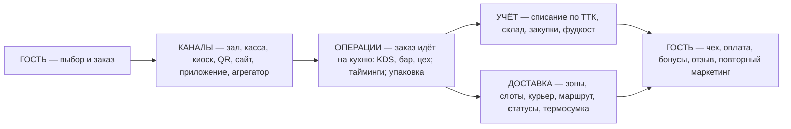
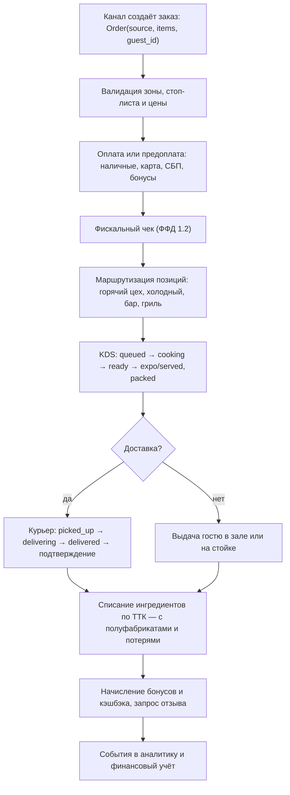

# 01. Референс-архитектура ресторанной CRM/ERP полного цикла

> Документ отвечает на вопрос: **из каких компонентов состоит система «от заказа до клиента, через чеки и кухню, с расходом продуктов, курьером и отзывом»** — и как эти компоненты связаны. Это целевая модель, на которую накладываются аудиты аналогов.

## 1. Сквозной процесс (end-to-end)

Параллельно работают «горизонтальные» контуры: **персонал** (смены, табель, ФОТ), **финансы** (деньги, P&L, антифрод), **стандарты/безопасность** (ХАССП, чек-листы, госсистемы), **франшиза** (УК, роялти, контроль сетей).

## 2. Тринадцать доменов платформы

| # | Домен | Ключевые объекты | Отвечает за |
|---|---|---|---|
| D1 | **POS и фискализация** | смена, чек, ФН, ОФД-документ | приём оплат, 54-ФЗ, ЕГАИС/ЧЗ на кассе |
| D2 | **Каналы заказов** | заказ, источник, предзаказ, бронь | все точки входа гостя в одну очередь заказов |
| D3 | **Кухня/производство** | кухонный тикет, курс, станция, акт приготовления | скорость и точность приготовления, ТТК на экране |
| D4 | **Склад и закупки** | ингредиент, ТТК, поставщик, накладная, заказ поставщику, инвентаризация | фудкост, остатки, снабжение без дефицита и излишков |
| D5 | **Доставка и курьеры** | зона, слот, курьер, маршрут, термосумка, инцидент | собственный канал выручки без 30% комиссии |
| D6 | **CRM, лояльность, отзывы** | гость, сегмент, бонусный счёт, кампания, отзыв, NPS | возвращаемость, LTV, гостевой опыт |
| D7 | **Персонал** | сотрудник, смена, табель, ставка, мотивация, допуск | ФОТ под нагрузку, антифрод, обучаемость |
| D8 | **Финансы и аналитика** | касса дня, управленческий счёт, P&L, KPI-дашборд | деньги под контролем, решения на данных |
| D9 | **Франшиза/УК** | франчайзи, договор, роялти, стандарт, аудит | масштабируемость и контроль сети |
| D10 | **Комплаенс и безопасность** | ХАССП-журнал, температурный лист, бракераж, ВСД | легальность, безопасность еды, готовность к проверкам |
| D11 | **Платформа/интеграции** | тенант, точка, устройство, API-ключ, вебхук, событие | мультитенантность, офлайн, экосистема |
| D12 | **Меню-инжиниринг** | блюдо, модификатор, комбо, сезонность, цены по каналам | маржа каждого блюда, единое меню во всех каналах |
| D13 | **Гостевой интерфейс** | меню гостя, корзина, оплата, статусы, история | конверсия заказов и самообслуживание |

Каждый домен детализирован в `docs/research/components/`.

## 3. Жизненный цикл заказа (единая модель данных)

### Ключевые сущности и их связи

- **Order** 1—N **OrderItem** (блюдо + модификаторы); Order N—1 **Channel**; Order N—1 **Guest**.
- **OrderItem** N—1 **Recipe (ТТК)**; Recipe = N **RecipeLine** (ингредиент, кол-во, потери, замены) + полуфабрикаты (рекурсия).
- **StockMovement** — любая операция: приёмка, списание продажей, акт приготовления, перемещение, инвентаризация, порча. Остаток = проекция потока движений (событийная модель, а не «запись в таблице»).
- **PurchaseOrder** — автозаказ по прогнозу → подтверждение → приёмка (сверка по ЭДО) → переоценка себестоимости ТТК (партии/ФИФО).
- **DeliveryAssignment** — связка Order ↔ Courier с таймстампами статусов; порождает метрики времени и инциденты.
- **Review** привязан к Order (или визиту гостя в зал) — это даёт причинно-следственную связь «блюдо/курьер/смена ↔ оценка».
- **FranchiseAccount** — УК видит агрегированные данные точек договора, роялти считается от выручки (из чеков), стандарты проверяются чек-листами.

## 4. Роли и их рабочие места

| Роль | Рабочее место | Что делает |
|---|---|---|
| Кассир/официант | сенсорный терминал, планшет | заказы, оплаты, возвраты |
| Повар | KDS-экран, терминал шефа | статусы, ТТК, акты списания/разбора |
| Бармен | барный принтер/экран | напитки, инвентаризация бара |
| Управляющий точкой | планшет/веб | смены, стоп-листы, инвентаризация, инциденты |
| Закупщик | веб | заказы поставщикам, цены, ЭДО |
| Курьер | мобильное приложение | заказы, маршруты, фото-подтверждения |
| Маркетолог УК | веб | кампании, сегменты, меню, отзывы |
| Франчайзи | кабинет франчайзи | свои точки, роялти, отчёты, заявки в УК |
| Операционный директор УК | веб/приложение | дашборд сети, аудиты, стандарты |
| Бухгалтер | веб + выгрузка в 1С | сверки, декларация, взаиморасчёты |
| Владелец | мобильное приложение | выручка, фудкост, NPS в реальном времени |

## 5. Принципы, без которых система не станет «корпоративной»

1. **Единая модель данных на все каналы.** Зал, доставка, киоск, агрегатор — один и тот же Order; иначе невозможны ни фудкост, ни LTV гостя.
2. **Событийная модель остатков.** Остаток склада вычисляется из журнала движений: полная аудитируемость («почему списано 3 кг сыра?» — вот события).
3. **Офлайн-первичность кассы и кухни.** Точка обязана торговать без интернета: локальная очередь событий + синхронизация (это есть у iikoFront, r_keeper, Toast — обязателен и у нас).
4. **Госсистемы — из коробки.** ЕГАИС, Честный ЗНАК (ТС ПИоТ), Меркурий, ФФД 1.2 — не «интеграции», а базовая функциональность.
5. **Мультитенантность с иерархией**: УК → франчайзи → точка → рабочие места. Права, цены и меню наследуются сверху с локальными переопределениями.
6. **Открытый API и вебхуки с первого дня** (в отличие от закрытых экосистем) — партнёры, агрегаторы, банки, 1С.
7. **Отзыв привязан к операции.** Отзыв без привязки к чеку/курьеру/смене — бесполезный текст; с привязкой — инструмент управления кухней и доставкой.
8. **Измеримость всего**: время приготовления, время доставки, точность инвентаризации, фудкост по блюду, NPS по точке — встроено, а не «купите сторонний BI».

## 6. Что отличает «франшизную» систему от обычной

Обычная автоматизация управляет **одной точкой**. Франшизная платформа управляет **копированием и контролем**:

- шаблон точки (меню, ТТК, цены, права, оборудование, чек-листы) → клонирование за часы;
- юридическая связка: договор, роялти (авто-расчёт от фискальной выручки), штрафы/бонусы;
- контроль исполнения стандартов (чек-листы с фото, тайные гости, аудиты);
- консолидированный дашборд УК и бенчмаркинг точек между собой;
- обучение и база знаний внутри продукта (видео ТТК, аттестация).

Этот слой есть фрагментарно только у iiko (Enterprise) и r_keeper; у облачных МСБ-систем — практически отсутствует. Главный конструктивный вывод для lovii — см. [`product-blueprint.md`](product-blueprint.md).
