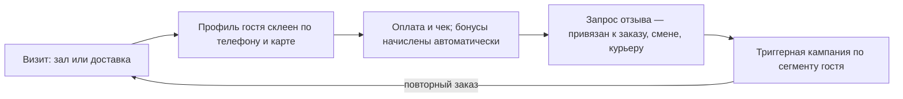

# 02. Персоны и сценарии (CJM)

> **Статус: ревизия №2 по итогам аудита корпуса · 10.10.2026.** Числовые факты сопровождаются ссылками; канонические перечисления — в «Модели данных», §0.

> Референс-архитектура описывает процесс «в железе»; этот документ описывает его глазами людей. Каждая персона — будущий пользователь платформы; каждая боль — продуктовая гипотеза.

## Персона 1. Гость — доставка

**Сценарий:** пятница вечер, заказ роллов домой.

| Шаг | Что происходит | Точка системы | Боль без платформы |
|---|---|---|---|
| 1 | Видит заведение в Яндекс Еде / приложении бренда | витрина, синк меню и стоп-листов | блюдо «есть» в агрегаторе, но кончилось на кухне → отмена |
| 2 | Собирает корзину, платит онлайн | оплата, облачная касса, чек | чек не приходит — тревога и недоверие |
| 3 | Ждёт | статусы заказа, обещание времени | «где мой заказ?» — звонки, негатив |
| 4 | Получает от курьера | статусы курьера, фото вручения | курьер заблудился, еда остыла |
| 5 | Через час получает запрос отзыва | отзывы, привязка к заказу | отзыв уходит на Карты без связи с заказом |
| 6 | Через неделю видит персональный оффер | CRM, RFM-кампании | никто не помнит гостя |

**Продуктовые следствия:** честное обещание времени; статусы в реальном времени; идентификация гостя даже из заказа агрегатора; рекавери по негативу в течение часов.

## Персона 2. Гость — зал

| Шаг | Точка системы |
|---|---|
| Садится за стол / бронирует | схема зала, бронирование |
| Официант принимает заказ на планшете | мобильный заказ, модификаторы, алерген-флаги |
| Кухня готовит по таймингу | KDS, курсы, синхронизация подач |
| Просит счёт, платит картой, называет телефон | чек, лояльность по телефону, электронная карта |
| Оставляет оценку по QR на чеке | сбор отзывов в зале |

**Следствия:** заказ у стола = минус бумажки и минус ошибки; бонусы начисляются без «карточки нет с собой» — по номеру телефона.

## Персона 3. Курьер

| Шаг | Точка системы |
|---|---|
| Выходит на смену в приложении | смены, статус «на линии» |
| Получает назначение пушем | диспетчеризация, зоны |
| Забирает заказ, отмечает «забрал» | статусы, сверка состава |
| Везёт по маршруту (2–3 заказа пакетом) | маршрутизация по API |
| Вручает: фото/код, оплата у клиента (если наложенный) | фото-подтверждение, эквайринг/наличные |
| Сдаёт смену: деньги, термосумка | материальная ответственность |

**Следствия:** приложение должно работать на дешёвых Android; офлайн-устойчивость в лифтах/подвалах; прозрачный расчёт заработка за смену.

## Персона 4. Франчайзи (владелец точки)

**Сценарий:** купил франшизу, открывает первую точку.

| Шаг | Точка системы |
|---|---|
| Подписывает договор, получает доступ | кабинет франчайзи, договор |
| УК клонирует шаблон точки (меню, ТТК, цены, чек-листы) | шаблоны точек |
| Нанимает людей, обучает по базе знаний | персонал, аттестация |
| Делает первую закупку по автозаказу у одобренных поставщиков | закупки УК |
| Запускается: касса, кухня, доставка | фазы 1–3 |
| Еженедельно видит роялти-счёт от фискальной выручки | биллинг |
| Видит свой рейтинг среди точек сети | бенчмаркинг |

**Следствия:** онбординг ≤ 3 дней; франчайзи доверяет системе, потому что роялти считается от чеков, которые он видит сам.

## Персона 5. Операционный директор УК

| Шаг | Точка системы |
|---|---|
| Утром смотрит пульс сети: выручка, инциденты, просрочки ХАССП | дашборд УК |
| Видит точку с фудкостом 38% вместо 32% | фудкост-аналитика |
| Назначает внеплановый аудит | чек-листы с фото, задачи |
| Раскатывает новую сезонную позицию по сети | версионирование шаблона меню |
| В конце месяца закрывает роялти и маркетинговый сбор | биллинг, акты |

**Следствия:** контроль без микроменеджмента — отклонения всплывают сами; обновление сети происходит за минуты с подтверждением точек.

## Персона 6. Повар

| Шаг | Точка системы |
|---|---|
| Принимает смену по чек-листу (температуры, санитария) | ХАССП-журналы |
| Видит тикеты на экране, готовит по нормативу | KDS |
| Смотрит фото подачи прямо на экране | ТТК на экране |
| Объявляет стоп-лист одним тапом | стоп-лист во все каналы |
| Выпускает заготовки актом, клеит этикетку со сроком | производство, принтер этикеток |

**Следствия:** повар не уходит с кухни за бумагой; всё на экране планшета, в перчатках — крупные кнопки.

## Персона 7. Кассир

| Шаг | Точка системы |
|---|---|
| Открывает смену, получает размен | касса, смены |
| Пробивает заказ зала или принимает агрегатор-заказ в общую очередь | касса, очередь каналов |
| Идентифицирует гостя по телефону, начисляет бонусы | лояльность на кассе |
| Оформляет возврат и корректный чек | возвраты, ФФД 1.2 |
| Закрывает смену: Z-отчёт, сверка эквайринга | закрытие смены, сверки |

**Следствия:** кассир не различает «свои» и «агрегаторные» заказы — одна очередь; гость без приложения получает бонусы по телефону (согласие фиксируется по 152-ФЗ).

## Сводная таблица «персона × домен»

| Домен | Гость | Курьер | Франчайзи | УК | Повар | Кассир |
|---|---|---|---|---|---|---|
| Заказ/касса | ✅ | | | ✅ | | ✅ |
| Кухня | | | ✅ | ✅ | ✅ | |
| Склад/закупки | | | ✅ | ✅ | ✅ | |
| Доставка | ✅ | ✅ | ✅ | ✅ | | |
| Гостевой контур | ✅ | | ✅ | ✅ | | ✅ |
| Персонал | | ✅ | ✅ | ✅ | ✅ | ✅ |
| Франшиза | | | ✅ | ✅ | | |
| Комплаенс | | | ✅ | ✅ | ✅ | |
