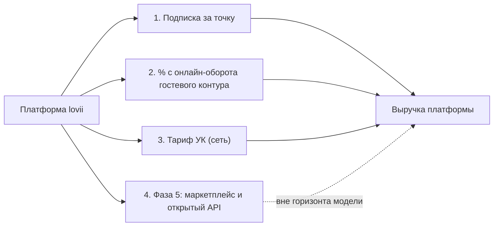

# Бизнес 01. Финансовая модель платформы

> **Статус: ревизия №2 по итогам аудита корпуса · 10.10.2026.** Все числовые гипотезы модели помечены «Г» и требуют валидации (интервью с франчайзи, пилот); рыночные данные — со ссылками на источники корпуса.

> Задача документа — посчитать **экономику самой платформы** (не точки): на чём зарабатываем, сколько стоит постройка, когда модель выходит в ноль и при каких условиях. Экономика точки — в [`../academic/02-unit-economics.md`](../academic/02-unit-economics.md); рынок и цены конкурентов — в [`../00-market-landscape.md`](../00-market-landscape.md) и обзорах вендоров.

## 1. Источники выручки (4 потока)

1. **Подписка за точку** — основной поток. Бесплатный вход (мировой стандарт: Toast «$0 старт», Square Free, Fusion POS «0 ₽/мес за ПО» — см. [`../competitors/toast.md`](../competitors/toast.md), [`../competitors/ru-smaller.md`](../competitors/ru-smaller.md)) с платными тарифами глубины.
2. **Комиссия с онлайн-оборота** — % с заказов, прошедших через гостевой контур (сайт/приложение/мини-апп). Логика: точка платит 1,5% вместо 16,67–29,17% без НДС агрегаторам ([`../components/02-order-channels.md`](../components/02-order-channels.md)) — платформа зарабатывает на прямом канале, который сама и создаёт.
3. **Тариф «УК»** — управление сетью: бенчмаркинг, аудиты стандартов, роялти-биллинг, шаблоны точек.
4. **Маркетплейс/открытый API** — фаза 5 ([`../product-blueprint.md`](../product-blueprint.md), D11/P2), в этой модели не считается: модель обязана сходиться без него.

## 2. Ценовые допущения (синхронизированы с [тарифной сеткой](02-pricing.md))

| Поток | Величина | Пометка |
|---|---|---|
| Тариф «Базовый» | 2 990 ₽/мес за точку | Г — вилка рынка 2 000–5 000 ₽ ([`../00-market-landscape.md`](../00-market-landscape.md), §4) |
| Тариф «Про» | 5 990 ₽/мес за точку | Г — ниже iiko Pro 8 600 ₽ ([`../competitors/iiko.md`](../competitors/iiko.md)) при сопоставимой глубине |
| Доля точек на платных тарифах | 60% | Г — бесплатный вход не означает нулевую конверсию: глубина (автозаказ, фудкост-аналитика, франшиза) платная |
| Комиссия с онлайн-оборота | 1,5% с заказов гостевого контура | Г — в 13–23 раза ниже комиссии агрегаторов |
| Доля онлайн-заказов точки | 25% выручки | Г — доставка+самовывоз растут +17%/год ([`../00-market-landscape.md`](../00-market-landscape.md), §1) |
| Тариф «УК» | 12 990 ₽/мес + 990 ₽/мес за точку сверх 10 | Г |
| Средний чек точки | 900 ₽, выручка 1,2 млн ₽/мес | Г — ориентир малого общепита |

**Средняя выручка с точки в месяц (ARPU, базовый сценарий):** подписка ≈ 3 600 ₽ (смесь «Базовый»/«Про» при 60% конверсии) + 1,5% × 25% × 1,2 млн = 4 500 ₽ ≈ **8 100 ₽/мес** — это ниже старших пакетов iiko/r_keeper (8 600–10 600 ₽ только подписка) и сопоставимо с облачными МСБ-системами, но при корпоративной глубине.

## 3. Затраты на постройку и эксплуатацию

| Статья | Величина | Пометка |
|---|---|---|
| Команда разработки, фазы 0–3 (М1–М18) | 8–12 человек, ~2,4–3,0 млн ₽/мес | Г — вилка ФОТ команды; сверять с рынком труда на старте |
| Команда эксплуатации и поддержки | 3–4 человека с фазы 2, ~0,7–1,0 млн ₽/мес | Г |
| Продажи и онбординг (сейлз + внедрение) | 2 человека с фазы 3, ~0,5–0,7 млн ₽/мес | Г |
| Инфраструктура (облако, СМС, мониторинг) | 0,3–0,5 млн ₽/мес, растёт с числом точек | Г; офшорится собственной инфраструктурой: кассы и ФН покупают точки ([`../infrastructure/banks-kassa-ofd.md`](../infrastructure/banks-kassa-ofd.md)) |
| Маркетинг запуска | разово 1,5–2,5 млн ₽ | Г |

Итого за 24 месяца: **≈ 75–90 млн ₽** затрат (Г). Ключевое допущение: кассовое оборудование, ФН и эквайринг остаются на стороне точки — платформа не финансирует железо (модель Toast «свой hardware» сознательно не копируем на старте).

## 4. Сценарный прогноз (24 месяца)

| Показатель | Консервативный | Базовый | Агрессивный |
|---|---|---|---|
| Точек к М24 (свои + франшиза + независимые) | 60 | 150 | 400 |
| Из них платящих (60%) | 36 | 90 | 240 |
| Выручка М24: подписка | 130 тыс ₽ | 324 тыс ₽ | 864 тыс ₽ |
| Выручка М24: % с оборота (все точки) | 162 тыс ₽ | 405 тыс ₽ | 1 080 тыс ₽ |
| Выручка М24: тарифы УК | 60 тыс ₽ (2 сети) | 150 тыс ₽ (5 сетей) | 450 тыс ₽ (12 сетей) |
| **Итого М24** | **≈ 350 тыс ₽/мес** | **≈ 880 тыс ₽/мес** | **≈ 2,4 млн ₽/мес** |
| Операционный ноль | М30+ | М24–М26 | М18–М20 |

Выводы модели:

1. **% с онлайн-оборота — крупнейший поток** при росте числа точек: он масштабируется с выручкой клиента, а не с числом подписок. Это подтверждает выбор «бесплатный вход + комиссия с созданного нами канала».
2. **Операционный ноль в базовом сценарии — конец второго года**; до этого платформа финансируется из затратного бюджета (75–90 млн ₽) или развивается поэтапно от собственной сети (наши точки — первые клиенты, их экономия и есть ранняя выручка ценности).
3. **Франшиза ускоряет модель**: одна сделка УК = 10+ точек одновременно, плюс роялти-биллинг делает нас полезными самой УК (а не только точкам).

## 5. Чувствительность: что ломает модель

| Параметр | −20% к допущению | Эффект |
|---|---|---|
| Конверсия в платные тарифы (60% → 48%) | −190 тыс ₽/мес при 150 точках | сдвигает ноль на 3–4 мес; лечится глубиной «Про», а не ценой |
| Доля онлайн-заказов (25% → 20%) | −90 тыс ₽/мес при 150 точках | главный риск — если гостевой контур «не взлетит»; митигируется живым прототипом [lovii.mobiap.com](http://lovii.mobiap.com) |
| Отток точек 4%/мес вместо 2% | нужно ×1,7 новых подключений | решает онбординг ≤3 дней и индекс стандарта ≥85% (точки «держит» результат) |
| Цена «Про» 5 990 → 4 990 | −15% подписочной выручки | допустимо как промо при годовом контракте |

## 6. Что нужно для перевода гипотез в факты

1. Интервью с 5–10 франчайзи: готовность платить за тарифы и % с оборота (валидация «Г»).
2. Демо-доступы iiko/Poster/Quick Resto: сверка глубины «Про» против цены ([`../executive-summary.md`](../executive-summary.md), «что дальше»).
3. Пилот на собственной точке: фактические затраты внедрения и конверсия персонала.

## Источники

- Рынок и цены: [`../00-market-landscape.md`](../00-market-landscape.md); тарифы вендоров — раздел «Аудиты аналогов».
- Экономика точки: [`../academic/02-unit-economics.md`](../academic/02-unit-economics.md).
- Принципы монетизации: [`../product-blueprint.md`](../product-blueprint.md), §3.
- Комиссии агрегаторов (16,67–29,17% без НДС ≡ 20–35% с НДС): [`../components/02-order-channels.md`](../components/02-order-channels.md).
