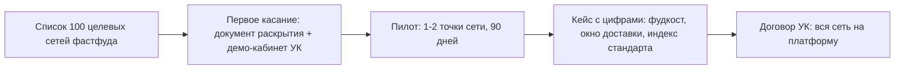

# Бизнес 03. Стратегия выхода на рынок (GTM)

> **Статус: ревизия №2 по итогам аудита корпуса · 10.10.2026.** Целевые числа — гипотезы до пилота; структура рынка — по [`../00-market-landscape.md`](../00-market-landscape.md).

> Вопрос документа: **как платформа получит первые платящие точки и превратит их в поток**. Продукт и цены — в [`02-pricing.md`](02-pricing.md), экономика — в [`01-financial-model.md`](01-financial-model.md).

## 1. Кому продаём и в каком порядке

| Волна | Сегмент | Почему они | Размер рынка |
|---|---|---|---|
| 0 | **Своё производство и свои точки** | не нужно продавать — нужно доказать; идеальные условия для обкатки и первых кейсов | — |
| 1 | **Действующие франшизы (УК)** | одна сделка = 10+ точек; у УК уже есть боль контроля и роялти, которую мы закрываем из коробки ([`../gap-analysis.md`](../gap-analysis.md), G1) | ~40 000 точек в сетях |
| 2 | **Малый общепит с доставкой** (пицца, роллы, дарк китчен) | полный цикл + гостевой контур = экономия на агрегаторах, которая видна в деньгах | ~80 000 |
| 3 | **Микробизнес** (кофейни, шаурма, островки) | бесплатный вход снимает барьер; конверсия в платные тарифы по мере роста | ~120 000 |

Порядок не случаен: франшизы дают плотность кейсов и чужими руками обучают рынок («если сеть из 30 точек работает на lovii, нам подойдёт»).

## 2. Позиционирование одной фразой

**«Корпоративная глубина по цене входа, франшиза из коробки»** — против «тяжёлых» (глубоко, дорого, закрыто), против облачных МСБ (дёшево, но потолок функций), против «зоопарка» точечных сервисов ([`../00-market-landscape.md`](../00-market-landscape.md), §3). Доказательства: одна система вместо 5–7 подписок; роялти от фискальной выручки «поправить нельзя»; гостевой контур в той же базе, что и операционный.

## 3. Воронка волны 1 (франшизы)

- **Вход в разговор** — не «купите SaaS», а «посмотрите свой кабинет УК на живых данных»: демо уже показывает пульс сети, роялти, аудиты, бенчмарки ([`../saas/03-role-scenarios.md`](../saas/03-role-scenarios.md), роли УК и собственника).
- **Пилотные условия**: тариф «Про» по цене «Базового» на 6 месяцев, внедрение силами нашей команды, обязательство кейса по итогам ([`02-pricing.md`](02-pricing.md), §2).
- **Критерий успеха пилота** — три числа в кейсе: фудкост (цель −2 п.п. за 6 мес), доставка в окно ≥90%, индекс стандарта ≥85% (те же метрики, что и в [`../product-blueprint.md`](../product-blueprint.md)).

## 4. Каналы привлечения по волнам

| Канал | Волна | Комментарий |
|---|---|---|
| Прямые продажи собственникам сетей | 1 | 2 сейлза+внедренца из финмодели; цикл сделки 1–3 мес |
| Кейсы и цифры пилотов | 1–2 | главный контент; каждая волна продаётся кейсом предыдущей |
| Партнёрство с интеграторами/банками | 2–3 | связка «РКО+касса+эквайринг» как у Т-Бизнес ([`../infrastructure/banks-kassa-ofd.md`](../infrastructure/banks-kassa-ofd.md)) |
| Бесплатный вход + продукт ведёт сам | 3 | регистрация без сейлза, апгрейд по мере использования |
| Гостевой контур как вирусный канал | 2–3 | витрина и отзывы гостей точек работают на узнаваемость бренда платформы |

## 5. План первых 90 дней после запуска фаз 1–3

| День | Действие |
|---|---|
| 1–30 | Свои точки на платформе 30 дней без отката (критерий плана реализации); сбор телеметрии целей |
| 30–45 | Два демо-прогона с целевыми УК; список 100 сетей с приоритизацией |
| 45–90 | Договорённость о 2 пилотах (1–2 точки каждый); параллельно — очередь из 10 независимых точек на бесплатном входе |

## 6. Антириски

1. **Долгий цикл сделки с УК** компенсируется бесплатным входом для независимых точек: выручка капает, пока «дозревают» сети.
2. **«Мы уже на iiko»** — не спорим о миграции: пилот одной точкой параллельно (правило «откат всегда дешевле простоя», [`../plan/01-implementation-plan.md`](../plan/01-implementation-plan.md)).
3. **Репутационный риск сбоев** у первых клиентов — операционные обязательства и дежурство описаны в [`../infrastructure/02-operations-sla.md`](../infrastructure/02-operations-sla.md).
4. **Демпинг конкурентов** — не участвуем: отвечаем глубиной и франшизным контуром, которых у облачных МСБ нет ([`../gap-analysis.md`](../gap-analysis.md)).
