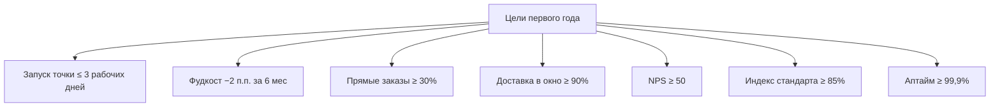

# Бизнес 04. План метрик и измерений

> **Статус: ревизия №2 по итогам аудита корпуса · 10.10.2026.** Каждая целевая метрика [`../product-blueprint.md`](../product-blueprint.md) привязана к источнику событий и отчёту — цели без способа измерения не существует.

> Принципы: (1) метрика считается **из событий платформы**, а не из ручного ввода; (2) у каждой метрики один владелец роли и один экран, где она живёт; (3) точка видит те же числа, что и УК, — измерение не может быть «аргументом в споре».

## 1. Дерево целей первого года

## 2. Как измеряется каждая цель

| Цель | Формула | Источник событий | Экран/отчёт |
|---|---|---|---|
| Запуск ≤ 3 дней | дни от клона шаблона до первого чека | события онбординга тенанта + первый фискальный чек | кабинет УК, таблица запусков |
| Фудкост ≤ 30% | себестоимость списаний по ТТК / выручка за период | `StockMovement` (sale_writeoff, партии) + чеки | фудкост-аналитика точки и рейтинг УК ([`../components/08-finance-analytics.md`](../components/08-finance-analytics.md)) |
| Прямые заказы ≥ 30% | заказы `channel ∈ {site, app, miniapp, kiosk, phone}` / все заказы | `Order.channel` — канонический словарь ([`../components/12-data-model.md`](../components/12-data-model.md), §0) | экономика каналов CRM ([`../components/06-crm-loyalty-feedback.md`](../components/06-crm-loyalty-feedback.md)) |
| Окно доставки ≥ 90% | назначения `delivered ≤ promised_at` / все доставленные | `DeliveryAssignment.delivered_at` против `Order.promised_at` | диспетчерская и отчёт доставки ([`../components/05-delivery-couriers.md`](../components/05-delivery-couriers.md)) |
| NPS ≥ 50 | (промоутеры − критики) / все ответившие | опрос после заказа в гостевом контуре | динамика рейтинга и отзывов УК/франчайзи |
| Индекс ≥ 85% | взвешенное выполнение чек-листов аудита | события аудитов с фото ([`../components/09-franchise-network.md`](../components/09-franchise-network.md)) | аудиты и индекс стандарта |
| Аптайм ≥ 99,9% | 1 − время недоступности облачных сервисов за месяц | мониторинг платформы | отчёт эксплуатации ([`../infrastructure/02-operations-sla.md`](../infrastructure/02-operations-sla.md)) |

## 3. Бизнес-метрики платформы (для собственной финмодели)

| Метрика | Формула | Источник |
|---|---|---|
| MRR | Σ подписок + начисленная комиссия с оборота за месяц | биллинг ([`01-financial-model.md`](01-financial-model.md)) |
| ARPU на точку | MRR / активные точки | биллинг + телеметрия |
| Конверсия в платные тарифы | платные точки / все активные | биллинг |
| Отток точек (мес) | потерянные активные точки / точки на начало месяца | биллинг + телеметрия |
| Доля онлайн-выручки | онлайн-заказы гостевого контура / вся выручка точки | `Order.channel` |

Целевые ориентиры: конверсия ≥ 60% (гипотеза сетки), отток ≤ 2%/мес ([`01-financial-model.md`](01-financial-model.md), §5).

## 4. Правила честности измерений

1. **Выручка для роялти и комиссий — только фискальная** (ОФД/ККТ), «поправить нельзя» ([`../saas/03-role-scenarios.md`](../saas/03-role-scenarios.md), F1).
2. **Метрики качества сервиса считаются по событиям**, а не по самооценке: время выдачи — из статусов кухонных тикетов, окно — из таймстампов назначений.
3. **Опрос гостя — не чаще раза в заказ**; отказ отвечать не портит метрику (считаем по ответившим, доля ответов — отдельный индикатор).
4. **Бенчмарки сети обезличены**: точка видит своё место, но не данные конкурентов-соседей ([`../academic/04-personal-data-loyalty.md`](../academic/04-personal-data-loyalty.md), §5).
5. Каждое целевое значение в отчётах сопровождается датой среза и периодом — читабельность против «средней температуры».
