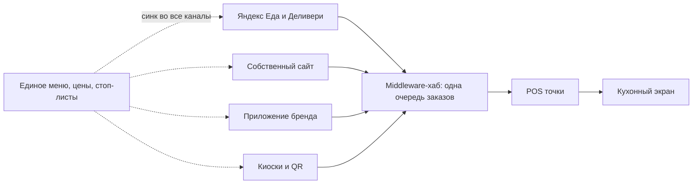

# Аудит класса систем: middleware доставки и курьерские сервисы

> **Статус: ревизия №2 по итогам аудита корпуса · 10.10.2026.** Числовые факты сопровождаются ссылками; канонические перечисления — в «Модели данных», §0.

Слой между каналами заказов (агрегаторы, сайт, приложение) и кухней/кассой. Класс доказал, что омниканальность и логистика — отдельные продукты, за которые платят.

Модель работы класса:

## 1. Мировые агрегаторы заказов

### Deliverect
- Омниканальные цифровые заказы: модульные API для собственных витрин, 1 000+ интеграционных партнёров (POS, лояльность, KDS, DSP, платежи) [1](https://www.deliverect.com/en-us).
- Менеджмент маркетплейсов: **99,6% успешных инъекций заказов** в POS, единый дашборд платформ, умное управление меню, синк остатков в реальном времени, динамические цены, A/B-тесты, автопланирование [1](https://www.deliverect.com/en-us).
- Диспетчеризация и доставка + кейтеринг (Deliverect Catering: котировки, счета, депозиты, групповые заказы) [1](https://www.deliverect.com/en-us).

### Otter
- «Все заказы на одном экране»: POS-интеграции с 20+ кассовыми системами (в т.ч. Micros, Lightspeed, Toast, Square, Revel) [2](https://www.tryotter.com/integrations); импорт меню из POS и публикация во все каналы; консолидация онлайн-заказов в POS и отправка на кухню без ручного ввода [3](https://www.tryotter.com/products/pos-integration).
- Полный стек сверху: Order Manager, Kitchen Display, меню и «86» (стоп-листы), лояльность, маркетинг, рейтинг и отзывы, виртуальные бренды, живые алерты, аналитика [2](https://www.tryotter.com/integrations).
- Офлайн-режимы терминала, KDS и принтеров — в сравнительной таблице против конкурентов [4](https://www.tryotter.com/).

### Checkmate, Olo
- Классические интеграционные мосты «агрегаторы → POS»; упоминаются в отраслевых обзорах как стандарт стека доставки [5](https://merchants.ubereats.com/us/en/resources/articles/pos-integration/).

**Урок:** омниканальный слой «одна очередь заказов + единое меню во все каналы» — обязательный базовый слой нашей платформы (не аддон).

## 2. Российские сервисы доставки и курьеров

| Сервис | Что делает |
|---|---|
| Smartomato | сайт + мобильное приложение + интеграции с Яндекс Едой, Delivery, Broniboy [6](https://lemma-group.ru/articles/avtomatizatsiya-kanalov-polucheniya-zakazov-i-protsessov-dostavki-edy/) |
| DeliveryPlus | доставка еды/продуктов: сайт, приложение, онлайн-оплата, статусы; интеграции iikoDelivery / r_keeper Delivery, курьеры Яндекс Еды и Dostavista [6](https://lemma-group.ru/articles/avtomatizatsiya-kanalov-polucheniya-zakazov-i-protsessov-dostavki-edy/) |
| Foodpicasso | приложение курьера с построением маршрутов, контроль курьеров собственником [6](https://lemma-group.ru/articles/avtomatizatsiya-kanalov-polucheniya-zakazov-i-protsessov-dostavki-edy/) |
| eDA | белое мобильное приложение ресторана с корзиной и оплатой; интеграция с кассой (бесплатно для iiko); аналитика гостей [6](https://lemma-group.ru/articles/avtomatizatsiya-kanalov-polucheniya-zakazov-i-protsessov-dostavki-edy/) |
| FoodBand / 1b.app / LetBefit | конструкторы служб доставки: сайт, приложение, курьеры, CRM [7](https://toolfox.ru/services/programmy-dlya-dostavki-edy) |
| EDICourier | CRM курьерской доставки с мобильным приложением [8](https://picktech.ru/catalog/food-delivery-software/) |
| ЯКурьер | автоназначение заказа ближайшему подходящему исполнителю, сквозной чат по заявке [8](https://picktech.ru/catalog/food-delivery-software/) |
| Vezubr | онлайн-диспетчеризация, расчёт стоимости доставки, маршрутизация, тендер перевозчикам [7](https://toolfox.ru/services/programmy-dlya-dostavki-edy) |
| Яндекс Маршрутизация | ИИ-оптимизация маршрутов, пробки, временные окна, ограничения по массе/объёму, приложение курьера [7](https://toolfox.ru/services/programmy-dlya-dostavki-edy) |

**Ключевые факты рынка доставки:**
- Собственный сайт доставки окупается за 2–3 месяца за счёт экономии 20–35% комиссии агрегаторов [7](https://toolfox.ru/services/programmy-dlya-dostavki-edy).
- Без интеграции с Яндекс Едой менеджер переносит заказы вручную → ошибки и задержки; интеграции есть у iiko, r_keeper, Poster, FoodBand [7](https://toolfox.ru/services/programmy-dlya-dostavki-edy).
- Маршрутизация курьеров часто подключается отдельно — нужен API у выбранной CRM [7](https://toolfox.ru/services/programmy-dlya-dostavki-edy).

## 3. Выводы для lovii

1. Встроенный омниканальный слой (как Otter/Deliverect) + интеграции агрегаторов РФ — базовая поставка, не премиум.
2. Курьерская логистика — своё приложение курьера и диспетчеризация, а математика маршрутов — по API роутинг-провайдеров (Яндекс Маршрутизация) до появления своей зрелой.
3. Белая витрина (сайт + приложение бренда) должна собираться из меню автоматически — конструктор, а не услуга веб-студии.

## Источники

1. https://www.deliverect.com/en-us
2. https://www.tryotter.com/integrations
3. https://www.tryotter.com/products/pos-integration
4. https://www.tryotter.com/
5. https://merchants.ubereats.com/us/en/resources/articles/pos-integration/
6. https://lemma-group.ru/articles/avtomatizatsiya-kanalov-polucheniya-zakazov-i-protsessov-dostavki-edy/
7. https://toolfox.ru/services/programmy-dlya-dostavki-edy
8. https://picktech.ru/catalog/food-delivery-software/
