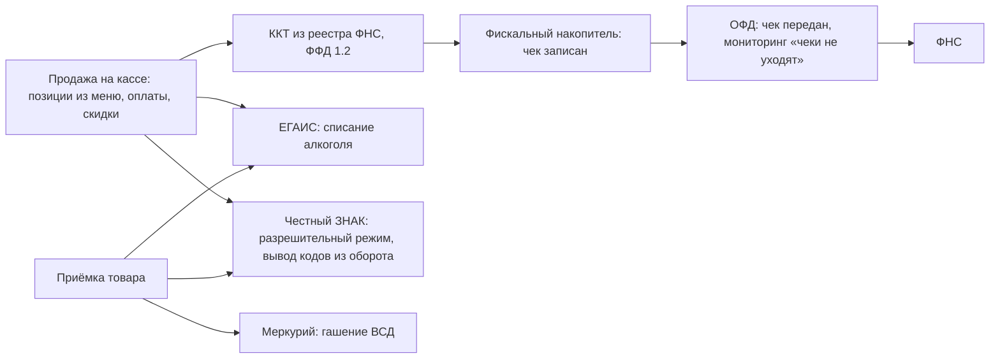

# Компонент 01. Касса и фискализация (POS / Fiscal)

> **Статус: ревизия №2 по итогам аудита корпуса · 10.10.2026.** Числовые факты сопровождаются ссылками; канонические перечисления — в «Модели данных», §0.

> Домен D1. Ядро всей платформы: ни одна копейка не должна пройти мимо кассы, ни один чек — мимо ФНС.

## 1. Назначение и границы

- Приём и оформление заказов в зале/на стойке, все виды оплат, возвраты, фискальные документы.
- Юридическая обвязка: 54-ФЗ, ФФД 1.2, ОФД, ЕГАИС, Честный ЗНАК (ТС ПИоТ), работа с маркировкой и алкоголем.
- Кассовые операции: открытие/закрытие смены, X/Z-отчёты, инкассация, внесение/выплата.

Фискальный контур кассы — путь каждой продажи:

## 2. Функциональные требования

### 2.1. Кассовые операции
- Продажа, чек коррекции, возврат прихода/расхода, аннулирование до закрытия смены.
- Комбинированные оплаты: наличные + карта + СБП (QR) + бонусы + депозит гостя.
- Разделение счёта (сплит), перенос стола, объединение чеков — для полного обслуживания в зале.
- Отложенный чек / предзаказ / депозит (банкет).
- Скидки и акции применяются **на кассе по правилам лояльности** (автоматически, без кассира-«скидочника»).
- Офлайн-режим: продажи без связи с облаком, буферизация чеков и фискальных документов, фоновая синхронизация.

### 2.2. Фискализация (РФ)
- Работа с ККТ из реестра ФНС (АТОЛ, ШТРИХ-М, Эвотор, Вики Принт, MSPOS и др.) через драйверы/облачные драйверы.
- ФФД 1.2 обязателен (с 01.02.2025 ФФД 1.05 не принимается для новых регистраций; с 01.03.2026 — единственный формат) [1](https://vc.ru/rating_top/3029537-trebovaniya-54-fz-k-onlayn-kassam).
- Наименование позиции в чеке обязательно — касса читает номенклатуру из меню/товароучёта [2](https://franchise.roliksushi.ru/blog/chestny-znak-merkuriy-kassy).
- Электронные чеки (СМС/email/QR) — экономия ленты и точка сбора контактов для CRM.
- **Облачная касса** для онлайн-оплат на сайте/в приложении: чек в момент расчёта обязателен и для интернета-заказов [2](https://franchise.roliksushi.ru/blog/chestny-znak-merkuriy-kassy).
- Интеграция с ОФД (договор ~3 тыс ₽/год/касса), мониторинг «чеки не уходят» — алерт владельцу.

### 2.3. Маркировка и алкоголь
- ЕГАИС: приёмка накладных, подтверждение, списание при продаже/вскрытии, алкодекларация; крепкий алкоголь — помарочный учёт.
- Честный ЗНАК: приёмка УПД по ЭДО, разрешительный режим на кассе (проверка кода до пробития), вывод из оборота при использовании в готовке (акты списания с кодами) [3](https://www.restohub.pro/avtomatizaciya-restorana-iiko-2026).
- ТС ПИоТ — обязательный модуль проверки кодов маркировки для продавцов маркированного товара [4](https://www.moysklad.ru/poleznoe/izmenenija-v-54-fz/).
- Меркурий: гашение ВСД при приёмке мяса/рыбы/молочки.

### 2.4. Антифрод кассы
- Каждое действие — под персональным кодом/картой сотрудника; возвраты и отмены — только по праву.
- Журнал подозрительных операций: скидки сверх лимита, отмены после печати, «левые» возвраты, открытые чеки без позиций.
- Видеоконтроль с наложением чеков (как в iiko): событие на кассе ↔ фрагмент видео [3](https://www.restohub.pro/avtomatizaciya-restorana-iiko-2026).
- Сравнение «пробито vs принято по инвентаризации»: автоматический сигнал о расхождениях.

> Роли, экономика и критерии выбора трёх внешних контуров — банка-эквайера, кассы и ОФД, включая лучшие примеры рынка 2026, — собраны в справочнике [«Платёжная инфраструктура»](../infrastructure/banks-kassa-ofd.md).

## 3. Оборудование (совместимость — обязательна)

| Класс | Примеры | Комментарий |
|---|---|---|
| Фискальные регистраторы | АТОЛ, ШТРИХ-М, Вики Принт | основной класс для РФ |
| Моноблоки/смарт-терминалы | Эвотор, MSPOS, aQsi | для микроточек |
| Денежные ящики, дисплеи покупателя, сканеры 2D (Data Matrix), весы | стандартный набор | |
| Эквайринг-терминалы | интеграции с банками, оплата по QR СБП | |
| Планшеты официанта | iOS/Android | мобильный приём заказов у стола |

## 4. Как это сделано у аналогов (кратко)

- **iikoFront** — эталон РФ: ФН+ОФД, разрешительный режим ЧЗ, ЕГАИС, видеоконтроль, карта сотрудника обязательна для открытия стола; статистика «автоматизация снижает потери на кассе на 30–50%» [3](https://www.restohub.pro/avtomatizaciya-restorana-iiko-2026).
- **r_keeper** — мультиплатформенная касса «р_к Некст», ФЗ-54, офлайн-режим с автосохранением, настройка техкарт прямо на планшете [5](https://rkeeper.ru/).
- **Poster** — касса на планшете, офлайн, пречеки на кухню, оплаты картой/QR [6](https://toolfox.ru/services/s/poster).
- **Toast** — собственный Android-hardware + встроенный процессинг (обязателен «их» эквайринг), offline mode, handheld-терминалы у официантов — доказательство, что платежи = якорь удержания [7](https://www.posusa.com/toast-pos-review/).
- **Saby Presto** — кассы на Windows и Android, офлайн-синхронизация, скидки и смешанные оплаты [8](https://saby-sbis.ru/blog/programmy-dlya-avtomatizacii-obshchepita-podborka-dlya-kafe-i-restorana).

## 5. Метрики домена

- Выручка по сменам/точкам/каналам; средний чек; глубина скидки; доля безнала/СБП.
- Время оформления заказа; доля чеков с ошибкой/возвратом.
- Расхождения кассы (план-факт по инкассации).
- Доля чеков с идентификацией гостя (мост в CRM).

## 6. Требования к реализации для lovii

1. Абстракция «драйвер ККТ»: реестр поддерживаемых моделей, адаптеры под АТОЛ/ШТРИХ/Эвотор + облачная касса как отдельный адаптер (для интернет-заказов и курьеров без кассы — курьерам по 54-ФЗ возить ККТ не обязательно, чек бьётся центральной/облачной кассой [4](https://www.moysklad.ru/poleznoe/izmenenija-v-54-fz/)).
2. Единый сервис чека: чек строится из Order; никакие данные в чек не попадают в обход заказа.
3. Телеметрия касс: «касса офлайн > N минут», «ФН заполнен на 90%», «чеки не уходят в ОФД» → пуш владельцу/УК.
4. Готовый «пакет точки»: касса + ФН + ОФД + эквайринг в одном онбординге (для франчайзи — единая точка входа, идеал — как у Toast «один договор на всё» [9](https://vc.ru/rating_top/3029524-onlajn-kassa-po-54-fz-luchshie-ofd-i-kassovye-resheniya-dlya-biznesa)).
