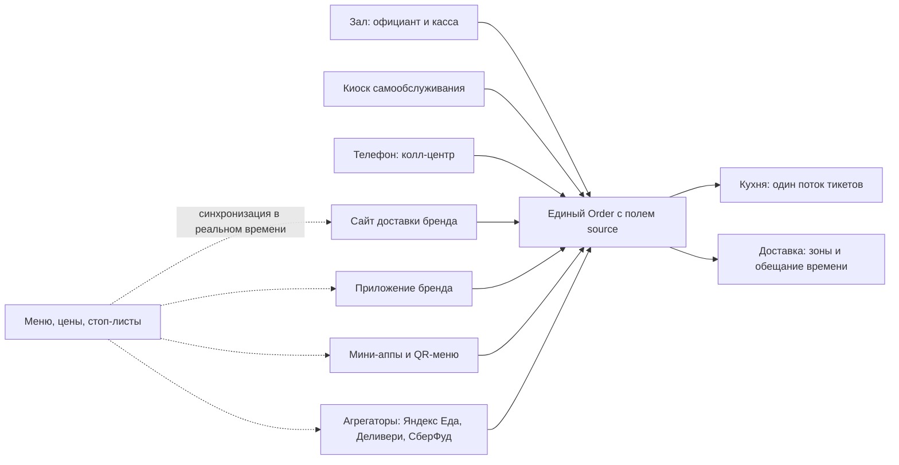

# Компонент 02. Каналы приёма заказов (Order Channels)

> **Статус: ревизия №2 по итогам аудита корпуса · 10.10.2026.** Числовые факты сопровождаются ссылками; канонические перечисления — в «Модели данных», §0.

> Домен D2. Все точки входа гостя — в одну очередь заказов. Каналы сменяются, модель заказа — одна.

## 1. Перечень каналов

| Канал | Формат | Комментарий |
|---|---|---|
| Зал: официант/касса | офлайн | основной для full-service |
| Киоск самообслуживания | офлайн | фастфуд, столовые; снижает ФОТ |
| Заказ по телефону | колл-центр | нужен для дарк китченов и пиццерий |
| Собственный сайт доставки | онлайн | витрина меню + корзина + оплата |
| Мобильное приложение бренда | онлайн | iOS/Android, push, история заказов |
| Мини-аппы (Telegram) | онлайн | дешёвая альтернатива нативному приложению |
| Электронное меню по QR | зал/самовывоз | заказ и оплата за столом без официанта |
| Агрегаторы | онлайн | Яндекс Еда, Деливери, СберФуд и др. |
| Повторный заказ из истории | онлайн | 1 клик из профиля гостя |

Все каналы сходятся в один контракт заказа; меню и стоп-листы синхронизируются обратно во все каналы:

## 2. Требования к архитектуре каналов

1. **Единый API заказов**: любой канал создаёт один и тот же объект `Order` с полем `source`. Каналы не знают про кухню и склад — только про контракт заказа.
2. **Синхронизация меню и стоп-листов во все каналы** в реальном времени: блюдо снято с продажи — исчезло на сайте, в приложении и у агрегаторов (у Deliverect заявлено 99,6% успешных инъекций заказов и синк остатков/цен как ключевая ценность [1](https://www.deliverect.com/en-us)).
3. **Зоны и условия доставки** по каналам: разные зоны/пороги бесплатной доставки для сайта и агрегаторов.
4. **Маршрутизация в точку**: при заказе с сайта система выбирает точку-исполнителя (ближайшая/свободная/по зонам).
5. **Предзаказ и слоты**: на время («к 19:00»), самовывоз через N минут.
6. **Омниканальная корзина гостя**: гость узнаётся по телефону/карте независимо от канала — одна история заказов (основа CRM).
7. **Экономика канала**: по каждому заказу фиксируется комиссия (агрегатор %), стоимость привлечения — для отчёта «маржа по каналам».

## 3. Каналы агрегаторов (РФ): ключевые факты

- Яндекс Еда/Деливери: модель «доставка сервиса» — комиссия **~29,17% без НДС** (логистика на Яндексе, зона 3 км пеший / 10 км авто); модель «своя доставка» — комиссия **~16,67% без НДС**, зону задаёт ресторан; самовывоз — 16,67%, радиус 2 км [2](https://yandex.ru/project/eda/partners/registration).
- Управление заказами агрегатора возможно через личный кабинет либо **через кассовую систему** при интеграции [2](https://yandex.ru/project/eda/partners/registration).
- Готовые интеграции с Яндекс Едой и Деливери есть у iiko, r_keeper, Poster и ряда других: заказы падают сразу в систему и на кухонный экран [3](https://toolfox.ru/services/programmy-dlya-dostavki-edy).
- Скорость решает: при доставке до 30 минут вероятность повторного заказа растёт до +20% [2](https://yandex.ru/project/eda/partners/registration).

**Продуктовый вывод:** агрегаторы — дорогой, но неотключаемый канал. Платформа обязана (а) заводить заказы агрегаторов без ручного ввода, (б) показывать их реальную маржу рядом с прямыми каналами, (в) перетягивать гостя в прямой канал бонусами/упаковкой-вкладышем.

## 4. Мировые аналоги

- **Otter** — «все заказы на одном экране»: импорт меню из POS во все каналы, агрегация доставки в POS, меню/цены синхронно во все каналы; 20+ POS-интеграций (из 100+ интеграций всего) [4](https://www.tryotter.com/).
- **Deliverect** — 1000+ партнёров-интеграций, динамические цены по каналам, A/B-тесты меню, диспетчеризация и кейтеринг [1](https://www.deliverect.com/en-us).
- **Toast** — онлайн-заказы в собственном цифровом магазине + прямые интеграции DoorDash/Uber Eats/Grubhub в KDS [5](https://www.therestauranthq.com/restaurants/toast-pos-review/).

## 5. RU-сервисы «сайт + приложение для доставки»

- **Smartomato** — сайт + мобильное приложение + интеграция с Яндекс Едой, Delivery, Broniboy [6](https://lemma-group.ru/articles/avtomatizatsiya-kanalov-polucheniya-zakazov-i-protsessov-dostavki-edy/).
- **DeliveryPlus** — сайт/приложение доставки, интеграция с iikoDelivery / r_keeper Delivery, курьеры Яндекс Еды и Dostavista [6](https://lemma-group.ru/articles/avtomatizatsiya-kanalov-polucheniya-zakazov-i-protsessov-dostavki-edy/).
- **eDA** — белое мобильное приложение ресторана с приёмом заказов и оплатой, бесплатная интеграция с iiko [6](https://lemma-group.ru/articles/avtomatizatsiya-kanalov-polucheniya-zakazov-i-protsessov-dostavki-edy/).
- **FoodBand / 1b.app** — конструкторы служб доставки «под ключ» [3](https://toolfox.ru/services/programmy-dlya-dostavki-edy).
- **Quick Resto** — свой сайт/приложение + агрегаторы из коробки [7](https://picktech.ru/catalog/food-delivery-software/).

## 6. Метрики домена

- Конверсия витрины (просмотр меню → корзина → заказ) по каналам.
- Выручка/маржа по каналам; доля собственных каналов.
- Время приёма заказа (телефония) и доля отмен до кухни.
- Доля заказов с распознанным гостем.

## 6.5. Киоски самообслуживания и экраны заказа

- Киоск — полноэкранный режим платформы на сенсорном терминале: меню, модификаторы, корзина, оплата (эквайринг/СБП), печать номера заказа.
- Экран покупателя на кассе — состав чека и оплата у кассира.
- Требования: офлайн-устойчивость как у кассы; интеграция с фискализацией той же точки (единый фискальный накопитель); крупные элементы интерфейса, режим «быстрых кнопок» для фастфуда.
- Мировой контекст: киоски — часть экосистем Toast и Revel; в РФ растёт спрос в столовых и фастфуде на фоне роста ФОТ.

## 6.6. Бронирование, банкеты, кейтеринг

- Бронирование стола: схема зала, слоты времени, депозит/предоплата, напоминания гостю; бронь видна на кассе и учитывается в загрузке зала.
- Банкеты: отдельный тип заказа с меню-сетом, предоплатой этапами и печатью на кухню по расписанию подач.
- Кейтеринг (крупные заказы заранее): витрина, котировки, счета, депозиты и раздельная оплата — референс: Deliverect Catering [1](https://www.deliverect.com/en-us); бронирование столов как модуль есть в Poster Pro и Tillypad.
- Для франшизы: стандарт банкета — часть шаблона точки (меню-сеты, депозитная политика).

## 7. Требования к реализации для lovii

1. Конструктор витрин: одна товарная база → сайт, приложение, мини-апп, киоск, агрегаторы (как у Otter: «обнови меню один раз — изменится везде» [4](https://www.tryotter.com/)).
2. Виджет «ловим гостя»: после заказа в агрегаторе — вкладыш с QR на прямое приложение и бонус за первый прямой заказ.
3. Колл-центр для франшизы может быть **виртуальным**: единый номер УК с маршрутизацией в точки + карточка гостя у оператора (как в iiko Enterprise [8](https://multi-bit.com/avt_iiko/iiko_chto_eto)).
4. Каждый канал — отдельный модуль-плагин над единым Order API, чтобы подключение новых каналов не трогало ядро.
