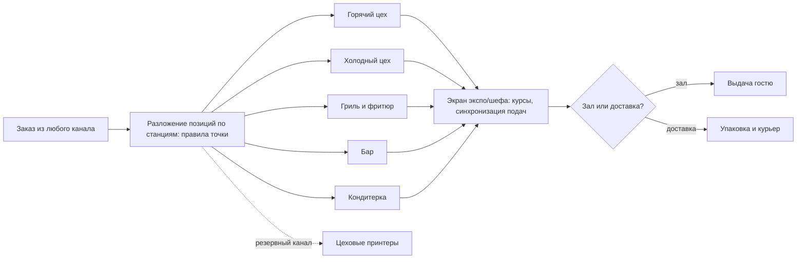
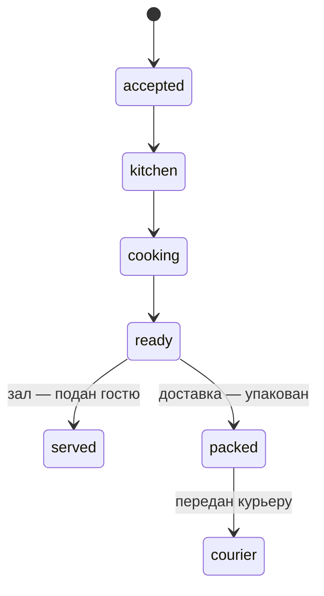

# Компонент 03. Кухня и производство (KDS / Kitchen Operations)

> Домен D3. Место, где заказ превращается в еду и где теряются или зарабатываются 25–35% себестоимости. Задача модуля — скорость без ошибок и полное списание по техкартам.

## 1. Функциональные требования

### 1.1. Маршрутизация заказов

- Позиции заказа автоматически раскладываются по станциям/цехам: горячий, холодный, гриль, фритюр, бар, кондитерка, упаковка.
- Правила маршрутизации настраиваются на точку; печать на цеховые принтеры как резервный канал и/или экраны.
- Разбиение на подачи (курсы) и «вместе с…», приоритеты, пометки «аллергия», «без лука» — до повара, а не до кассира.

### 1.2. Кухонный экран (KDS)
- Цветовые статусы с таймерами: новый → в работе → готов → выдан/упакован; просрочка подсвечивается.
- Объединение позиций по блюдам (группировка одинаковых позиций из разных заказов в пиковые часы).
- Фото подачи и состав блюда прямо на экране (ТТК на экране) — повар не уходит за бумажной картой.
- Объявление «стоп-листа» с кухни — мгновенно во все каналы продаж.
- Экраны шефа/экспо: контроль всех заказов, перераспределение между станциями, «запаздывающие» позиции.

### 1.3. Тайминги и дисциплина
- Норматив приготовления на блюдо/категорию (по ТТК); факт — от статусов на экране.
- Отчёты: среднее время приготовления по станции/повару/смене, доля просроченных заказов, узкие места по часам загрузки.
- Контроль времени выдачи для доставки (обещание «45 минут» начинается на кухне).

### 1.4. Производство и полуфабрикаты
- Многоуровневые ТТК: блюдо состоит из полуфабрикатов, полуфабрикат — из сырья; списание корректно на любом уровне.
- Акты производства и разбора: цех выпустил партию заготовок из сырья — склад переместился «сырьё → заготовка» с фиксацией выхода и потерь.
- Планирование заготовок по прогнозу продаж (с учётом сезонности и дней недели) и сроков годности.
- Бракераж и списание готового: просрочка на витрине — актом, а не «пропало».

### 1.5. Терминология статусов (единая для зала и доставки)

> Статусы `accepted`, `kitchen`, `cooking`, `ready`, `served`, `packed`, `courier` — единый словарь для зала и доставки; просрочка по нормативу подсвечивается на каждом шаге.

## 2. Как это сделано у аналогов

- **iiko**: выбор схемы — цеховые принтеры или терминал шефа с контролем времени приготовления, просмотром ТТК и оформлением актов списания/разбора/перемещения [1](https://multi-bit.com/avt_iiko/iiko_chto_eto); контроль свежести блюд на витрине — только в Enterprise-тарифе [2](https://iikoservice.ru/).
- **r_keeper КДС Про**: визуализация заказов и статусов, тайминги, ЭДО при выпуске продукции, печать этикеток с весом/составом/сроком годности; заявлено снижение ФОТ кухни на 10–30% [3](https://rkeeper.ru/).
- **Saby Presto «Монитор производства»**: на планшете повара — рецептура, фото подачи, комментарии гостей, остатки, списания, подписание документов [4](https://saby-sbis.ru/blog/programmy-dlya-avtomatizacii-obshchepita-podborka-dlya-kafe-i-restorana).
- **Toast KDS**: цветные статусы, маршрутизация по станциям, флаги аллергенов, coordination expo; тестировщики отмечают устойчивость линии в пиковые часы [5](https://www.posusa.com/toast-pos-review/).
- **Lightspeed KDS**: маршрутизация по станциям, курсы и приоритеты, дашборды производительности кухни [6](https://www.devopsschool.com/blog/top-10-kitchen-display-systems-kds-features-pros-cons-comparison/).
- **Revel KDS**: кастомные кухонные процессы, мультисцены, разделение потоков доставки и зала [6](https://www.devopsschool.com/blog/top-10-kitchen-display-systems-kds-features-pros-cons-comparison/).

## 3. Метрики домена

- Время «заказ принят → готов» (медиана/перцентили) по станциям.
- Доля заказов с просрочкой по нормативу; доля позиций, возвращённых гостем из-за ошибок.
- Загрузка станции по часам (для планирования смен и заготовок).
- Точность списаний: план по ТТК против факта инвентаризации (см. компонент 04).

## 4. Требования к реализации для lovii

1. KDS — web-приложение на любом планшете/экране, офлайн-устойчивое (локальная очередь тикетов).
2. Связка «тикеты ↔ склад»: статус «готов» триггерит списание по ТТК, а не момент пробития (так честнее для многоуровневых полуфабрикатов) — но с возможностью обратной корректировки.
3. «Фабрика-кухня» как отдельный тип объекта: производство заготовок и отгрузка на точки с приёмкой на месте (модель есть у r_keeper — приложение официанта + кассы + интерфейс фабрики-кухни + доставка + склад [7](https://eto-razvod.ru/review/rkeeper/)).
4. Видеонаблюдение поверх тикетов: инцидент «заказ готовился 25 минут» → клип из видео (антифрод и обучение).
5. Для франшизы: эталонные нормативы времени из ТТК УК, отчёт «какая точка отстаёт от эталона скорости».
