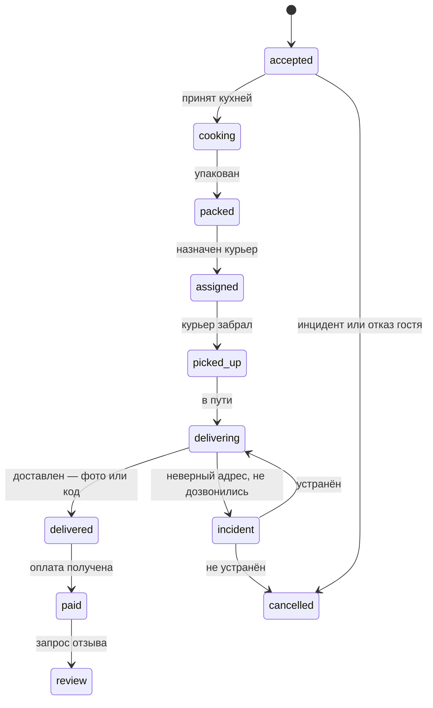

# Компонент 05. Доставка, курьеры и логистика

> Домен D5. Собственная доставка — маржа без 17–30% комиссии агрегаторов, но она же — самый операционно сложный контур: люди, дорога, термосумки, обещание времени.

## 1. Состав модуля

### 1.1. Зоны и условия
- Полигоны/радиусы зон доставки по точкам; разные условия для своих курьеров и агрегаторов.
- Порог бесплатной доставки, стоимость по зонам, минимальная сумма заказа.
- Тепловая карта эффективности доставки (заказы × время × маржа) для пересмотра зон — есть в iiko [1](https://multi-bit.com/avt_iiko/iiko_chto_eto).

### 1.2. Жизненный цикл заказа доставки

- Обещание времени гостю: расчёт от загрузки кухни и расстояния; автооповещения СМС/push.
- Инциденты: отказ гостя, неверный адрес, не дозвонились, авария — типизированные статусы с последствиями (возврат/переготовка).

### 1.3. Приложение курьера
- Получение назначений пушем, маршрут с навигацией, отметки статусов, фото вручения.
- Мгновенные уведомления о назначении/изменении/отмене заказа — базовый стандарт (как в iikoDelivery [2](https://lemma-group.ru/articles/kak-organizovat-sluzhbu-dostavki-s-pomoshchyu-iiko/)).
- Наличные и эквайринг у клиента (терминал или QR), передача денег, сдача смены.
- Показатели курьера: доставки в час, среднее время, рейтинг от гостей.

### 1.4. Диспетчеризация и маршрутизация
- Автоназначение ближайшего свободного курьера с учётом загрузки и типа транспорта (пеший/вело/авто).
- Пакетирование заказов по пути (2–3 заказа в один рейс) при соблюдении слотов.
- Интеграция с роутинг-движками: Яндекс Маршрутизация (ИИ-оптимизация, пробки, временные окна, ограничения по массе/объёму, мобильное приложение курьера) [3](https://toolfox.ru/services/programmy-dlya-dostavki-edy); Vezubr, Borzo for Business как внешние сервисы [3](https://toolfox.ru/services/programmy-dlya-dostavki-edy).
- Вызов внешних курьеров (Яндекс Доставка, Dostavista) в пики — есть в iiko [4](https://journal.sovcombank.ru/biznesu/programma-iiko-aiko-dlya-restoranov-opisanie-preimuschestva) и DeliveryPlus [5](https://lemma-group.ru/articles/avtomatizatsiya-kanalov-polucheniya-zakazov-i-protsessov-dostavki-edy/).

### 1.5. Учёт курьеров
- Курьеры как сотрудники/самозанятые: смены, ставка/сдельная, чаевые, штрафы/бонусы.
- Матответственность: термосумки, терминалы, наличные в кассе курьера; сверка в конце смены.

## 2. Аналоги и бенчмарки

- **iikoDelivery**: заказы из всех источников в одну систему, карта перемещений курьеров, автопостроение маршрута, отчёты по точкам/заказам/курьерам; весь контур в единой базе со складом и себестоимостью [2](https://lemma-group.ru/articles/kak-organizovat-sluzhbu-dostavki-s-pomoshchyu-iiko/).
- **r_keeper**: модуль доставки + фабрика-кухня; заявлено «+10–30% выручки доставки, −15–30% стоимости доставки» [6](https://rkeeper.ru/).
- **Foodpicasso**: отдельное приложение курьера с построением логистики маршрута, контроль курьеров собственником [5](https://lemma-group.ru/articles/avtomatizatsiya-kanalov-polucheniya-zakazov-i-protsessov-dostavki-edy/).
- **EDICourier, ЯКурьер**: отдельные CRM курьерской доставки с автораспределением и сквозным чатом по заявке [7](https://picktech.ru/catalog/food-delivery-software/).
- **Toast**: собственная доставка + синк с DoorDash/Uber Eats/Grubhub в одном дашборде [8](https://www.therestauranthq.com/restaurants/toast-pos-review/).
- **Deliverect**: диспетчеризация и управление доставкой как отдельный слой платформы [9](https://www.deliverect.com/en-us).

## 3. Метрики домена

- Среднее время «заказ принят → доставлен»; доля доставок в обещанное окно.
- Доставок на курьера в час; стоимость доставки на заказ (своя/агрегатор).
- Доля инцидентов по типам; рейтинг курьеров.
- Выручка и маржа доставки против зала и агрегаторов.

## 4. Требования к реализации для lovii

1. Приложение курьера — нативное (или качественный WebView), офлайн-устойчивое, с фоновой геолокацией только во время смены.
2. Назначение курьеров — правилно-ориентированное: зоны, приоритет своим, автомаршрут как опция через роутинг-провайдера (не строить свой TSP-решатель с нуля).
3. Обещание времени — единая формула: `время = норматив кухни + упаковка + маршрут`; все каналы показывают одно число.
4. Связка с фискализацией: курьер без кассы, чек пробивается облачной кассой/центральной кассой точки; предоплата онлайн покрывает большинство заказов.
5. Для франшизы: стандарт скорости доставки как часть бренда УК; бенчмаркинг точек по времени и инцидентам.
