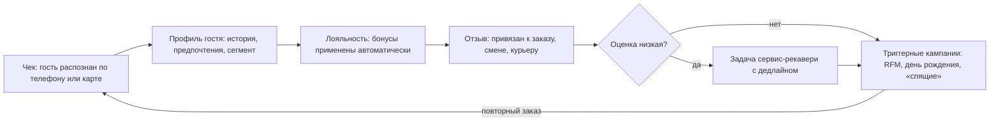

# Компонент 06. Гостевой контур: CRM, лояльность, отзывы, NPS

> **Статус: ревизия №2 по итогам аудита корпуса · 10.10.2026.** Числовые факты сопровождаются ссылками; канонические перечисления — в «Модели данных», §0.

> Домен D6. Замыкает петлю: чек → профиль гостя → коммуникация → повторный заказ → отзыв → улучшение операций. Без этого контура система — учётная, а не клиентская.

## 1. Профиль гостя (единая карточка)

Источники склейки гостя:
- телефон/карта лояльности при оплате;
- аккаунт в приложении/на сайте;
- Wi-Fi-авторизация;
- заказы в агрегаторах (частично, через телефон в заказе);
- отзывы и анкеты.

Состав карточки: история заказов по каналам, предпочтения (блюда, аллергены), день рождения, сегмент, бонусный счёт, отзывы и обращения, NPS, пожизненная ценность (LTV).
Рыночный эталон склейки — ReMarked: заказы, звонки, доставки, Wi-Fi, отзывы на порталах, карты лояльности и заявки с сайта в одной карточке [1](https://remarked.ru/effectively-involve-guests-in-the-restaurant-loyalty-program).

## 2. Лояльность: механики

- Бонусы (кэшбэк баллами), скидки накопительные/фиксированные, подарок на N-й визит/день рождения, комбо-акции, «6-я кофе в подарок».
- Правила начисления/списания: процент, потолок, срок жизни баллов, исключения (акционные позиции, агрегаторы).
- Уровни/статусы, персональные предложения по сегментам (бонусные, дисконтные, гибридные программы описаны как стандарт индустрии [2](https://premiumbonus.ru/hub/articles/loyalnost-dlya-restorana)).
- Электронные карты в Apple/Google Wallet и в Telegram-ботах — стандарт де-факто (пример тарификации: карты+CRM от 6 990 ₽/мес у getMeBack [3](https://getmeback.ru/business/restaurants/)).
- Реферальные механики «приведи друга».
- **Лояльность должна применяться на кассе автоматически** (по номеру телефона/карте), а не «покажите карточку».

Экономика: удержание в 5–7 раз дешевле привлечения; лояльные гости дают до 80% прибыли ресторана [4](https://revvy.ai/blog/tpost/noos8c51o1-programma-loyalnosti-dlya-restoranov-v-2).

## 3. Кампании и триггеры

- Сегменты: RFM-анализ (давность/частота/деньги), любимые блюда, «спящие», «именинники».
- Триггерные сценарии: не приходил 30/60/90 дней → оффер; завершил заказ доставки → запрос отзыва через 1 час; день рождения за 3 дня → персональное предложение.
- Каналы: push, СМС, email, Telegram/WhatsApp-боты (мессенджерные программы лояльности заявляют +30% выручки через автокоммуникации [5](https://crmindex.ru/ratings/platformu_programm_loyalnosti/restoran)).
- ИИ-слои: Loona.ai и SWiP продвигают персональные кампании и ИИ-хостес поверх данных заказов [5](https://crmindex.ru/ratings/platformu_programm_loyalnosti/restoran).

## 4. Отзывы и NPS

### Сбор
- После визита/доставки: запрос оценки (5 баллов + комментарий) в СМС/мессенджер/пуш (реализация у getMeBack: оценка сервиса после оплаты, группировка отзывов в кабинете, ответ гостю и возврат недовольных бонусом [3](https://getmeback.ru/business/restaurants/)).
- QR на чеке/тейбл-тенте; виджет в приложении.
- Мониторинг публичных площадок (Яндекс Карты, 2ГИС, соцсети) и ответы из одного окна — функциональность ReMarked [1](https://remarked.ru/effectively-involve-guests-in-the-restaurant-loyalty-program).

### Привязка к операциям (ключевое отличие «просто отзывов» от управляемых)
Каждый отзыв связывается с: заказом → блюдами, сменой → сотрудниками, каналом доставки → курьером, точкой. Это позволяет:
- находить «токсичные» блюда (систематические жалобы на позицию меню);
- видеть качество по сменам и поварам;
- наказывать/поощрять курьеров по рейтингу вручения.

### Обработка
- Негативный отзыв → автоматическая задача менеджеру с дедлайном ответа (сервис-рекавери: бонус/замена/извинение).
- Динамика NPS по точке/смене — метрика качества сервиса на дашборде УК.

## 5. Как у аналогов

- **iiko**: электронные карты лояльности в базе; конструктор акций и аналитика лояльности — в Pro/Enterprise [6](https://iikoservice.ru/); iiko-biz передаёт предпочтения гостей в CRM-партнёры [1](https://remarked.ru/effectively-involve-guests-in-the-restaurant-loyalty-program).
- **r_keeper Френдс**: бонусные программы, акции, персональные предложения, сегментация, отзывы, рассылки, QR-программы [7](https://rkeeper.ru/).
- **Saby Presto**: собственный каталог + структурирование базы по предпочтениям и истории, авторассылки [8](https://saby-sbis.ru/blog/programmy-dlya-avtomatizacii-obshchepita-podborka-dlya-kafe-i-restorana).
- **Quick Resto**: гостевое мобильное приложение с заказами, отзывами, баллами и историей [9](https://prowizard.store/company/articles/vybiraem_programmnoe_obespechenie_ucheta_dlya_obshchepita/).
- **Toast**: card-linked лояльность, gift cards, email-маркетинг встроены [10](https://hustlemarketers.com/toast-pos-guide/).
- Внешние: PremiumBonus (CRM+лояльность для HoReCa), SAMOSALE (мессенджеры), SWiP (ИИ) [5](https://crmindex.ru/ratings/platformu_programm_loyalnosti/restoran).

## 6. Метрики домена

- Доля идентифицированных чеков; доля участников программы в выручке.
- Частота визитов, реактивация «спящих», конверсия кампаний, стоимость возврата гостя.
- NPS по точке/смене/каналу; время реакции на негативный отзыв; доля отзывов, закрытых компенсацией.

## 7. Требования к реализации для lovii

1. CRM встроен в кассу и чек (телефон спрашивается по умолчанию; идентификация по карте/телефону за 1 действие).
2. Отзывы — поток событий с привязками к заказу/смене/курьеру + задачи на обработку со сроками.
3. Белая витрина отзывов для франшизы: УК видит рейтинг всех точек и худшие драйверы негатива.
4. Все механики лояльности — декларативные правила (конструктор акций), а не код под каждую акцию.
5. 152-ФЗ: согласия на обработку ПДн фиксируются при регистрации гостя; выгрузка/удаление по запросу.
