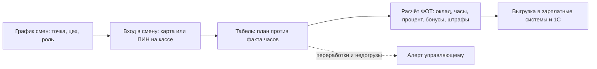

# Компонент 07. Персонал: смены, табель, ФОТ, мотивация, обучение

> Домен D7. Второй по размеру расход ресторана после продуктов (25–35% выручки). Плюс — главный источник злоупотреблений и главный носитель стандартов франшизы.

## 1. Функциональные требования

### 1.1. Кадры и допуски
- Карточки сотрудников: должность, ставка/оклад/%, документы (медкнижка — срок действия, алерт о продлении), допуски и права по операциям (скидки, возвраты, инвентаризация).
- Персональная авторизация на кассе/в бэк-офисе (карта/ПИН/биометрия); каждое действие атрибутировано.
- Ролевая модель: кассир, официант, повар, управляющий, товаровед, бухгалтер, франчайзи, УК — с наследованием и локальными переопределениями.

### 1.2. Планирование и табель

- Графики смен по точкам и цехам; план/факт отработанных часов.
- Авторизация входа/выхода по карте/ПИН на кассе (как в iiko: учёт рабочего времени в тарифе «Кафе» и выше [1](https://iikoservice.ru/)); сверка «план смен ↔ факт в кассе» (сотрудник в смене, но кассу не открывал).
- Табель и расчёт ФОТ: оклад + часы + % от выручки/чаевых − штрафы + бонусы; выгрузка в зарплатные системы/1С.
- Контроль переработок и недогрузов: «план ФОТ на смену не превышает X% прогноза выручки».

### 1.3. Мотивация и KPI
- План-факты по сменам: выручка, средний чек, скорость кухни, инвентаризационные отклонения, отзывы гостей — в дашборде сотрудника и руководителя.
- Чаевые: безнал-чаевые на кассе/в приложении с распределением по пулу (официанты/кухня).
- Конкурсы сети (лучший повар месяца по данным системы) — инструмент УК франшизы.

### 1.4. Обучение и аттестация (критично для франшизы)
- База знаний: видео-ТТК, стандарты сервиса, санитарные регламенты внутри продукта.
- Аттестация сотрудника чек-листом/тестом (есть в платформах контроля стандартов [2](https://serviceinspector.ru/tsifrovie-standarti-i-kontrol-v-restoranah-kafe-i-obshchepite)).
- Онбординг новой точки: план обучения персонала перед открытием — часть франшизного трека.

## 2. Как у аналогов

- **iiko**: учёт рабочего времени с тарифа «Кафе»; управление персоналом в Pro; каждое действие на кассе — под картой сотрудника, видео синхронизировано с чеками [1](https://iikoservice.ru).
- **r_keeper**: модуль планирования и расчёта оплаты труда — графики, учёт времени, начисления [3](https://vimtex.ru/stati/programma-r_keeper-kompleksnoe-reshenie-dlya-restorannogo-biznesa/).
- **Quick Resto**: расчёт зарплаты, графики сотрудников [4](https://prowizard.store/company/articles/vybiraem_programmnoe_obespechenie_ucheta_dlya_obshchepita/).
- **Saby Presto**: график смен, часы, KPI сотрудников [4](https://prowizard.store/company/articles/vybiraem_programmnoe_obespechenie_ucheta_dlya_obshchepita/).
- **Toast**: scheduling, tips management, payroll-интеграции, встроенный Toast Payroll [5](https://blog.rvatechvisions.com/toast-restaurant-pos/).
- **Мир**: 7shifts, Homebase, Deputy как отдельные WFM-продукты, интегрируемые с POS [6](https://www.tryotter.com/integrations).

## 3. Метрики домена

- Labor cost % (ФОТ/выручка) по точке и смене; план/факт часов.
- Выручка на человеко-час; текучесть; доля смен с нарушением графика.
- Результаты аттестаций; корреляция обучения с операционными метриками.

## 4. Требования к реализации для lovii

1. Смена сотрудника = объект, связанный с кассовыми сменами, тикетами кухни и инвентаризациями (атрибуция всех операций).
2. Табель автоматически из входов в систему; ручные правки — только с правом и следом.
3. Медкнижки и допуски как «блокираторы»: просроченная медкнижка → сотрудник не ставится в смену (комплаенс-контроль).
4. Для франшизы: штатное расписание и ставки — рекомендации УК, факт — за франчайзи; бенчмаркинг labor cost по сети.
