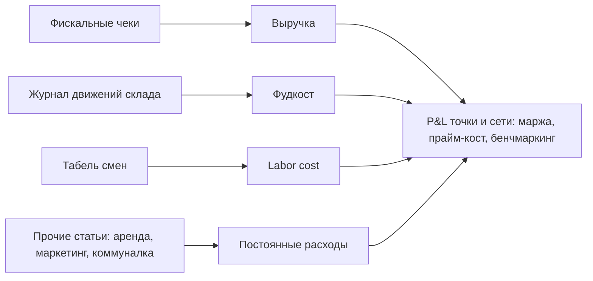

# Компонент 08. Финансы, P&L, аналитика и контроль

> **Статус: ревизия №2 по итогам аудита корпуса · 10.10.2026.** Числовые факты сопровождаются ссылками; канонические перечисления — в «Модели данных», §0.

> Домен D8. Владелец должен видеть бизнес в телефоне лучше, чем управляющий видит его в зале. Финансы и аналитика собирают данные всех остальных доменов.

## 1. Операционные финансы

- Кассовые смены: план-факт наличных, инкассация, сверка с эквайрингом (выгрузка из банка), расхождения — алерты.
- Управленческие доходы/расходы: внесение прочих доходов/расходов по статьям (аренда, ФОТ, маркетинг, логистика, коммуналка).
- Взаиморасчёты с поставщиками (счета, оплаты, кредиторка) и с агрегаторами (комиссии в актах сверки).
- Кассовый разрыв: прогноз остатка денег на 2–4 недели вперёд по плановым платежам.

## 2. Отчёт о прибылях и убытках (управленческий)

- Авто-сборка: выручка (из чеков) − фудкост (из склада) − labor cost (из табеля) − постоянные (из статей) = маржа по точке.
- Разрез: точка / неделя / месяц / канал / категория.
- Сравнение плана и факта; бенчмаркинг точек между собой (ключевая ценность для УК франшизы).
- Промышленный стандарт рынка: рентабельность общепита в РФ около 7–9% и снижается [1](https://www.sostav.ru/publication/rynok-obshchepita-v-rossii-pochti-udvoil-oborot-za-dva-goda-84785.html) — значит точность учёта расходов критична.

## 3. Бизнес-аналитика (встроенная)

- Более 200 готовых отчётов — ориентир глубины (заявлено у iiko [2](https://iikoservice.ru/)): выручка, популярность блюд, загрузка персонала, себестоимость, маржинальность; настраиваемые отчёты.
- Мобильное приложение владельца: выручка в реальном времени, фудкост, средний чек, рейтинги блюд — как в приложении iiko [3](https://www.restohub.pro/avtomatizaciya-restorana-iiko-2026).
- Приложения руководителя с онлайн-выручкой, остатками, кассовыми операциями и push-уведомлениями о важных событиях — стандарт облачных систем (пример: Fusion POS [4](https://fusionpos.ru/)).
- ABC-анализ меню, отчёты по скидкам/отменам, тепловые карты часов загрузки.

## 4. Антифрод и видеоконтроль

- Видео, синхронизированное с событиями кассы (чеки, отмены, открытия стола): снижение потерь на кассе на 30–50% [3](https://www.restohub.pro/avtomatizaciya-restorana-iiko-2026).
- Отчёты по подозрительным операциям: возвраты, скидки, отмены после печати, расхождения инвентаризаций.
- Модуль видеонаблюдения «умная камера»: подсчёт гостей, заполняемость зала (есть у Saby [5](https://saby-sbis.ru/blog/programmy-dlya-avtomatizacii-obshchepita-podborka-dlya-kafe-i-restorana)).
- Отчёт «фактический расход против теоретического» — главный детектор воровства на кухне.

## 5. Роялти-финансы (франшиза)

- Автоматический расчёт роялти от фискальной выручки (данные чеков — юридически достоверный источник).
- Паушальные платежи, маркетинговый сбор, штрафы за нарушение стандартов — в одном биллинге франчайзи.
- Акт сверки УК ↔ франчайзи формируется системой, а не бухгалтером.

## 6. Как у аналогов (укрупнённо)

| Система | Финансы/аналитика |
|---|---|
| iiko | 200+ отчётов, финуправление в Pro, видеоконтроль, мобильное приложение владельца [2](https://iikoservice.ru) |
| r_keeper | отчёты по ключевым показателям в реальном времени, финучёт в «Лайфтайм» [6](https://rkeeper.ru/) |
| 1С:Общепит | бухгалтерский и налоговый учёт, отчётность, взаиморасчёты — эталон бухгалтерии [7](https://1cfresh.com/solutions/food) |
| Poster | финучёт на всех тарифах, P&L-подобные отчёты [8](https://toolfox.ru/services/s/poster) |
| Toast | Sales Summary (net sales, скидки, чаевые, расхождения наличных), xtraCHEF-аналитика затрат [9](https://hustlemarketers.com/toast-pos-guide/) |
| Lightspeed | сильнейшая инвентарная аналитика и мультиточка [10](https://www.owner.com/blog/best-pos-system-for-restaurants) |

## 7. Требования к реализации для lovii

1. Единая витрина владельца (мобильное приложение): выручка сегодня, фудкост недели, NPS, проблемные точки — на одном экране.
2. Все отчёты строятся из событийной шины (заказы, движения склада, табель, счета) — единая модель метрик, никаких «двух разных выручек».
3. Бенчмаркинг внутри франшизы (анонимизированный рейтинг точек по 10–15 метрикам) — встроенный.
4. Выгрузки: 1С (обязательно), банк-клиент, Excel/CSV, API.
