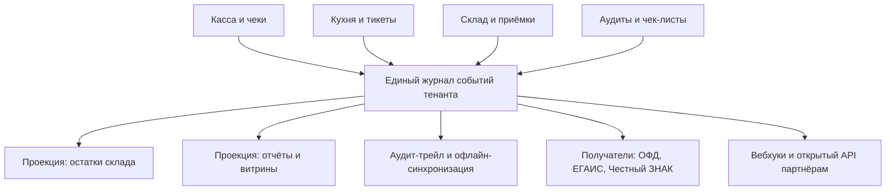

# Компонент 11. Платформа: архитектура, API, офлайн, мультитенантность

> Домен D11. Фундамент, который решает, станет ли продукт экосистемой или останется «ещё одной кассой».

## 1. Архитектурные принципы

1. **Облачная мультитенантность** с иерархией УК → франчайзи → точка → устройство; данные изолированы по тенанту, справочники наследуются по иерархии.
2. **Событийное ядро**: все изменения (заказы, движения склада, смены, аудиты) — события в едином логе. Из него строятся остатки, отчёты, аудит-трейл, интеграции. Побочные выгоды: синхронизация ОФД/ЕГАИС/ЧЗ — те же «получатели событий».
3. **Офлайн-первый фронт**: касса и KDS работают без интернета (локальный сервер/буфер), синхронизация при появлении связи. Требование рынка: автосохранение при потере связи у r_keeper [1](https://rkeeper.ru/), offline mode у Toast как ключевая причина выбора [2](https://hustlemarketers.com/toast-pos-guide/), автономный режим у Saby [3](https://saby-sbis.ru/blog/programmy-dlya-avtomatizacii-obshchepita-podborka-dlya-kafe-i-restorana).
4. **Открытый API и вебхуки** с первого дня: заказы, меню, склад, гости, отчёты. Маркетплейс интеграций — стратегия Toast (200+ приложений [4](https://blog.rvatechvisions.com/toast-restaurant-pos/)) и Deliverect (1000+ партнёров [5](https://www.deliverect.com/en-us)).
5. **Устройства — плагинная модель**: драйверы ККТ, принтеров, весов, сканеров, экранов гостя подключаются адаптерами.
6. **Обновления без остановки точки**: релизы фронта — по тенантам/точкам, откат одной кнопкой.

Событийное ядро — все данные платформы текут через один журнал:

## 2. Интеграции, без которых нельзя выходить на рынок РФ

| Категория | Партнёры |
|---|---|
| Агрегаторы доставки | Яндекс Еда/Деливери, СберФуд |
| Платежи | банки-эквайеры, СБП (оплата по QR) |
| ЭДО | Контур.Диадок, СБИС, 1С-ЭДО |
| Бухгалтерия | 1С (выгрузка продаж/закупок/производства) |
| Госсистемы | ЕГАИС, Честный ЗНАК (вкл. ТС ПИоТ), Меркурий, ОФД |
| Роутинг | Яндекс Маршрутизация и аналоги для курьеров |
| Коммуникации | СМС-шлюзы, Telegram-боты, пуш-сервисы |
| Видеонаблюдение | видеосервисы с событиийной синхронизацией чеков |
| Телефония | ВАТС для колл-центра доставки |

## 3. Данные и их контракты (внешний контур)

- Каталог меню наружу (витрины, агрегаторы) — единый формат блюд/модификаторов/цен по каналам.
- Заказ внутрь — единый контракт `Order` с источником; все каналы равны.
- Телеметрия точек (опционально, для УК) — метрики производительности и качества.
- Гостевые данные — только при согласии, экспорт/удаление по запросу (152-ФЗ).

## 4. Надёжность и масштаб

- Целевой SLA облака 99,9%+; деградация фронта при падении облака недопустима (см. офлайн-первый).
- Резервное копирование по тенантам, восстановление точки за минуты.
- Производительность: сеть 1 000 точек × 2 000 чеков/день — событийная шина и репликация витрин отчётов.
- Безопасность: 2FA для управляющих ролей, журнал доступа, шифрование ПДн.

## 4.1. Безопасность и соответствие (свод требований)

- **152-ФЗ**: согласия гостей на обработку ПДн фиксируются при регистрации; хранение ПДн на территории РФ; выгрузка и удаление по запросу; журнал доступа к персональным данным.
- **Изоляция тенантов**: ни один запрос не может пересечь границу тенанта; агрегированные бенчмарки УК — только обезличенные и по точкам договора.
- **Аутентификация и права**: 2FA для ролей УК/управляющих; линейный персонал — ПИН/карта с короткими сессиями; права наследуются по иерархии и переопределяются локально.
- **Аудит-трейл**: все изменения справочников, цен, ТТК и прав пишутся в событийный лог с автором и устройством; история доступна франчайзи по его точке.
- **Резервное копирование и восстановление**: RPO ≤ 15 минут, RTO ≤ 1 час для облака; локальный буфер точки хранит данные до восстановления связи (см. офлайн-первый).
- **Платёжная безопасность**: не храним полные данные карт — только токены процессинга; СБП-платежи через сертифицированные шлюзы.
- **Юридическая значимость**: ЭДО-документы (УПД, акты, роялти-счета) подписываются квалифицированными подписями через операторов ЭДО.

## 5. Экосистемная стратегия

- **Маркетплейс приложений** (партнёрские модули: видеонаблюдение, WFM, бронирование, тайный гость) — повтор модели Toast [4](https://blog.rvatechvisions.com/toast-restaurant-pos/).
- **SDK партнёрских интеграций**: документация, песочница, сертификация.
- **Данные как сервис**: обезличенные бенчмарки индустрии (фудкост по категориям в регионе) — будущая монетизация и причина не уходить с платформы.

## 6. Критерии готовности платформы (DoD MVP)

- [ ] Тенант с иерархией создан, шаблон точки клонирован за <1 часа.
- [ ] Касса продаёт 8 часов без интернета, синхронизируется без потерь.
- [ ] Чек уходит в ОФД; продажа маркированного товара проходит разрешительный режим.
- [ ] Заказ из веб-витрины появляется на KDS за <3 секунд.
- [ ] Открытый API: токен, вебхук на событие заказа, документация опубликована.
