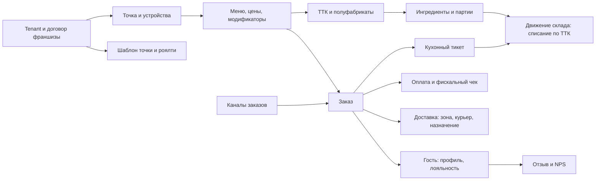

# Компонент 12. Модель данных и контракты

> **Статус: ревизия №2 по итогам аудита корпуса · 10.10.2026.** Числовые факты сопровождаются ссылками; канонические перечисления — в «Модели данных», §0.

> Атрибутный уровень референс-модели. Документ — вход для проектирования схемы БД и открытого API. Все идентификаторы глобально уникальны (по тенанту + сущность).

## 0. Канонические перечисления (единый словарь платформы)

Этот раздел — единственный источник правды для статусов и каналов. Все компоненты и спецификации ссылаются сюда; изменение словаря делается только здесь (ревизия №1 внешнего аудита, находки F-01…F-03, F-32).

| Сущность | Поле | Канонические значения |
|---|---|---|
| Order | `status` | `new` → `accepted` → `kitchen` → `ready` → `served` (зал) \| `packed` → `delivered` (доставка) \| `cancelled` |
| KitchenTicket | `status` | `queued` \| `cooking` \| `ready` \| `served` |
| DeliveryAssignment | `status` | `assigned` \| `picked_up` \| `delivering` \| `delivered` \| `failed` |
| Order | `channel` | `pos \| site \| app \| miniapp \| kiosk \| phone \| aggregator:{name}` |
| StockMovement | `type` | `receive \| sale_writeoff \| production_in \| production_out \| transfer \| writeoff_spoilage \| writeoff_staff \| inventory_adjust \| return` |

Правила чтения и маппинг устаревших токенов:

1. **Два уровня статусов не смешиваются.** `Order.status` — жизненный цикл заказа (единый для всех каналов); `KitchenTicket.status` — жизненный цикл тикета станции. «Окно экспо» (готовое блюдо ждёт выдачи) — не отдельный статус, а время между `ready` и `served` заказа; если точке нужен отдельный экран экспо, он фильтрует заказы в состоянии `ready`.
2. **Доставка — две сущности.** `Order` доходит до `packed`, дальше работает `DeliveryAssignment` (`assigned → picked_up → delivering → delivered`); отказ моделируется парой: запись `DeliveryIncident` + статус `failed` у назначения. Токен `courier` из ранних ревизий не используется: «передан курьеру» = назначение в `picked_up`, заказ остаётся в `packed` до `delivered`.
3. **Подтверждение вручения** — `proof_photo` и/или `proof_code` (сценарий «фото или код» из компонента 05 поддерживается обоими полями).
4. **Канал `phone`** — заказ через колл-центр (полноценный канал приёма, компонент 02); в аналитике каналов участвует наравне с остальными.
5. **Списание по ТТК** — движением `sale_writeoff` при переводе тикета в `ready` (а не в момент пробития чека); корректировки — движением `return`/`inventory_adjust`.

Обзор связей между доменами (атрибутные схемы — в разделе ниже, полные контрактные спецификации — в [спецификациях](../specs/01-domain-model.md)):



## 1. Иерархия организации

### Tenant (тенант)
`id, name, type (owner_brand | franchisee | independent), status, created_at`

### FranchiseAgreement (договор франшизы)
`id, tenant_uk, tenant_franchisee, number, date_start, date_end, territory, royalty_pct, marketing_fee_pct, lump_sum, status`

### Location (точка)
`id, tenant_id, agreement_id?, name, type (dine_in | dark_kitchen | production | hybrid), address, geo, timezone, working_hours, delivery_enabled, status`

### Device (устройство)
`id, location_id, kind (kkt | kds | pos_terminal | tablet | label_printer | kiosk), model, serial, kkt_reg_number?, status`

## 2. Меню и рецептура

### MenuItem (блюдо/товар)
`id, location_scope | global, category_id, name, slug, description, photos, base_price, tax_group, vat, is_alcohol, is_marked, unit, status, energy_value (БЖУ), allergens[]`

### PriceRule (цены по каналам/точкам)
`id, menu_item_id, channel | location | zone, price, valid_from/to`

### ModifierGroup / Modifier (модификаторы)
`group: id, name, type (single | multi | required), min, max`
`modifier: id, group_id, name, price_delta, qty_effect (влияние на расход)`

### Recipe (ТТК)
`id, menu_item_id, version, approved_by, approved_at, portion_weight, prep_time_norm_sec, station_ids[], photo_plating, instructions_md, status`

### RecipeLine (строка ТТК)
`id, recipe_id, ingredient_id | recipe_id (полуфабрикат), qty, unit, loss_cold_pct, loss_hot_pct, substitutions[]`

### Ingredient (ингредиент)
`id, name, unit, category, default_shelf_life, is_tracked_lots, barcode?`

## 3. Заказы и платежи

### Order
`id, location_id, channel (pos | site | app | miniapp | kiosk | phone | aggregator:{name}), guest_id?, table_id?, delivery? (address, zone_id, slot), status (new → accepted → kitchen → ready → served | packed → delivered | cancelled), created_at, promised_at, total, discount_total, source_meta (aggregator_order_id?, commission_pct?)`
> Перечисления `channel` и `status` — канонические (§0); контракт создания заказа — в спецификации 03, источник гостя — объект `guest {phone, consent}`, согласие фиксируется по 152-ФЗ.

### OrderItem
`id, order_id, menu_item_id, qty, modifiers[], price, comment_to_kitchen, station_routing, course_no, status`

### Payment
`id, order_id, method (cash | card | sbp_qr | bonus | deposit), amount, rrn?, status, fiscal_ref`

### FiscalReceipt (фискальный чек)
`id, order_id, kkt_id, fn_number, fiscal_document_no, fiscal_sign, ffd_version, ofd_status (sent | pending | error), receipt_type (sell | refund | correction), items[] (name, qty, price, vat, marking_code?, excise?), created_at`

### StopList
`id, location_id, menu_item_id | recipe_id, reason, started_by, valid_until`

## 4. Склад и закупки

### Lot (партия)
`id, ingredient_id, location_id, supplier_id, qty_received, price_unit, received_at, expires_at?, marking_codes?`

### StockMovement (движение — единственный источник остатков)
`id, location_id, ingredient_id | recipe_id, lot_id?, type (receive | sale_writeoff | production_in | production_out | transfer | writeoff_spoilage | writeoff_staff | inventory_adjust | return), qty, doc_ref, author_id, device_id?, created_at`
> Остаток = агрегация движений; каждое движение привязано к документу и автору.

### PurchaseOrder / PurchaseOrderLine
`po: id, location_id, supplier_id, status (draft → confirmed → shipped → received | rejected), expected_at, edo_doc_id?`
`line: id, po_id, ingredient_id, qty, price_expected, price_fact?, qty_fact?`

### Supplier
`id, name, legal, categories[], delivery_days[], payment_terms, price_list_ref, status`

## 5. Производство и кухня

### KitchenTicket (тикет станции)
`id, order_id, station_id, items[], status (queued | cooking | ready | served), created_at, started_at?, ready_at?`
> Норматив времени берётся из Recipe; факт — из статусов. Перевод в `ready` триггерит списание по ТТК (§0, правило 5).

### ProductionBatch (акт производства)
`id, location_id, recipe_id, qty_out, consumed[] (ссылки на StockMovement), yield_pct, author_id, created_at, label_printed`

## 6. Доставка

### DeliveryZone
`id, location_id, polygon | radius, min_order, delivery_fee, max_promise_min, channels[]`

### Courier
`id, tenant_id, employment (staff | self_employed), transport (foot | bike | car), status, rating`

### DeliveryAssignment
`id, order_id, courier_id, status (assigned | picked_up | delivering | delivered | failed), assigned_at, picked_up_at, delivered_at, proof_photo?, proof_code?, failure_reason?`
> Статусы — канонический словарь §0 (токен `picked` ранних ревизий заменён на `picked_up`); отказ — пара `DeliveryIncident` + `failed`.

### DeliveryIncident
`id, assignment_id, type (no_answer | wrong_address | accident | refusal), resolution, resolved_by`

## 7. Гости и лояльность

### Guest
`id, phones[], email?, name, birthday?, wifi_auth?, sources[], consent_152fz_at, created_at`

### LoyaltyAccount
`id, guest_id, program_id, balance, level, card_token (wallet)`

### LoyaltyTx
`id, account_id, order_id?, type (earn | redeem | expire | adjust), amount, reason`

### Campaign / CampaignEvent
`campaign: id, name, segment_rule (RFM/ручной), channel, offer_rule, status`
`event: id, campaign_id, guest_id, sent_at, opened_at?, redeemed_order_id?`

### Review
`id, order_id? | visit_id?, guest_id?, rating (1..5), text, source (post_order_sms | qr_check | app | aggregator | map), tags[] (блюдо/курьер/смена — из связей заказа), sentiment?, response?, sla_deadline?`

## 8. Персонал

### Employee
`id, tenant_id, location_ids[], role, rate_type (hour | shift | pct), rate_value, medbook_expires_at?, pin | card_uid, status`

### Shift (план) / TimesheetEntry (факт)
`shift: id, employee_id, location_id, planned_start/end, position`
`timesheet: id, employee_id, fact_start/end, source (card | pin | kkt_session)`

## 9. Франшиза и контроль

### LocationTemplate (шаблон точки)
`id, uk_tenant_id, version, menu_ref, recipe_pack_ref, price_policy, rights_matrix, checklist_pack_ref, norms_ref, status`

### RoyaltyInvoice
`id, agreement_id, period, gross_revenue (из FiscalReceipt), royalty_amount, marketing_fee, penalties, status, edo_doc_id?`

### Checklist / Audit / AuditAnswer / RemediationTask
`checklist: id, uk_tenant_id, version, items[] (question, weight, require_photo)`
`audit: id, checklist_id, location_id, auditor_id, scheduled | adhoc, started_at, finished_at, score`
`answer: id, audit_id, item_id, result, photo?, geo?, comment?`
`task: id, audit_id, item_id, assignee_id, deadline, status`

## 10. Событийный слой и интеграционные контракты

Все сущности выше порождают события в шине. Ключевые типы:
`order.created / order.status_changed / payment.completed / fiscal.receipt_sent / kitchen.ticket_status / stock.movement / delivery.status_changed / review.created / audit.finished / franchise.invoice_created`

### Вебхуки наружу
```
{
  "event": "order.status_changed",
  "tenant": "...", "location": "...",
  "object_id": "ord_...", "version": 12,
  "data": { "status": "ready", "at": "..." }
}
```

### Контракт заказа внутрь (для всех каналов)
`POST /v1/orders`: `location_id, channel, items[{menu_item_id, qty, modifiers[]}], guest?{phone, consent}, delivery?{address, zone_id, slot}, payment_intent?, idempotency_key`
Ответ: `order_id, promise_time, status_url`. Полная контрактная форма с примером — в [`../specs/03-api-contracts.md`](../specs/03-api-contracts.md) (источник контракта — спецификация 03; источник модели — этот документ).

### Контракт меню наружу (витрины/агрегаторы)
`GET /v1/menu?location=` → категории, позиции с модификаторами, цены по каналам, стоп-лист, доступность.

## 11. Принципы целостности

1. Любой остаток и любой отчёт выводятся из событий — нет «ручных остатков».
2. Фискальные данные — источник выручки для роялти; других источников нет.
3. Отзыв всегда ссылается на заказ/визит → на смену, станцию, курьера.
4. Версии: рецепт, шаблон точки, чек-лист — версионируемые объекты с раскатом и откатом.
5. ПДн гостей: согласия, хранение в РФ, выгрузка/удаление по запросу (152-ФЗ).
