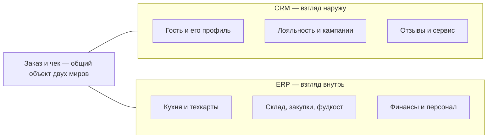
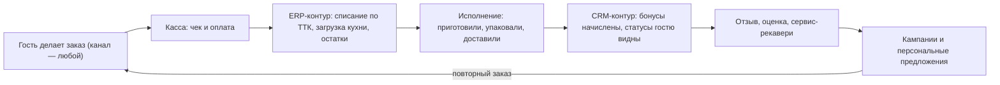
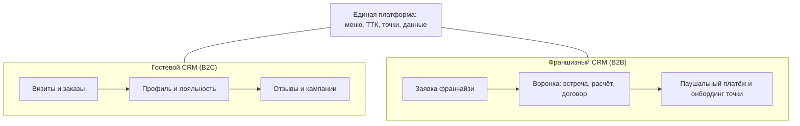

# Сравнение CRM и ERP — простыми словами и применительно к общепиту

> Классическая пара систем, которую постоянно путают: CRM управляет отношениями с клиентами, ERP — ресурсами предприятия. Эта страница сравнивает их лоб в лоб, показывает, как они работают вместе, и объясняет, почему ресторану полного цикла нужны обе — и почему это аргумент в пользу единой платформы.

## 1. В один взгляд

| Короткий вопрос | Ответ |
|---|---|
| Чья это территория? | **CRM** — клиент, продажи, маркетинг. **ERP** — ресурсы, процессы, финансы, производство |
| Главный объект данных? | Клиент, сделка, обращение, лояльность | Заказ, складская позиция, производственный документ, платёж |
| Кто пользуется? | Маркетинг, продажи, сервис | Бухгалтерия, производство, закупки, логистика, руководство |
| Что оптимизирует? | Конверсии, скорость сделок, возвращаемость, лояльность | Себестоимость, остатки, сроки, загрузку ресурсов |
| Ключевые метрики? | CLV, retention, NPS, конверсия | Фудкост, маржа, оборачиваемость, исполнение плана |
| Сложность внедрения? | Обычно проще и быстрее, много облачных решений | Сложнее и дороже: требует настройки под процессы |

## 2. Что такое CRM (управление отношениями с клиентами)

**Главная цель:** продавать больше, лучше понимать клиента и не терять отношения с ним.

**Что умеет:**

- ведёт базу клиентов и историю взаимодействий (визиты, заказы, обращения);
- строит воронку продаж и напоминает о следующих шагах;
- автоматизирует рутину: рассылки, акции по сегментам, постановку задач;
- собирает аналитику по клиентам: конверсии, ценность (CLV), отток;
- интегрируется с мессенджерами, почтой, телефонией, соцсетями.

**Пример в общепите (гостевой контур):** гость заказал роллы на доставку и назвал номер телефона. Система склеила его профиль, начислила бонусы, через час попросила отзыв, а через три недели «спящего» гостя разбудила персональная акция на любимое блюдо.

## 3. Что такое ERP (планирование ресурсов предприятия)

**Главная цель:** управлять всеми ресурсами компании — деньгами, складом, производством, персоналом — и делать процессы прозрачными.

**Что умеет:**

- управляет финансами, учётом и налогами;
- ведёт складской учёт: остатки, перемещения, партии, сроки;
- планирует производство по рецептурам и загрузке;
- управляет закупками и поставщиками;
- считает персонал: смены, табель, ФОТ;
- связывает отделы в единую систему: продажа сразу влияет на остатки и потребность в закупке.

**Пример в общепите:** кассир пробил пиццу — система списала муку, сыр и соус по техкарте (ТТК), пересчитала фудкост, а закупщику ушло предложение дозаказать моцареллу по прогнозу продаж.

В общепите роль производственного плана играет **техкарта**: ТТК = BOM, акт производства = производственный ордер, фудкост = управленческая себестоимость. Поэтому полнофункциональные ресторанные системы — это отраслевые ERP (детали — в [терминологическом разборе](terminology-crm-erp.md)).

## 4. Ключевые отличия

| Критерий | CRM | ERP |
|---|---|---|
| Фокус | «Снаружи»: клиент, продажи, маркетинг | «Внутри»: ресурсы, процессы, финансы, производство |
| Основной объект | Гость, сделка, лид, обращение | Заказ, позиция склада, производственный акт, платёж |
| Главный пользователь | Маркетинг и продажи | Бухгалтерия, кухня, закупки, руководство |
| Что оптимизирует | Конверсии, скорость сделок, лояльность | Себестоимость, сроки, остатки, загрузку |
| Цена ошибки | Потеря гостя и репутации | Кассовые разрывы, недостачи, штрафы регуляторов |
| Внедрение и сложность | Часто проще и быстрее, есть облачные решения | Сложнее и дороже, требует глубокой настройки |
| Примеры классов на рынке | Битрикс24, amoCRM, getMeBack, ReMarked | 1С:Общепит, iiko, r_keeper, SAP |

## 5. Как они работают вместе

В крупных компаниях CRM и ERP используют **в связке**: CRM отвечает за привлечение и продажу, ERP — за исполнение заказа. Между ними настраивают интеграцию, чтобы данные о продажах автоматически попадали в учёт, а статусы исполнения возвращались в клиентский контур.

Иногда в ERP есть встроенный модуль CRM или наоборот — но это не делает классы одним и тем же: пока данные клиента и данные исполнения живут в разных системах, между ними нужен «переводчик»-интеграция, а каждая интеграция — это швы, задержки и потери данных.

## 6. Особенности общепита: два контура, о которых забывают

В общепите слово «CRM» покрывает сразу **две разные сущности**:

1. **Гостевой контур (B2C)** — профиль гостя, лояльность, отзывы, кампании. Классическая «воронка сделок» здесь почти не нужна: гость не ведёт переговоры — он просто возвращается или нет. Главные объекты — визит, блюдо и оценка.
2. **Франшизный контур (B2B)** — а вот здесь воронка сделок уже нужна: заявки потенциальных франчайзи, встречи, договоры, паушальные платежи. Это классический CRM продаж поверх франшизной ERP.

ERP общепита тоже особенная: вместо цехов с многонедельным циклом — **производство за минуты** (кухня), вместо закупки контейнерами — ежедневные поставки свежих продуктов, плюс обязательные госсистемы (54-ФЗ, ЕГАИС, Честный ЗНАК, Меркурий), которых нет в «классических» ERP.

## 7. Почему lovii объединяет оба класса в одной базе

Рынок предлагает выбирать: либо «тяжёлая» отраслевая ERP с дорогой подпиской, либо облачная касса со слабой спиной, либо зоопарк из 5–7 отдельных сервисов со швами интеграций. Наша ставка — в том, что **заказ и чек от природы принадлежат обоим мирам**, и если они живут в одной модели данных:

- продажа мгновенно меняет остатки и фудкост (нет «перевода» между системами);
- отзыв госта привязан к конкретному блюду, смене и курьеру (см. [разрыв G2 в gap-анализе](gap-analysis.md));
- роялти считается автоматически от фискальной выручки — и у франчайзи, и у УК одна правда;
- микробизнес получает корпоративную глубину по цене входа.

Корректная формула продукта: **«отраслевая ERP-платформа для общепита со встроенным гостевым контуром (операционный + аналитический CRM) и контуром франшизы»**. Как эта формула разложена на домены и модули — в [продуктовом blueprint](product-blueprint.md).

---

**Углубиться дальше:**

- Академическая терминология, происхождение терминов и правила применения: [«Терминология: CRM и ERP»](terminology-crm-erp.md)
- Как устроен гостевой контур: [Компонент 06. CRM, лояльность, отзывы](components/06-crm-loyalty-feedback.md)
- Как устроен учёт и финансы: [Компонент 04. Склад и фудкост](components/04-inventory-procurement.md), [Компонент 08. Финансы и P&L](components/08-finance-analytics.md)
- Словарь отраслевых терминов: [Глоссарий](glossary.md)
