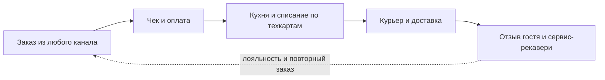

# Резюме исследования (для руководства)

> **Статус: ревизия №2 по итогам аудита корпуса · 10.10.2026.** Числовые факты сопровождаются ссылками; канонические перечисления — в «Модели данных», §0.

> Одна страница сути: что исследовали, что выяснили, что строим. Полные материалы — в разделах этого сайта.

## Контекст

Мы запускаем производство и франшизу и строим для [lovii.ru](https://lovii.ru) собственную платформу полного цикла: **от заказа и чека — через кухню и списание продуктов — до курьера и отзыва гостя**. Каждый подключающийся партнёр должен получать готовый комплекс «из коробки». Проведён полный аудит рынка и аналогов.

## Рынок (РФ, 2026)

- Оборот общепита **4,3–5,3 трлн ₽/год**, 240 000+ заведений; доставка из заведений **505 млрд ₽ (+17%/год)** — самый быстрорастущий канал.
- Рентабельность отрасли снижается (8,9% → 7,9%) → автоматизация становится способом выживания: каждый процент фудкоста и каждая минута скорости — деньги.
- Регуляторика обязательна для всех: онлайн-кассы (54-ФЗ, ФФД 1.2), ЕГАИС, Честный ЗНАК, Меркурий. Продукт без них не продаётся.

## Что показал аудит аналогов (13 обзоров, 30+ вендоров)

- **«Тяжёлые» (iiko, r_keeper, 1С)** дают глубину, но недешевы: корпоративные пакеты iiko — 8 600–10 600 ₽/мес за точку ([`competitors/iiko.md`](competitors/iiko.md)), при этом даже облачный r_keeper Cloud стартует от 4 085 ₽/мес, а 1С:Фреш — от ~2 684 ₽/мес; долгое внедрение, закрытые экосистемы. Франшизные функции — только в старших тарифах.
- **Облачные МСБ-касс (Poster, Quick Resto, Saby Presto, Fusion)** — быстрый старт за 2–5 тыс ₽, но потолок: урезанные закупки, слабая курьерская логистика, нет контроля стандартов и роялти.
- **Мировой эталон (Toast)** доказал модель: бесплатное ПО + обязательный процессинг + свой hardware + офлайн-первый фронт + 200+ интеграций.
- **Точечные сервисы** (доставка, лояльность, аудиты) закрывают дыры больших систем — но ценой «зоопарка» из 5–7 подписок и ручных сверок.

## Семь разрывов рынка — наше окно возможностей

1. **Франшиза «под ключ»**: роялти от фискальной выручки + аудиты стандартов + централизованные закупки — нигде не объединены в одной системе.
2. **Отзыв как операционные данные**: никто не связывает оценку гостя с конкретным блюдом, сменой и курьером.
3. **Корпоративная глубина по цене микробизнеса**: автозаказ по прогнозу, фудкост-аналитика, видеоконтроль заперты в дорогих тарифах.
4. **Единый профиль гостя** через зал/доставку/агрегаторы без интеграционных швов.
5. **Курьерская логистика** как часть операционного контура с экономикой против агрегаторов (комиссия 16,67–29,17% без НДС ≡ 20–35% с НДС).
6. **Прослеживаемость партий** «сырьё → заготовка → блюдо → чек» + ХАССП-журналы поверх данных склада.
7. **Быстрый ввод точки**: шаблон точки с библиотекой ТТК бренда заполняется за часы, а запуск в работу — за ≤3 рабочих дней (шаблон и запуск — разные этапы онбординга).

## Ответ продукта: платформа lovii

- 17 модулей в 6 фазах: Фаза 0–1 (кассы+кухня+склад, ~6 мес) → Фаза 2 (госсистемы+закупки) → Фаза 3 (доставка+гость) → Фаза 4 (франшиза) → Фаза 5 (открытая платформа, ИИ).
- Цены: **бесплатный вход**, монетизация подпиской за точку + % с онлайн-оборота + тариф «УК».
- Первые пользователи — наше собственное производство и пилотные франшизные точки.
- Цели первого года: запуск точки ≤ 3 дней; фудкост −2 п.п. за полгода; доля прямых заказов ≥ 30%; доставка в обещанное окно ≥ 90%; NPS ≥ 50.

## Что дальше

1. Утвердить скоуп фаз 0–1 и состав пилотной точки.
2. Зафиксировать контракты данных (готов черновик: `Модель данных`).
3. Демо-доступы к iiko/Poster/Quick Resto для сверки глубины.
4. Интервью с 5–10 франчайзи общепита — валидация ценовой модели.
