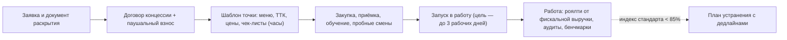

# Франч-бук lovii (v0): коммерческое предложение и стандарты сети

> **Статус: ревизия №2 по итогам аудита корпуса · 10.10.2026.** Финансовые параметры помечены «Г» (гипотезы до интервью с франчайзи); операционные стандарты синхронизированы с демо-кабинетом и [`../components/09-franchise-network.md`](../components/09-franchise-network.md).

> Франч-бук отвечает на три вопроса: **сколько стоит вход, что франчайзи получает взамен, как сеть держит стандарт**. Это коммерческий документ; юридическая оболочка — [структура договора концессии](../legal/05-franchise-contract-outline.md); экономика — в [`../academic/05-franchising-economics.md`](../academic/05-franchising-economics.md) и [`../academic/02-unit-economics.md`](../academic/02-unit-economics.md).

## 1. Сделка в цифрах

| Параметр | Значение | Пометка |
|---|---|---|
| Паушальный взнос | 350 000 ₽ | Г — вилка рынка фастфуд-франшиз; сверить с интервью |
| Роялти | 4% от фискальной выручки | Г — рыночный коридор 2–6% ([`../academic/05-franchising-economics.md`](../academic/05-franchising-economics.md)); расчёт прозрачен: от чеков, которые франчайзи видит сам |
| Маркетинговый сбор | 2% выручки | синхронизировано с демо («Маркетинговый фонд (2%)»): копилка, отчёт, заявки с SLA 48 ч |
| Срок запуска точки | шаблон — за часы, запуск в работу — ≤3 рабочих дней | норматив онбординга ([`../components/09-franchise-network.md`](../components/09-franchise-network.md)) |
| Срок окупаемости точки | 18–24 мес при выручке от 1,2 млн ₽/мес | Г — по юнит-экономике ([`../academic/02-unit-economics.md`](../academic/02-unit-economics.md)) |
| Платформа lovii | тариф «Про» со скидкой 20% с 5-й точки договора | [тарифная сетка](../business/02-pricing.md) |

## 2. Что франчайзи получает в коробке

1. **Бренд и стандарты**: товарный знак, дизайн-гайд, техкарты и меню с версионированием (обновления раскатываются на сеть за минуты).
2. **Платформу полного цикла**: касса ФФД 1.2, кухня, склад, закупки у одобренных поставщиков, доставка, лояльность — один кабинет вместо «зоопарка» подписок.
3. **Запуск**: клонирование шаблона точки (меню, ТТК, цены, права, чек-листы), обучение персонала, пробные смены; онбординг ведёт УК через кабинет.
4. **Прозрачную экономику**: роялти считается платформой от фискальной выручки — «данные из ОФД поправить нельзя»; франчайзи видит расчёт в своём кабинете.
5. **Поддержку с SLA**: заявки в УК с таймером; просрочка видна собственнику сети автоматически ([`../saas/03-role-scenarios.md`](../saas/03-role-scenarios.md), сценарий F3).

## 3. Путь франчайзи

## 4. Стандарты и контроль

1. **Аудиты**: ежемесячный чек-лист с фото; нарушения превращаются в задачи с дедлайном; индекс стандарта — публичный рейтинг точек сети. Целевой индекс — **≥85%** (в демо: «Индекс ≥ 85% — спокойное продление»).
2. **Бенчмаркинг**: франчайзи видит себя относительно сети по выручке, фудкосту, времени выдачи, рейтингу гостей — анонимно относительно других партнёров.
3. **Качество продукта**: фудкост в коридоре 25–30%, списания строго по ТТК, стоп-листы синхронны во все каналы ([`../glossary.md`](../glossary.md)).
4. **Санкции и выход**: систематический индекс ниже порога — порядок исправления по договору; при выходе из сети — экспорт своих данных по Пользовательскому соглашению и прекращение использования товарного знака.

## 5. Почему эту франшизу купят

1. **Прозрачность как продукт**: роялти от фискальной выручки и автоматический документ раскрытия — выше стандарта РФ ([`../legal/05-franchise-contract-outline.md`](../legal/05-franchise-contract-outline.md), §3).
2. **Скорость запуска**: шаблон за часы и ≤3 рабочих дней до открытия против недель у классических сетей.
3. **Одна система вместо пяти**: касса, склад, доставка, лояльность и контроль уже в сделке; конкуренты продают франшизный модуль старшими тарифами ([`../gap-analysis.md`](../gap-analysis.md), G1).
4. **Экономика сходится**: юнит-модель точки и роялти 4% оставляют прибыль франчайзи в рыночном коридоре ([`../academic/02-unit-economics.md`](../academic/02-unit-economics.md)).

## 6. Открытые вопросы (до версии 1.0)

1. Валидация паушального взноса и роялти интервью с 5–10 франчайзи.
2. Эксклюзив территории: фиксировать радиус или оставлять открытым (сравнить с практикой сетей из обзоров).
3. Политика собственных поставок УК (центральный склад/фабрика-кухня) — отдельная модель после первой точки.
