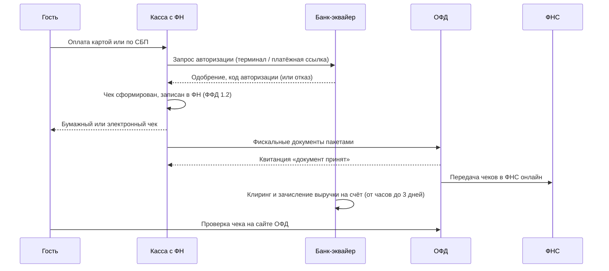
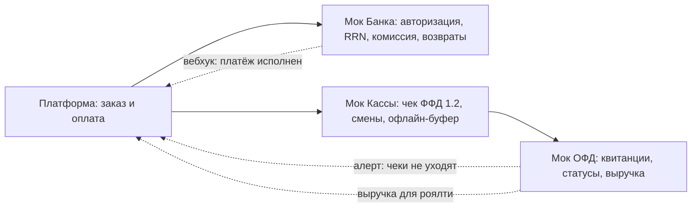

# Платёжная и фискальная инфраструктура: банки, онлайн-кассы, ОФД

> Справочник по трём внешним контурам, без которых не проходит ни одна продажа: **банк-эквайер** (деньги), **онлайн-касса** (фискальный учёт) и **ОФД** (доставка чеков в ФНС). Зачем каждый нужен, какую часть выручки «съедает», лучшие примеры на рынке 2026 — и что должны эмулировать мок-сервисы для разработки платформы.

## 1. Цепочка одного платежа

Три контура юридически и технически независимы: с банком, с ОФД и регистрацией ККТ в ФНС заключаются **отдельные договоры** (рынок движется к «одному договору на всё» — см. §6).

## 2. Кто есть кто: роль и функции

| Контур | Кто это | Ключевые функции | Кому подчиняется |
|---|---|---|---|
| **Банк-эквайер** | Банк или платёжный сервис, принимающий платежи покупателей | Авторизация карт, приём СБП, клиринг и зачисление выручки, возвраты, терминалы/платёжные ссылки, антифрод | ЦБ РФ, правила платёжных систем |
| **Онлайн-касса (ККТ)** | Устройство из реестра ФНС с фискальным накопителем (ФН) | Формирование чеков по ФФД 1.2, запись в ФН, смены и X/Z-отчёты, ЕГАИС/Честный ЗНАК на кассе | 54-ФЗ, реестр ФНС |
| **ОФД** | Оператор фискальных данных (17 в реестре ФНС) | Приём чеков от ККТ, передача в ФНС, хранение 5 лет, проверка чеков покупателями, аналитика для бизнеса | 54-ФЗ, лицензия ФНС |

Важно не путать: **касса не отправляет деньги и не принимает платежи** — это фискальный регистратор; **банк не передаёт чеки в ФНС** — это делает ОФД; **ОФД не участвует в движении денег**.

## 3. Экономика: сколько выручки съедают инфраструктурные контуры

| Статья | Ориентир 2026 | Комментарий |
|---|---|---|
| Торговый эквайринг (карты в точке) | **1,0–2,2%** с оборота [1](https://toolfox.ru/blog/ekvayring-2026-onlayn-i-offline-kak-podklyuchit) [2](https://rko.business/ekvayring/torgovyj/) | Для общепита типично 1,2–2,2%; ставка зависит от оборота и МСС |
| Интернет-эквайринг (сайт/приложение) | 2,0–2,8% [1](https://toolfox.ru/blog/ekvayring-2026-onlayn-i-offline-kak-podklyuchit) | Дороже торгового — онлайн-витрина и доставка |
| СБП (оплата по QR) | **0,4–0,7%** [1](https://toolfox.ru/blog/ekvayring-2026-onlayn-i-offline-kak-podklyuchit) | В 3–5 раз дешевле карт; деньги зачисляются мгновенно |
| Аренда терминала | 0–2 400 ₽/мес [1](https://toolfox.ru/blog/ekvayring-2026-onlayn-i-offline-kak-podklyuchit) | У Т-Банка и Точки часто бесплатно |
| ОФД | ~250–300 ₽/мес за кассу; ~3 000 ₽/год [3](https://toolfox.ru/blog/ofd-2026-top-9-operatorov) | Есть бюджетные тарифы от 900 ₽/год |
| Фискальный накопитель (ФН) | ~8 500–15 000 ₽ раз в 36 мес [4](https://vc.ru/rating_top/2968009-gde-kupit-onlajn-kassu-luchshie-resheniya-i-somplekt-kassafnofd) | Для общепита на спецрежимах — ФН на 36 мес |
| Касса (оборудование) | 12 000–60 000 ₽ разово [5](https://rokass.ru/blog/avtomatizatsiya-magazinov/top-10-onlayn-kass-2026-reyting-luchshikh-modeley-dlya-ip-i-biznesa/) | Фискальный регистратор, смарт-терминал |
| Облачная касса (онлайн-продажи) | 1 500–3 900 ₽/мес [6](https://online-check.business.ru/rejting-oblachnykh-kass/) | Обязательна для оплат на сайте/в приложении |

**Пример расчёта.** Точка с выручкой 1,5 млн ₽/мес, 80% оплат картами, 20% — СБП и наличные, две кассы:

- эквайринг: 1,2 млн × 1,5% ≈ **18 000 ₽/мес**;
- СБП: 0,2 млн × 0,7% ≈ 1 400 ₽/мес;
- ОФД: 2 кассы × 250 ₽ ≈ 500 ₽/мес;
- амортизация ФН и касс: ≈ 1 000 ₽/мес.
- **Итого ≈ 21 000 ₽/мес, или ~1,4% выручки** — типичный порядок для общепита.

Вывод для продукта: **главный рычаг экономии — доля оплат по СБП** и переговоры о ставке при росте оборота; всё остальное — сотни рублей в месяц.

## 4. Онлайн-кассы: лучшие примеры (реестр ФНС, ФФД 1.2)

Требования 2026: модель в реестре ФНС, поддержка **ФФД 1.2** (формат 1.05 выведен с 01.03.2026), ФН 1.1М, ТС ПИоТ для маркированного товара [7](https://vc.ru/rating_top/3029537-trebovaniya-54-fz-k-onlayn-kassam).

### 4.1. Фискальные регистраторы (работают в связке с нашей кассовой программой)

| Модель | Особенности | Цена | Для чего в общепите |
|---|---|---|---|
| АТОЛ 30Ф | лидер рынка, 75 мм/с, ресурс головки 50 км | от 26 000 ₽ | универсал для кафе и фастфуда [5](https://rokass.ru/blog/avtomatizatsiya-magazinov/top-10-onlayn-kass-2026-reyting-luchshikh-modeley-dlya-ip-i-biznesa/) |
| АТОЛ 25Ф / 22Ф | высокоскоростные, 250 мм/с | от 30 000 ₽ | высокая проходимость, фудкорты |
| РИТЕЙЛ-КОМБО-01Ф | влагозащита корпуса | от 37 500 ₽ | бары, кухни, фудкорты [5](https://rokass.ru/blog/avtomatizatsiya-magazinov/top-10-onlayn-kass-2026-reyting-luchshikh-modeley-dlya-ip-i-biznesa/) |
| POScenter-02Ф | до 260 мм/с | от 29 300 ₽ | замена ШТРИХ-М [5](https://rokass.ru/blog/avtomatizatsiya-magazinov/top-10-onlayn-kass-2026-reyting-luchshikh-modeley-dlya-ip-i-biznesa/) |
| Штрих-М (Штрих-Лайт-ФР и др.) | старейший производитель, ЕГАИС | от 20 000 ₽ | классика, алкомаркеты при ресторанах [4](https://vc.ru/rating_top/2968009-gde-kupit-onlajn-kassu-luchshie-resheniya-i-somplekt-kassafnofd) |

### 4.2. Смарт-терминалы (касса «всё в одном» на Android)

| Модель | Особенности | Цена | Для чего |
|---|---|---|---|
| Эвотор 7.2 / 7.3 | магазин приложений Эвотор.Маркет, экосистема Сбера | от 34 900 ₽ | кафе, кофейни, малые точки [4](https://vc.ru/rating_top/2968009-gde-kupit-onlajn-kassu-luchshie-resheniya-i-somplekt-kassafnofd) |
| АТОЛ Sigma 7 / 10 | сенсорные, товароучётные приложения | от 25 000 ₽ | точки с простым меню |
| MSPOS-K | компактный, дешевле аналогов | от 15 000 ₽ | кофейни, островки [4](https://vc.ru/rating_top/2968009-gde-kupit-onlajn-kassu-luchshie-resheniya-i-somplekt-kassafnofd) |
| АТОЛ СТБ 5 | мобильный, аккумулятор ~6 ч | от 25 000 ₽ | курьеры с наложенным платежом, летние веранды |

### 4.3. Облачные кассы (для оплат на сайте и в приложении)

| Продукт | Цена | Особенности |
|---|---|---|
| АТОЛ Онлайн | от 1 733–3 860 ₽/мес | тарифы Старт/Базовый/«Без забот» [6](https://online-check.business.ru/rejting-oblachnykh-kass/) |
| Цифровая касса Эвотор | 1 750–3 200 ₽/мес | интеграции Сбер, ЮKassa, 1С-Битрикс [6](https://online-check.business.ru/rejting-oblachnykh-kass/) |
| Контур.Маркет | пакетом с учётом и ОФД | единый договор «касса+ОФД+учёт» [7](https://vc.ru/rating_top/3029537-trebovaniya-54-fz-k-onlayn-kassam) |

Правило для платформы: **облачная касса обязателена для онлайн-оплат** (чек в момент расчёта), курьеры без ККТ принимают оплату через эквайринг/СБП, а чек бьёт облачная касса.

## 5. Банки для приёма платежей покупателей: лучшие примеры

Ставки торгового эквайринга для общепита в 2026 — ориентир 1,2–2,2% [2](https://rko.business/ekvayring/torgovyj/), исторический коридор по отрасли 1,4–1,8% [8](https://www.sostav.ru/blogs/266402/36716). СБП у всех крупных банков 0,4–0,7%.

| Банк | Торговый эквайринг | Интернет | СБП | Терминал | Фишки для общепита |
|---|---|---|---|---|---|
| **Т-Банк** | от 1,0–1,2% | 2,3–2,7% | от 0,4% | бесплатно | связка с Т-Бизнес: РКО+касса+эквайринг одним договором [7](https://vc.ru/rating_top/3029537-trebovaniya-54-fz-k-onlayn-kassam) [1](https://toolfox.ru/blog/ekvayring-2026-onlayn-i-offline-kak-podklyuchit) |
| **Сбер** | 1,4–2,1% | 2,4–2,8% | 0,3–0,7% | 2 400 ₽/мес или выкуп | крупнейшая сеть терминалов; экосистема с Эвотором и Первым ОФД [1](https://toolfox.ru/blog/ekvayring-2026-onlayn-i-offline-kak-podklyuchit) |
| **Точка** | от 0,94–2,1% | 2,6–2,7% | 0,4–0,7% | бесплатно | зачисление до 4 раз в день, тарифы по обороту [9](https://rko.business/ekvayring-v-gorode/moskva/) |
| **Альфа-Банк** | от 1,0–1,99% | ~2,3–2,7% | 0,4–0,7% | по тарифу | льготные ставки новым клиентам [10](https://evotor.ru/programs/priyem-platezhey/dlya-fastfuda-2/) |
| **ВТБ** | от 1,3–2,1% | ~2,5% | 0,4–0,7% | по тарифу | кэшбэк-акции на комиссию [11](https://bankiros.ru/rko/ehkvajring-dlya-obshchepita) |
| **Эвотор Пэй / агрегаторы** | от 1,0% | — | есть | в комплекте | 11 банков-партнёров на выбор, подключение за день — удобно для франчайзи [10](https://evotor.ru/programs/priyem-platezhey/dlya-fastfuda-2/) |

Критерии выбора для сети/франшизы: единый договор на РКО+эквайринг+кассы, бесплатные терминалы, зачисление день в день, качество API для сверок, поддержка СБП с динамическим QR.

## 6. ОФД: операторы и их продукты

На май 2026 в реестре ФНС 17 операторов; базовая цена рынка — ~3 000 ₽/год за кассу [3](https://toolfox.ru/blog/ofd-2026-top-9-operatorov) [12](https://modulkassa.ru/blog/base/kakoy-vybrat-ofd).

| Оператор | Цена (ориентир) | Продукт и сильные стороны |
|---|---|---|
| **Платформа ОФД** (Эвотор ОФД) | от 300 ₽/мес, ~3 000–4 000 ₽/год | лидер рынка; ориентирован на сети и крупный ритейл; связка с экосистемой Эвотор/Сбер [3](https://toolfox.ru/blog/ofd-2026-top-9-operatorov) [13](https://vc.ru/official_/2910208-luchshiy-ofd-dlya-onlayn-kass) |
| **Первый ОФД** | от 900 ₽/год | оператор Сбера; бюджетный вход в его экосистеме [3](https://toolfox.ru/blog/ofd-2026-top-9-operatorov) |
| **Яндекс ОФД** | ~300 ₽/мес, скидки до 650 ₽ за 3 года | сильны для доставки и интернет-торговли; интеграции с Яндекс Едой [3](https://toolfox.ru/blog/ofd-2026-top-9-operatorov) |
| **Контур.ОФД** | от 250 ₽/мес, ~2 735–3 000 ₽/год | связка с Контур.Маркетом и Эльбой, 3 месяца бесплатно, маркировка из коробки [3](https://toolfox.ru/blog/ofd-2026-top-9-operatorov) [7](https://vc.ru/rating_top/2968009-gde-kupit-onlajn-kassu-luchshie-resheniya-i-somplekt-kassafnofd) |
| **Такском-ОФД** | от 150–350 ₽/мес | один из старейших; экосистема ЭДО и подписей [3](https://toolfox.ru/blog/ofd-2026-top-9-operatorov) [7](https://vc.ru/rating_top/2968009-gde-kupit-onlajn-kassu-luchshie-resheniya-i-somplekt-kassafnofd) |
| **СБИС ОФД** (Тензор) | от 2 500 ₽/год | связка со СБИС: ЭДО, отчётность, общепит-модули [3](https://toolfox.ru/blog/ofd-2026-top-9-operatorov) |
| **1С-ОФД / ОФД.ру** | ~3 000 ₽/год | интеграции с 1С; сервис проверки чеков [12](https://modulkassa.ru/blog/base/kakoy-vybrat-ofd) |

Что даёт ОФД сверх «трубы в ФНС»: личный кабинет с мониторингом «чеки не уходят», отправка электронных чеков гостям (СМС/email — точка сбора контактов для CRM), аналитика по выручке, API для интеграции. Для платформы это **источник фискальной выручки для расчёта роялти** — ключ к франшизному контуру.

## 7. Что это значит для платформы и для мок-сервисов

Платформа **не строит** ни эквайринг, ни ККТ-драйверы с нуля, ни ОФД — она с ними **интегрируется** (правило «ничего не строить из покупаемого»). Контракты интеграций — в [Компоненте 11](../components/11-integration-platform.md) и [карте систем](../plan/02-systems-roadmap.md). Мок-сервисы ниже эмулируют поведение реальных контуров, чтобы разрабатывать и тестировать платформу без живых договоров.

### 7.1. Мок «Банк-эквайер» (прототип: Т-Бизнес / ЮKassa-подобный API)

- **Эндпоинты:** `создание платежа` (сумма, способ: карта/СБП/бонусы, возврат заказа), `статус платежа`, `возврат` (полный/частичный), `сверка за период` (выписка операций), `платёжная ссылка/динамический QR`.
- **Поведение:** одобрение с кодом авторизации и RRN; реалистичные отказы (недостаточно средств, истёк срок карты, антифрод) с кодами; зачисление выручки «на следующий день»; комиссия по способу оплаты (карта 1,5%, СБП 0,7% — настраивается).
- **Вебхуки:** `платёж одобрен`, `платёж отклонён`, `возврат исполнен` — с идемпотентностью повторных доставок.

### 7.2. Мок «Онлайн-касса / ФН» (прототип: драйвер АТОЛ)

- **Эндпоинты:** `открыть/закрыть смену` (смена живёт ≤24 ч), `чек прихода/возврата/коррекции`, `X-отчёт`, `Z-отчёт`, `состояние ФН` (заполненность %).
- **Контракт чека:** реквизиты ФФД 1.2 — признак расчёта, позиции с наименованием из меню, количеством, ценой, ставкой НДС; для маркированных позиций — код и результат проверки (эмуляция ТС ПИоТ: код не найден → отказ пробития).
- **Поведение:** офлайн-буфер — чеки копятся и уходят в ОФД после «восстановления связи»; переполнение ФН блокирует продажи; чек доступен через секунды после оплаты.

### 7.3. Мок «ОФД» (прототип: Платформа ОФД)

- **Эндпоинты:** `приём пакета фискальных документов` → квитанция с датой; `поиск чека` (по ФН/ФД/ФП); `статус передачи в ФНС`; `отправка электронного чека гостю` (СМС/email); `выгрузка выручки за период`.
- **Поведение:** подтверждение приёма каждого документа (именно оно переводит чек в статус «ушёл в ФНС»); симуляция задержек и сбоев («чеки не уходят» → алерт); аналитика по точкам как основа расчёта роялти.
- **Ключевая проверка интеграции:** платформа видит разрыв «чек пробит на кассе, но не подтверждён ОФД» дольше порога.

### 7.4. Связка трёх моков

---

### Источники

- [Рейтинг онлайн-касс 2026 (модели, цены)](https://rokass.ru/blog/avtomatizatsiya-magazinov/top-10-onlayn-kass-2026-reyting-luchshikh-modeley-dlya-ip-i-biznesa/)
- [Комплект касса+ФН+ОФД 2026, цены связок](https://vc.ru/rating_top/2968009-gde-kupit-onlajn-kassu-luchshie-resheniya-i-somplekt-kassafnofd)
- [Требования 54-ФЗ к онлайн-кассам 2026](https://vc.ru/rating_top/3029537-trebovaniya-54-fz-k-onlayn-kassam)
- [Топ-15 облачных касс с тарифами](https://online-check.business.ru/rejting-oblachnykh-kass/)
- [Эквайринг 2026: тарифы топ-10 банков](https://toolfox.ru/blog/ekvayring-2026-onlayn-i-offline-kak-podklyuchit)
- [Торговый эквайринг по сферам: кафе и рестораны 1,2–2,2%](https://rko.business/ekvayring/torgovyj/)
- [Сравнение эквайринга банков (Москва)](https://rko.business/ekvayring-v-gorode/moskva/)
- [Эквайринг для общепита 1,4–1,8% (исторический коридор)](https://www.sostav.ru/blogs/266402/36716)
- [Эквайринг для фастфуда: ставки по банкам](https://evotor.ru/programs/priyem-platezhey/dlya-fastfuda-2/)
- [Предложения по эквайрингу для общепита](https://bankiros.ru/rko/ehkvajring-dlya-obshchepita)
- [ОФД: топ-9 операторов и тарифы 2026](https://toolfox.ru/blog/ofd-2026-top-9-operatorov)
- [Тарифы ОФД: полная таблица операторов](https://modulkassa.ru/blog/base/kakoy-vybrat-ofd)
- [Рейтинг ОФД 2026 (цены Платформы ОФД)](https://vc.ru/official_/2910208-luchshiy-ofd-dlya-onlayn-kass)
