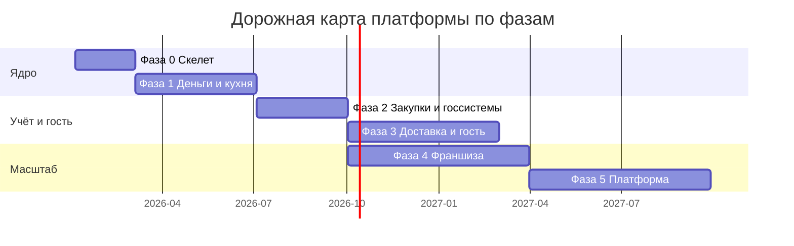

# План реализации платформы: фазы, вехи, первые 90 дней

> **Статус: ревизия №2 по итогам аудита корпуса · 10.10.2026.** Числовые факты сопровождаются ссылками; канонические перечисления — в «Модели данных», §0.

> Как стратегия из [`../product-blueprint.md`](../product-blueprint.md) превращается в календарный план. Принципы: строим на собственном производстве и пилотных точках (полигон), каждая фаза имеет критерий «стопа/продолжения», внешние системы подключаем по карте из [`02-systems-roadmap.md`](02-systems-roadmap.md), операционную нагрузку до готовности своих модулей несёт опорный стек из [`03-backbone-stack.md`](03-backbone-stack.md).

## 1. Принципы реализации

1. **Свой бизнес — первый клиент.** Ни один модуль не уходит «наружу», пока месяц не отработал на нашем производстве/точке.
2. **Фазовые гейты.** Переход к следующей фазе — по измеримому критерию, а не по календарю.
3. **Вертикальные срезы.** Каждый релиз — работающий сценарий «от заказа до чека», а не набор функций.
4. **Ничего не строить из покупаемого.** Фискализация, эквайринг, ЭДО, роутинг — только интеграции (см. карту систем).
5. **Откат всегда дешевле простоя.** Любой перенос функции с опорной системы на нашу — с параллельным запуском и возвратом за 1 день.

## 2. Фазы с гейтами (расшифровка blueprint)

| Фаза | Горизонт | Содержание | Гейт перехода (стоп/идём) |
|---|---|---|---|
| **0. Скелет** | М1–М2 | Тенанты и иерархия УК→франчайзи→точка, событийная шина, справочники меню/ТТК, роли и права | Точка создаётся клоном шаблона за <1 ч; событийный лог пишет 100% операций |
| **1. Деньги и кухня** | М2–М6 | Касса (офлайн-первый), ФФД 1.2, меню/ТТК, списание по ТТК, KDS с таймингами, склад-приёмка/инвентаризация, дашборд владельца | Пилотная точка 30 дней без бумаги и без отката; офлайн-смена 8 ч без связи; ни одного чека мимо ФНС |
| **2. Закупки и госсистемы** | М6–М9 | ЕГАИС, ЧЗ (разрешительный режим, ТС ПИоТ), Меркурий, ЭДО-приёмка, поставщики с прайсами, автозаказ по прогнозу, полуфабрикаты и акты | Точка продаёт маркировку и алкоголь легально; автозаказ закрывает неделю без дефицита; расхождение приёмки <2% |
| **3. Доставка и гость** | М9–М14 | Витрина сайта и мини-апп, приём агрегаторов в очередь, зоны/обещание времени, приложение курьера, диспетчер; лояльность на кассе; отзывы с привязкой к заказу | Прямые заказы ≥30% выручки доставки; доставка в обещанное окно ≥90%; идентифицированных чеков ≥60% |
| **4. Франшиза** | М12–М18 | Шаблоны точек с версионированием, роялти от фискальной выручки и биллинг, аудиты с фото и индексом стандарта, ХАССП-журналы, табель и ФОТ | Новая партнёрская точка за ≤3 дня; роялти считается без участия бухгалтера; индекс стандарта сети ≥85% |
| **5. Платформа** | М18+ | Открытый API и маркетплейс, видеоконтроль, ИИ-прогнозы спроса, бенчмарки индустрии | ≥3 внешних партнёра в маркетплейсе; прогноз автозаказа точнее скользящего среднего на 15%+ |

Календарно фазы укладываются так (перехлёст фаз 3 и 4 — осознанный: франшизный контур начинается до закрытия доставки):

## 3. Первые 90 дней — по неделям

| Недели | Поток «продукт» | Поток «операции и инфраструктура» |
|---|---|---|
| 1–2 | Скоуп фазы 0; контракты данных (меню, ТТК, заказ) из [`../components/12-data-model.md`](../components/12-data-model.md) | Выбор облака, репозитории, CI/CD; найм/аллокация ядра команды |
| 3–4 | Тенанты, иерархия, событийная шина | Выбор модели ККТ для пилота (АТОЛ/Эвотор), договоры: ОФД, банк-эквайер, ЭДО |
| 5–6 | Справочники меню и ТТК; импорт ТТК бренда (первая сотня блюд) | Регистрация ККТ в ФНС; юрлицо/договоры с поставщиками пилота |
| 7–8 | Роли и права; консоль УК и кабинет точки | Подготовка пилотной точки: сеть, устройства, монтаж экрана кухни |
| 9–10 | Прототип заказа: витрина → очередь → статусы (без фискализации) | Обучение пилотной смены; регламенты открытия/закрытия в системе |
| 11–13 | Касса на пилоте в «теневом режиме»: реальные заказы дублируются нашей системой параллельно опорной | Сверка теневой кассы с опорной: суммы, позиции, время; фиксация расхождений |

**Выход из 90 дней:** решение о включении нашей кассы как основной на пилоте (гейт фазы 1 начинается).

## 4. Команда по фазам (минимальный состав)

| Роль | Ф0–1 | Ф2 | Ф3 | Ф4+ |
|---|---|---|---|---|
| Бэкенд-разработка | 2 | 3 | 3 | 4 |
| Фронтенд (веб-касса, бэк-офис) | 1 | 2 | 2 | 2 |
| Мобильная разработка (курьер/гость) | — | — | 1–2 | 2 |
| Интеграции (ККТ/ЕГАИС/ЧЗ/агрегаторы) | 1 | 2 | 2 | 2 |
| DevOps | 0,5 | 1 | 1 | 1 |
| Продукт/аналитика | 1 | 1 | 2 | 2 |
| Внедрение и поддержка 24/7 | 1 | 1 | 2 | 3 |
| Бухгалтер/методолог учёта (общепит) | 0,5 | 0,5 | 0,5 | 0,5 |

## 5. Зависимости и риски фаз

| Риск | Влияние | Мера |
|---|---|---|
| Затяжка сертификации драйвера ККТ | сдвиг фазы 1 | начинать с одной реестровой модели; параллельный облачный вариант |
| Пилотная точка не даёт честной нагрузки | ложные гейты | обязательный «час пик» и выходные в зачёт; ротация смен |
| Интеграции агрегаторов требуют юр. договоров | сдвиг фазы 3 | договоры начинать за 2 месяца до фазы |
| Команда выгорает на «опорном» зоопарке | темп | лимит внешних сервисов по карте систем; ничего лишнего |

## 6. Управление программой

- Еженедельный операционный комитет: продуктовые метрики пилота + статус гейтов.
- Решения о переходе фаз фиксируются в репозитории (`docs/decisions/`) вместе с данными.
- Все целевые показатели — из единого дерева метрик ([`../product-blueprint.md`](../product-blueprint.md), раздел 5).
