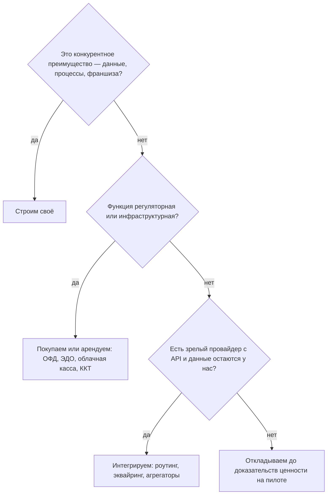

# Карта систем на пути реализации: строить / покупать / интегрировать

> **Статус: ревизия №2 по итогам аудита корпуса · 10.10.2026.** Числовые факты сопровождаются ссылками; канонические перечисления — в «Модели данных», §0.

> Стратегия строится на правиле: **ядро — своё, инфраструктура — покупная/арендованная, стыки — интеграции**. Документ фиксирует, какие системы потребуются на каждой фазе, в каком статусе и с каким порядком подключения. Оценки затрат — ориентировочные (по публичным ценам 2026, см. источники в аудитах).

## 1. Критерии решения

| Решение | Когда |
|---|---|
| **Строим** | Это конкурентное преимущество (данные, процессы, франшиза) или рынок РФ не даёт готового |
| **Покупаем/арендуем** | Регуляторная или инфраструктурная функция; дороже построить, чем платить |
| **Интегрируем** | Есть зрелый провайдер с API; данные остаются у нас |
| **Откладываем** | Ценность не доказана на пилоте |

Дерево решения для каждой системы:



## 2. Реестр систем

### 2.1. Фискализация и платежи

Эталонные ценовые вилки этого раздела — в [`../infrastructure/banks-kassa-ofd.md`](../infrastructure/banks-kassa-ofd.md), §3 (аудит №1: вилки согласованы).

| Система | Статус | Фаза | Ориентир затрат | Комментарий |
|---|---|---|---|---|
| ККТ (АТОЛ/ШТРИХ/Эвотор) | покупаем | Ф1 | 12–60 тыс ₽/шт | только модели из реестра ФНС с ФФД 1.2 и ФН 1.1М |
| Фискальный накопитель | покупаем | Ф1 | ~8,5–15 тыс ₽ | 36 мес для общепита на спецрежимах |
| ОФД | арендуем | Ф1 | ~3 тыс ₽/год/касса | договор обязателен; мониторим «чеки не уходят» |
| Облачная касса | арендуем | Ф3 | ~1,5–3,9 тыс ₽/мес | для онлайн-оплат сайта/приложения; курьеры без ККТ |
| Эквайринг + СБП | интегрируем | Ф1 | % с оборота | банк-партнёр; цель — единый договор «касса+эквайринг» как у Т-Бизнес |

### 2.2. Госсистемы и документооборот

| Система | Статус | Фаза | Комментарий |
|---|---|---|---|
| ЕГАИС (УТМ) | интегрируем | Ф2 | только при алкоголе в меню |
| Честный ЗНАК + ТС ПИоТ | интегрируем | Ф2 | разрешительный режим на кассе — обязательное требование |
| Меркурий (ВетИС) | интегрируем | Ф2 | приёмка мяса/рыбы/молочки |
| ЭДО (Контур.Диадок / СБИС / 1С-ЭДО) | арендуем+интегрируем | Ф2 | УПД с поставщиками; юридическая значимость |
| 1С (обмен) | интегрируем | Ф2 | выгрузка продаж/закупок/производства для бухгалтерии франчайзи |

### 2.3. Доставка и логистика

| Система | Статус | Фаза | Комментарий |
|---|---|---|---|
| Яндекс Еда / Деливери | интегрируем | Ф3 | комиссии 16,67–29,17% без НДС — см. [`../components/02-order-channels.md`](../components/02-order-channels.md) |
| Роутинг (Яндекс Маршрутизация и аналоги) | интегрируем по API | Ф3 | свою математику маршрутов не строим до фазы 5 |
| Вызов внешних курьеров (Яндекс Доставка и др.) | интегрируем | Ф4 | пиковые часы |
| Приложение курьера | строим | Ф3 | своё: статусы, фото вручения, заработок за смену |

### 2.4. Коммуникации с гостем

| Система | Статус | Фаза | Комментарий |
|---|---|---|---|
| СМС-шлюз | интегрируем | Ф3 | чеки, статусы, запрос отзыва |
| Мессенджеры (боты) | строим поверх их API | Ф3 | лояльность и кампании — свои правила, канал чужой |
| Push-сервисы (мобильные) | интегрируем | Ф3 | стандартные сервисы платформ |

### 2.5. Инфраструктура платформы

| Система | Статус | Фаза | Комментарий |
|---|---|---|---|
| Облако (хостинг в РФ) | арендуем | Ф0 | ПДн гостей — в РФ (152-ФЗ) |
| Мониторинг/алерты | строим из готовых компонентов | Ф0 | аптайм ≥99,9% — гейт платформы |
| Видеонаблюдение | партнёрская интеграция | Ф5 (пилот вручную) | синхронизация чеков с видео — как в iiko |
| Телефония колл-центра | арендуем (ВАТС) | Ф4 | единый номер УК с маршрутизацией в точки |

### 2.6. Внутренние инструменты разработки

| Система | Статус | Комментарий |
|---|---|---|
| Репозитории и CI/CD | готовые (этот репозиторий + Actions) | документация уже публикуется автоматически |
| Трекинг задач и база знаний | любые облачные | без самописи |
| Демо-стенды и песочница интеграций | строим | обязательны для партнёрского маркетплейса |

## 3. Порядок подключения по фазам

```
Ф0: облако, CI/CD, мониторинг
Ф1: ККТ + ФН + ОФД + эквайринг/СБП; регистрация в ФНС
Ф2: ЭДО, ЕГАИС/ЧЗ/Меркурий, обмен с 1С
Ф3: СМС/мессенджеры, облачная касса, агрегаторы, роутинг
Ф4: ВАТС колл-центра, внешние курьеры
Ф5: видео-партнёры, маркетплейс интеграций
```

## 4. Что никогда не строим сами (в горизонте 3 лет)

1. Фискальное железо и прошивки ККТ.
2. Банковский процессинг (в отличие от Toast в США — в РФ работаем через партнёров).
3. Государственные реестры и шлюзы — только официальные интеграции.
4. Математика маршрутизации — до появления своей логистической экспертизы.
5. Бухгалтерское ядро — только обмен с 1С.

## 5. Чек-лист выбора внешнего провайдера

- [ ] Договор с юрлицом РФ, оплата по счёту.
- [ ] Публичный SLA и поддержка 24/7 (для критичных: ОФД, эквайринг, облако).
- [ ] Экспорт данных без выкупа (защита от лок-ина).
- [ ] Совместимость с нашим событийным ядром (вебхуки/очереди).
- [ ] Опыт именно в общепите (референсы).
