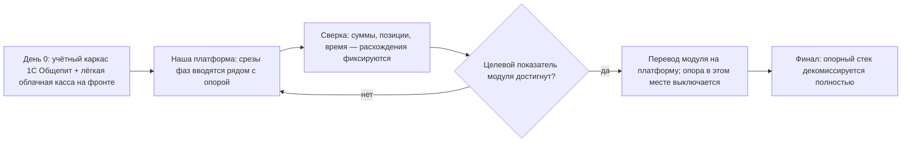

# Опорный стек: на чём работает бизнес до выхода на целевые показатели

> **Статус: ревизия №2 по итогам аудита корпуса · 10.10.2026.** Числовые факты сопровождаются ссылками; канонические перечисления — в «Модели данных», §0.

> Платформа строится месяцами, а производство и первые франшизные точки должны работать **сейчас**. Документ фиксирует: какие системы несут операционную нагрузку на каждом отрезке пути, при каких показателях модуль переводится на нашу платформу, и что демонтируется в конце.

## 1. Целевые (опорные) показатели выхода

Эти метрики — условие «опора больше не нужна». Взяты из [`../product-blueprint.md`](../product-blueprint.md):

| Показатель | Цель | Декомиссия опоры |
|---|---|---|
| Запуск новой точки | ≤ 3 дней | внешние кассы/учёт не нужны для онбординга |
| Фудкост пилотных точек | −2 п.п. за 6 месяцев | ручные таблицы и сторонний учёт |
| Доля просроченных тикетов кухни | ≤ 5% | бумажные чеки кухни |
| Доставка в обещанное окно | ≥ 90% | сторонние сервисы диспетчеризации |
| Доля прямых заказов | ≥ 30% | зависимость от агрегаторов как основного канала |
| Идентифицированные чеки | ≥ 60% | «анонимная» работа без CRM |
| NPS пилотных точек | ≥ 50 | внешние сервисы сбора отзывов |
| Индекс стандарта сети | ≥ 85% | бумажные чек-листы УК |
| Аптайм облака | ≥ 99,9% | локальные/ручные обходные процедуры |

## 2. Сценарии опоры (рассматривались)

| Сценарий | Суть | Плюсы | Минусы |
|---|---|---|---|
| A. Временная облачная касса (уровня Quick Resto/Poster) | быстрый старт пилота | запуск за дни; дешёвая | двойная работа при миграции; слабые франшизные функции; данные в чужой системе |
| B. Временный «тяжёлый» комбайн (уровня iiko Pro) | глубокий учёт сразу | эталонная глубина; знакомый рынку | дорого (8,6–10,6 тыс ₽/мес за кассу); миграция тяжелее; платим конкуренту за полигон |
| C. Чистый параллельный старт | ждём свою фазу 1, до этого — бумага | нет двойной работы | бизнес простаивает/теряет данные; неприемлемо для действующего производства |
| **C'. Гибрид (рекомендуется)** | **учётный каркас — 1С:Общепит с первого дня; операционный фронт — лёгкая облачная касса до готовности нашего среза фазы 1; далее покомпонентный перевод с параллельной работой** | бухгалтерия честная с дня 0; фронт дешёвый; миграции маленькие | требует дисциплины сверок |

Рекомендуемый сценарий C' в виде процесса — параллельная работа с покомпонентным переводом:



## 3. Опорный стек по периодам

### Период 0–6 мес (до готовности своей кассы и кухни)

| Контур | Несёт нагрузку | Зачем опорно | Условие перевода на платформу |
|---|---|---|---|
| Бухгалтерский/учётный каркас | 1С:Общепит (облако, ~3–5 тыс ₽/мес) | ТТК, себестоимость, отчётность без риска | остаётся экспортной бухгалтерией навсегда (не демонтируется) |
| Касса/зал | облачная МСБ-касса (типа Poster/Quick Resto, 3–5 тыс ₽/мес) | чеки, склад, минимум отчётности | теневая сверка нашей кассы ≥4 недель, расхождения <0,5% |
| Кухня | бумажные чеки + принтер | базовая скорость | наш KDS держит пиковый час без просрочек 5+ дней |
| Склад | та же облачная касса + таблицы заготовок | остатки «хоть как-то» | слепая инвентаризация в нашей системе с отклонением <2% |
| Доставка | агрегаторы + телефон | выручка без своей логистики | свой модуль: окно ≥90% в течение 3 недель |
| Гости | агрегаторные базы + тетрадь | сбор контактов | лояльность на нашей кассе ≥60% идентифицированных чеков |

### Период 6–12 мес (фазы 2–3)

| Контур | Несёт нагрузку | Условие перевода |
|---|---|---|
| Закупки | наша платформа (с фазы 2) — опорные таблицы демонтируются | автозаказ закрывает неделю без дефицита |
| Госсистемы | наша платформа — опора не нужна | первая легальная продажа маркированного товара |
| Сайт/приложение | наша витрина в тени опорного приёма заказов | конверсия витрины не ниже ручного приёма |
| Отзывы | наш модуль | время реакции на негатив <24 ч |

### Период 12–18 мес (фаза 4)

| Контур | Несёт нагрузку | Условие перевода |
|---|---|---|
| Контроль стандартов УК | электронные чек-листы (можно внешний сервис типа CheckOffice — см. [`../competitors/audit-standards-vendors.md`](../competitors/audit-standards-vendors.md)) | наш модуль аудитов закрывает 2 полных цикла проверок |
| Роялти | бухгалтерия вручную | первый автосчёт роялти без спора с франчайзи |
| Обучение | база знаний + видео | аттестация смен в системе ≥90% персонала |

## 4. Правила параллельной работы и миграций

1. **Теневой режим обязателен**: новый модуль работает рядом с опорным 2–4 недели; расхождения фиксируются ежедневно.
2. **Один источник правды на контур**: пока модуль в тени, опорная система — источник для отчётности; после перевода — только наша.
3. **Откат за 1 день**: любая точка может вернуться на опорный стек до конца фазы (договоры опорных сервисов не расторгаем до гейта фазы).
4. **Сверки еженедельны**: выручка (опорная касса ↔ наша), остатки (опорный склад ↔ наш), статусы заказов доставки.
5. **Данные не теряем**: из опорных систем выгружаем гостей, историю заказов и остатки при переводе контура.

## 5. Бюджет опорного стека (оценка на пилот: производство + 1–2 точки)

| Статья | Ориентир/мес |
|---|---|
| 1С:Общепит (облако) | 3–5 тыс ₽ |
| Облачная касса на 1–2 точки | 5–10 тыс ₽ |
| ОФД/эквайринг | по обороту + ~1 тыс ₽ |
| Агрегаторы | комиссия с оборота (16,67–29,17% без НДС) — мотив строить свой канал быстрее |
| Внешний сервис чек-листов (опционально, до фазы 4) | 5–15 тыс ₽ |
| **Итого постоянных затрат опоры** | **~15–30 тыс ₽/мес** |

Это плата за непрерывность бизнеса; демонтаж опоры по модулям окупает её уже снижением фудкоста и комиссии агрегаторов (экономия 20–35% на прямых заказах подтверждена практикой рынка — [`../competitors/middleware-delivery.md`](../competitors/middleware-delivery.md)).

## 6. Итоговая картина пути

```
СЕЙЧАС            М0–6               М6–12              М12–18             М18+
опора: 1С +       наша касса+кухня   наши закупки,      наша франшиза,     платформа:
лёгкая касса,     на пилоте,         госсистемы,        роялти, аудиты;    открытый API,
агрегаторы        опора сдаёт фронт  доставка и гость   опора сдаёт        ИИ, видео
                                     на нашу платформу  контроль УК
```

Критерий завершения пути: **все девять показателей раздела 1 достигнуты на пилотных точках, опорные сервисы расторгнуты, 1С остаётся только как бухгалтерский экспорт.**
