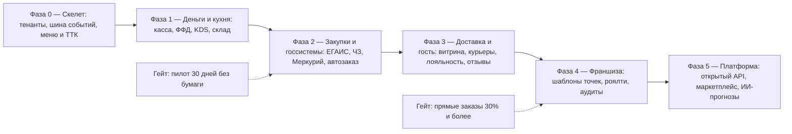

# 05. Продуктовый blueprint платформы lovii

> **Статус: ревизия №2 по итогам аудита корпуса · 10.10.2026.** Числовые факты сопровождаются ссылками; канонические перечисления — в «Модели данных», §0.

> Как исследование собирается в продукт. Документ задаёт целевую архитектуру, состав релизов, ценовую модель и критерии успеха. Это живой документ: он обновляется по мере разработки.

## 1. Миссия и позиционирование

**Миссия:** каждый, кто подключается к инфраструктуре [lovii.ru](https://lovii.ru), получает полный операционный комплекс — от кассы и чеков до контроля закупок, работы с поставщиками, доставки и отзывов гостей — с первого дня, без интеграторов и «зоопарка» сервисов.

**Позиционирование:** «операционная система для микробизнеса корпоративного класса» — глубина уровня «тяжёлых» систем, скорость запуска облачных касс, франшизный контроль из коробки.

**Кто платит первым:** собственная франшиза/производство (внутренний заказчик и полигон), затем партнёрские франшизы и независимые точки.

## 2. Целевая архитектура (домены → модули)

| Модуль | Домен из референс-модели | Приоритет |
|---|---|---|
| Касса и фискализация (54-ФЗ, ФФД 1.2, ОФД, ЕГАИС, ЧЗ/ТС ПИоТ, Меркурий) | D1 | P0 |
| Каналы заказов: зал, сайт-витрина, мини-апп, агрегаторы | D2 | P0 |
| Кухня: KDS, цеха, тайминги, стоп-листы, ТТК на экране | D3 | P0 |
| Меню и техкарты (ТТК, модификаторы, полуфабрикаты, себестоимость) | D12 | P0 |
| Склад и закупки (движения, инвентаризация, поставщики, автозаказ, ЭДО) | D4 | P0 |
| Персонал (роли, смены, табель, права) | D7 | P1 |
| Лояльность и профиль гостя (карты, бонусы, акции, кампании) | D6 | P1 |
| Отзывы и NPS (привязка к заказу/смене/курьеру, сервис-рекавери) | D6 | P1 |
| Доставка: зоны, слоты, приложение курьера, диспетчеризация | D5 | P1 |
| Финансы: смены, сверки, управленческий P&L, дашборд владельца | D8 | P1 |
| Франшиза: иерархия УК→франчайзи→точки, шаблоны точек, роялти | D9 | P1 |
| Комплаенс: ХАССП-чек-листы, сроки годности, прослеживаемость партий | D10 | P2 |
| Стандарты и аудиты сети (чек-листы с фото, задачи, индекс стандарта) | D9 | P2 |
| Видеоконтроль и антифрод | D8 | P2 |
| Открытый API и маркетплейс интеграций | D11 | P2 |
| Колл-центр доставки (единый номер УК) | D5 | P3 |
| Бенчмарки и ИИ-прогнозы (автозаказ 2.0, прогноз выручки) | D8 | P3 |

## 3. Дорожная карта (фазы)

### Фаза 0 — «Скелет» (месяцы 1–2)
- Мультитенантное ядро, иерархия УК/франчайзи/точка, событийная шина, справочники меню/ТТК.
- Авторизация и роли; устройство точки (кассы, экраны).
- **Критерий:** тенант и точка создаются из консоли; шаблон точки клонируется.

### Фаза 1 — «Деньги и кухня» (месяцы 2–6) — MVP
- Касса (офлайн-первый), смены, чеки, возвраты; драйверы реестровых ККТ; ОФД; ФФД 1.2.
- Меню/ТТК/модификаторы; списание по ТТК при продаже.
- KDS с таймингами и стоп-листом; цеховые принтеры как резерв.
- Склад: приёмка, перемещение, инвентаризация с телефона, минимальные остатки.
- Дашборд владельца: выручка, средний чек, фудкост.
- **Критерий:** собственная пилотная точка работает 30 дней без отката на бумагу.

### Фаза 2 — «Закупки и госсистемы» (месяцы 6–9)
- ЕГАИС, Честный ЗНАК (разрешительный режим, ТС ПИоТ), Меркурий; ЭДО-приёмка.
- Поставщики с прайсами; автозаказ по скользящему прогнозу с подтверждением.
- Полуфабрикаты и акты производства; себестоимость по партиям.
- **Критерий:** точка продаёт маркированный товар и алкоголь легально; автозаказ закрывает неделю без дефицита.

### Фаза 3 — «Доставка и гость» (месяцы 9–14)
- Витрина сайта и мини-апп; интеграция с Яндекс Едой/Деливери (приём заказов в очередь).
- Модуль доставки: зоны, обещание времени, приложение курьера, диспетчер, маршруты по API.
- Лояльность на кассе: карты, бонусы, конструктор акций; профиль гостя по телефону.
- Отзывы с привязкой к заказу/смене/курьеру + задачи сервис-рекавери; NPS на дашборде.
- **Критерий:** доля прямых заказов ≥ 30% у пилотных точек; время доставки в обещанное окно ≥ 90%.

### Фаза 4 — «Франшиза» (месяцы 12–18)
- Шаблоны точек (версии, раскат по сети с подтверждением); библиотека ТТК бренда.
- Роялти: авто-расчёт от фискальной выручки, биллинг, акты сверки.
- Аудиты: чек-листы с фото, автозадачи, индекс стандарта точки; ХАССП-журналы поверх партий склада.
- Персонал: табель из входов в систему, ФОТ-контроль, аттестация.
- **Критерий:** новая партнёрская точка запускается ≤ 3 рабочих дней; УК видит пульс сети в реальном времени.

### Фаза 5 — «Платформа и масштаб» (18+)
- Открытый API и маркетплейс партнёрских модулей; видео-контроль; ИИ-прогнозы спроса и цен.
- Бенчмаркинг по сети и индустрии; открытый слой данных для УК.

## 4. Ценовая модель

Принципы (по итогам аудита):
- **Вход бесплатный или символический** (урок Toast/Square/Fusion POS): франчайзи не должен бояться стартовать.
- Монетизация: **подписка за точку** + **% от оборота по онлайн-каналам** (витрина/доставка) + **опциональные модули** (видео, ИИ-прогнозы, колл-центр).
- Никаких лимитов на техкарты и точки сети в базовых тарифах (антипаттерн Poster).
- Для УК франшизы — отдельный тариф «УК»: консолидация, аудиты, роялти, бенчмарки.

Ориентиры рынка: 2 000–5 000 ₽/мес — вход МСБ [1](https://iikoservice.ru/blog/chto-vybrat-dlya-avtomatizaczii-predpriyatiya/); 8 600–10 600 ₽/мес — корпоративные тарифы конкурента [2](https://iikoservice.ru/). Наша цель: дать «корпоративную глубину» по цене входа.

## 5. Метрики успеха продукта (первый год)

| Уровень | Метрика | Цель |
|---|---|---|
| Точка | время запуска новой точки | ≤ 3 дня |
| Точка | офлайн-автономность кассы | 8 часов продаж без облака |
| Операции | фудкост пилотных точек | −2 п.п. за 6 месяцев |
| Операции | доля просроченных кухонных тикетов | ≤ 5% |
| Доставка | доля доставок в обещанное окно | ≥ 90% |
| Гости | доля идентифицированных чеков | ≥ 60% |
| Гости | NPS пилотных точек | ≥ 50 |
| Франшиза | индекс стандарта точек сети | ≥ 85% |
| Платформа | аптайм облака | ≥ 99,9% |

## 6. Риски и контрмеры

| Риск | Вероятность | Контрмера |
|---|---|---|
| Сложность фискального контура (54-ФЗ/ЕГАИС/ЧЗ) | высокая | партнёрство с ЦТО/драйверными вендорами на ранней фазе; пилот на одном типе ККТ |
| Инерция рынка («все сидят на iiko») | высокая | безболезненная миграция: импорт ТТК/остатков из iiko/Poster/1С; оффер на период миграции |
| Недоверие франчайзи к платформе УК | средняя | прозрачность данных точки; права франчайзи на свои данные и выгрузку |
| Расползание скоупа | высокая | жёсткие критерии фаз выше; приоритизация от нужд собственного производства |
| Офлайн-синхронизация | высокая | событийная модель с самого начала; еженедельные «убийства интернета» на пилоте |

## 7. Организационные выводы

1. Первый пользователь — **наше собственное производство и первые франчайзи-точки**: продукт проверяется на них до продажи наружу.
2. Команда поддержки 24/7 с первого платного клиента — слабая поддержка конкурентов ([пример критики](competitors/quick-resto.md)) превращается в наше конкурентное преимущество.
3. Контентная библиотека ТТК и чек-листов — часть продукта, а не «документы»: она снижает время запуска и защищает бренд франшизы.

## 8. Следующие шаги

1. Утвердить скоуп Фазы 0–1 и состав пилотной точки.
2. Выбрать технологический стек и драйверы ККТ; спроектировать событийную шину.
3. Зафиксировать контракты данных (меню, ТТК, заказ, движение склада) в `docs/specs/` (следующая фаза документации).
4. Провести глубинные интервью с 5–10 действующими франчайзи общепита для валидации ценовой модели и приоритетов.
