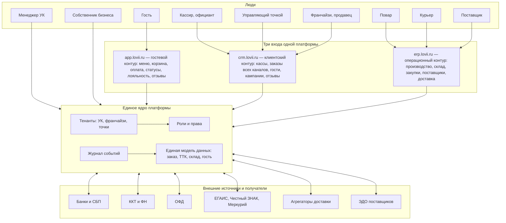

# SaaS-платформа lovii: карта системы

> Целевая картина того, что мы строим: **одна платформа — три входа** для разных ролей. `app.lovii.ru` — гостевой контур, `crm.lovii.ru` — клиентский и кассовый контур, `erp.lovii.ru` — операционный контур (поставщики, заказы, кухня, курьеры, отзывы). Всё вместе — единый комплекс на общей модели данных, описанной в [технических спецификациях](../specs/00-overview.md).
>
> 🎬 **Эта схема уже собрана в интерактивном виде** — [демо-кабинет платформы](https://bestdeejay-design.github.io/lovii-crm/demo/) (роли, мок-данные, журнал событий; спецификация — в [демо-кабинете](02-demo-cabinet.md)).

## 1. Схема-цель: все компоненты по пути

## 2. Кто куда входит

| Вход | Адрес | Аудитория | Что внутри |
|---|---|---|---|
| **Гостевой контур** | `app.lovii.ru` | Гости, посетители витрины | Меню и корзина, оплата (карты/СБП/бонусы), статусы заказа, история, программа лояльности, отзывы |
| **Клиентский контур (CRM)** | `crm.lovii.ru` | Кассиры, официанты, управляющие, продавцы-франчайзи | Кассы и смены, все каналы заказов в одной очереди, профиль гостя, лояльность и кампании, отзывы и сервис-рекавери, отчёты по выручке и гостям |
| **Операционный контур (ERP)** | `erp.lovii.ru` | Повара, курьеры, закупщики, поставщики | Кухня (KDS) и ТТК, склад и фудкост, закупки и прайсы поставщиков, диспетчеризация доставки, производство и полуфабрикаты, отчёты по себестоимости |
| **Кабинет УК** | внутри `erp/crm` под ролью УК | Менеджеры управляющей компании, собственник бизнеса | Шаблоны точек, стандарты и аудиты, роялти, бенчмаркинг сети, консолидированные отчёты; для собственника — живые операционные показатели, причины отклонений и рычаги влияния на систему |

Важно: это **не три продукта, а три рабочих места одной платформы**. Заказ, пробитый в `crm`, мгновенно виден на кухне в `erp`; отзыв из `app` привязан к тому же заказу; УК видит агрегаты по всем входам.

## 3. Роли и их потоки

| Роль | Контур | Поток, которым управляет | Ключевые отчёты |
|---|---|---|---|
| Гость | app | свой заказ, бонусы, отзыв | история заказов, баланс |
| Кассир/официант | crm | заказы зала и стойки | выручка смены, средний чек |
| Повар | erp | кухонные тикеты, заготовки | скорость станции, просрочки |
| Курьер | erp | назначенные доставки | доставки в час, рейтинг |
| Управляющий точкой | crm + erp | вся точка: смены, стоп-листы, инвентаризация | P&L точки, фудкост, индекс стандарта |
| Поставщик | erp (портал) | прайсы, накладные, заявки | взаиморасчёты, объём поставок |
| Продавец-франчайзи | crm + erp | свои точки по договору | роялти, маржа, отклонения |
| Менеджер УК | кабинет УК | сеть: стандарты, роялти, аудиты | пульс сети, бенчмарки, собираемость роялти |

## 4. Принципы единства комплекса

1. **Один контракт заказа** — любой канал (зал, витрина, агрегатор, телефон) создаёт один и тот же объект; контуры лишь по-разному его отображают ([спецификация 03](../specs/03-api-contracts.md)).
2. **Один журнал событий** — остаток склада, выручка для роялти, отчёты и аудиты строятся из одного источника ([спецификация 04](../specs/04-deployment-offline.md)).
3. **Изоляция тенантов** — УК, франчайзи и независимые точки живут в одной платформе, но данные видны только по своей иерархии.
4. **Роли решают всё** — один и тот же человек может иметь разные роли в разных контурах; права наследуются по иерархии УК → франчайзи → точка.
5. **Офлайн-первичность** — касса и кухня в `crm`/`erp` работают без интернета; синхронизация в ядро — при связи.
6. **Госсистемы из коробки** — 54-ФЗ, ЕГАИС, Честный ЗНАК, Меркурий подключены на уровне ядра ([платёжная инфраструктура](../infrastructure/banks-kassa-ofd.md)).

## 5. Техническая реализация адресов

Три поддомена — три фронтенда поверх одного бэкенда:

- `app.lovii.ru` — витрина и кабинет гостя (публичный доступ, лёгкая авторизация по телефону);
- `crm.lovii.ru` — рабочие места фронт-офиса (касса, зал, менеджер зала);
- `erp.lovii.ru` — бэк-офис и порталы партнёров (кухня, склад, поставщик);
- роль пользователя определяет, какие приложения и данные ему доступны; переключение контуров — без повторного входа (единая сессия платформы).

В демо-версии (следующий этап) все три адреса эмулируются в одном приложении с переключателем ролей — см. [спецификацию демо-кабинета](02-demo-cabinet.md).

---

**Дальше по разделу:** [правила и схемы движения информации](01-information-flow.md) → [демо-кабинет платформы](02-demo-cabinet.md).
