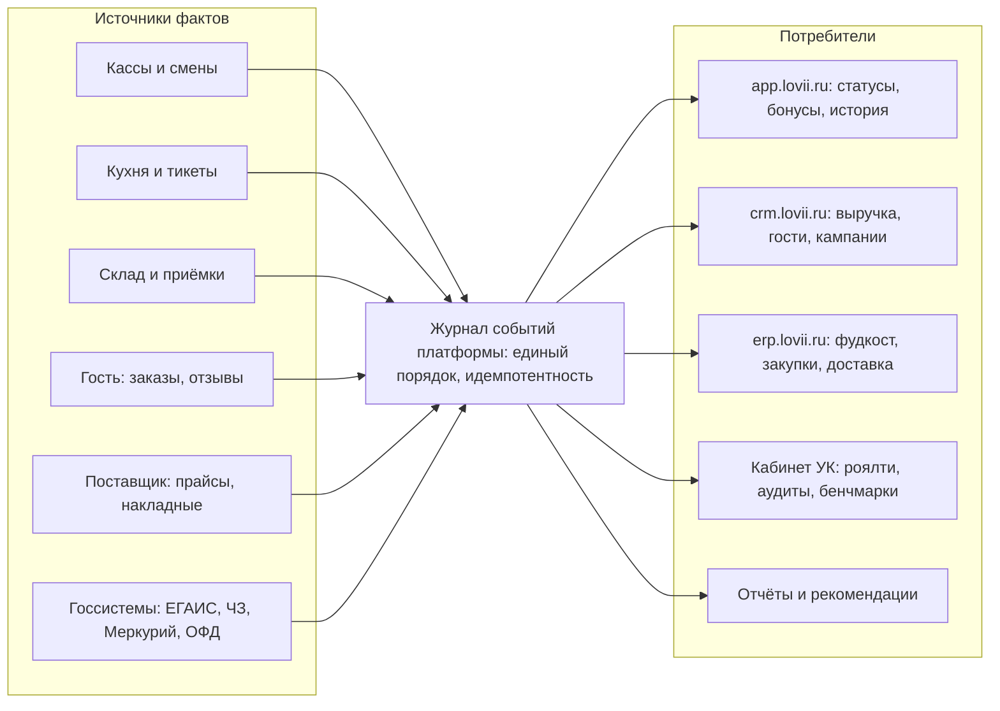
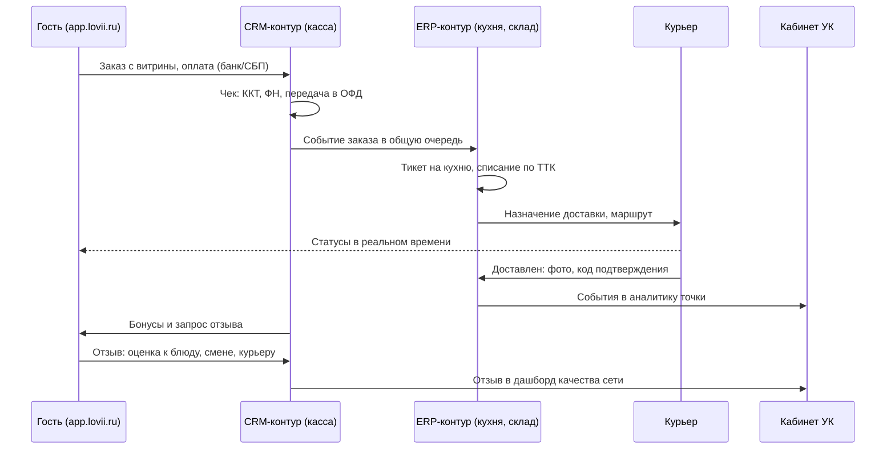
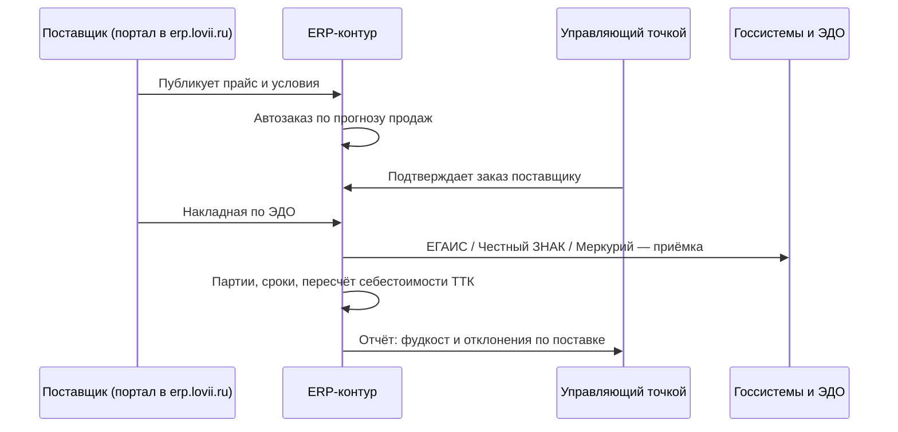

# Общие правила и схема движения информации

> **Статус: ревизия №2 по итогам аудита корпуса · 10.10.2026.** Числовые факты сопровождаются ссылками; канонические перечисления — в «Модели данных», §0.

> Как данные текут внутри единой платформы: источники, контракт, контуры-потребители. Эти правила обязательны для всех модулей и для демо-версии.

## 1. Семь правил движения информации

1. **Факт фиксируется один раз, в месте возникновения.** Кассир пробил чек — событие родилось на кассе; дальше все контуры читают его из журнала, а не вводят заново.
2. **Контракты сильнее интерфейсов.** Любой обмен (канал → ядро, ядро → контур, платформа → партнёр) идёт по задокументированному контракту ([спецификация 03](../specs/03-api-contracts.md)).
3. **Событие важнее состояния.** Заказ, движение склада, смена, отзыв — это события в журнале; текущие «статусы» — их проекции. Так мы получаем аудитируемость и офлайн-синхронизацию.
4. **Владелец данных один (принцип НСИ).** Меню и ТТК принадлежат УК/точке, прайсы — поставщику, профиль гостя — гостевому контуру. Изменяет владелец; остальные подписываются на изменения.
5. **Изоляция по иерархии.** Данные видны ровно на том уровне, где положено роли: гость → свой заказ; точка → свою точку; франчайзи → свои точки; УК → агрегаты и контроль по договору.
6. **Персональные данные — по согласию и в РФ.** Профиль гостя живёт в контуре лояльности с журналами доступа; выгрузка/удаление по запросу (152-ФЗ, [разбор 4](../academic/04-personal-data-loyalty.md)).
7. **Каждое событие имеет источник и подтверждение.** Для юридически значимых фактов — фискальный документ, подпись в ЭДО, фотофиксация в аудите.

## 2. Источники и потребители

## 3. Путь одного заказа через все контуры

## 4. Путь поставки: от прайса до фудкоста

## 5. Качество данных и аудит

- **Сверка контрольных сумм** между кассой, журналом и ОФД — основа алерта «что-то потерялось».
- **Аудиты стандартов** (чек-листы с фото) идут поверх тех же событий: каждое нарушение становится задачей с дедлайном ([Компонент 09](../components/09-franchise-network.md)).
- **Рекомендации** строятся на витринах журнала: фудкост выше порога → рекомендация по ТТК и поставщикам; просрочки кухни → рекомендация по сменам и нормативам ([Компонент 08](../components/08-finance-analytics.md)).
- **Законодательное соответствие** — не отчёт «для галочки», а проекция событий: фискальные документы, гашение ВСД, вывод кодов из оборота, журналы ХАССП ([Компонент 10](../components/10-compliance-safety.md)).

---

**Дальше:** [демо-кабинет платформы — роли, мок-данные, отчёты](02-demo-cabinet.md).
