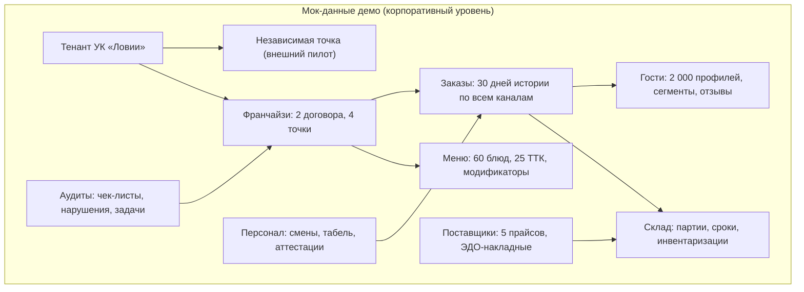

# Демо-кабинет платформы: роли, мок-данные, отчёты

> Спецификация демо-версии — следующего этапа после этой визуальной схемы. Демо показывает весь периметр платформы на мок-данных корпоративного уровня: каждый участник (поставщик, продавец, менеджер) входит в свою роль, управляет своим потоком и видит свои отчёты и рекомендации.

## 1. Цель демо

1. **Показать платформу целиком**: три контура (`app` / `crm` / `erp`) + кабинет УК на одном наборе данных.
2. **Проверить контракты на ощупь**: все экраны читают данные так, как будет читать реальная система (роли, иерархия, события).
3. **Дать инструмент продаж и онбординга**: франчайзи и поставщик за 10 минут понимают, где их рабочее место.

Демо **не** подключается к банкам, ККТ и ОФД — их эмулируют мок-сервисы из [платёжной инфраструктуры](../infrastructure/banks-kassa-ofd.md) (раздел про контракты моков).

## 2. Роли и их рабочие места в демо

| Роль | Вход | Что видит и чем управляет |
|---|---|---|
| **Гость** | `app` | Меню, корзина, оплата (мок банка), статусы заказа, бонусы, отзыв |
| **Кассир** | `crm` | Очередь заказов, чек, сплит-оплата, возвраты, смена |
| **Управляющий точкой** | `crm` + `erp` | Дашборд точки: выручка, фудкост, скорость кухни, стоп-лист, инвентаризация |
| **Повар** | `erp` | KDS: тикеты, тайминги, статусы, акты заготовок |
| **Курьер** | `erp` | Назначения, маршрут, статусы доставки, итоги смены |
| **Поставщик** | `erp` (портал) | Свои прайсы, заявки от точек, накладные, взаиморасчёты |
| **Продавец-франчайзи** | `crm` + `erp` | Свои точки: роялти, маржа, заявки в УК |
| **Менеджер УК** | кабинет УК | Пульс сети, аудиты, роялти, бенчмаркинг, рекомендации |

Переключатель ролей — часть демо: один пользователь может «пересесть» в любую роль и пройти свой поток.

## 3. Периметр мок-данных

Данные генерируются согласованно: выручка в чеках сходится с фудкостом и списаниями, отзывы привязаны к реальным «заказам», роялти считается от фискальной выручки мока.

## 4. Отчёты и рекомендации по ролям

| Роль | Отчёты | Рекомендации (примеры) |
|---|---|---|
| Управляющий | Выручка по часам, фудкост план/факт, скорость кухни | «Рост закупочной цены сыра на 12% у поставщика А — предложить замену из прайса Б» |
| Поставщик | Объём поставок, взаиморасчёты, возвраты | «Точки чаще берут фасовку 2 кг — добавить в прайс» |
| Продавец-франчайзи | Роялти, маржа точки, отклонения от эталона | «Индекс стандарта ниже 85% — открыто 3 задачи аудита» |
| Менеджер УК | Пульс сети, собираемость роялти, бенчмарки точек | «Точка №3 в красной зоне по просрочкам кухни — назначить внеплановый аудит» |
| Курьер | Доставки в час, рейтинг, итог смены | «Слот 19:00 перегружен — выйти второму курьеру» |

Рекомендации в демо считаются простыми правилами поверх мок-витрин — та же механика, что заложена в [Компоненте 08](../components/08-finance-analytics.md).

## 5. Аудиты и соответствие законодательству в демо

- **Чек-листы открытия/закрытия смены** с фотофиксацией и автозадачами.
- **ХАССП-журналы**: температуры, сроки заготовок, бракераж — на данных мок-склада.
- **Фискальный мониторинг**: алерт «чеки не уходят» от мок-ОФД.
- **Маркировка**: сценарий «код не найден → отказ пробития» от мок-кассы.
- Итог — **индекс соответствия точки** в кабинете УК.

## 6. План реализации демо (следующий этап)

1. **Каркас**: одно приложение, три «адреса» (`/app`, `/crm`, `/erp`) + кабинет УК; переключатель ролей в шапке.
2. **Мок-ядро**: согласованный датасет из раздела 3 + событийная лента, из которой строятся все экраны.
3. **Экраны первой очереди**: витрина гостя, очередь заказов и чек, KDS, склад/закупки, дашборд УК, портал поставщика.
4. **Мок-сервисы**: банк, касса/ФН, ОФД по контрактам из [платёжной инфраструктуры](../infrastructure/banks-kassa-ofd.md).
5. **Отчёты и рекомендации** по таблице из раздела 4.

Критерий готовности демо: новый человек без подготовки проходит сценарий «заказ гостя → чек → кухня → доставка → отзыв → отчёт УК» и может переключиться в роль поставщика и прайса.

---

**Назад:** [карта платформы](00-platform-map.md) · [правила движения информации](01-information-flow.md).
