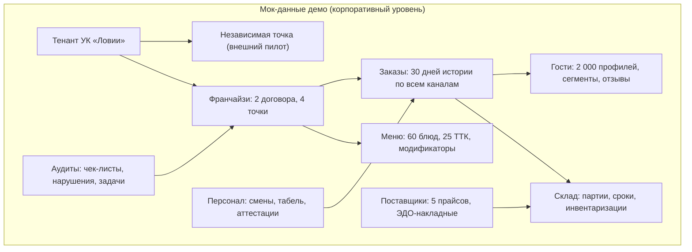

# Демо-кабинет платформы: роли, мок-данные, отчёты

> Спецификация демо-версии — следующего этапа после этой визуальной схемы. Демо показывает весь периметр платформы на мок-данных корпоративного уровня: каждый участник (поставщик, продавец, менеджер) входит в свою роль, управляет своим потоком и видит свои отчёты и рекомендации.

!!! success "Демо собрано — 10.10.2026"
    Интерактивный демо-кабинет опубликован: **[открыть демо](https://bestdeejay-design.github.io/lovii-crm/demo/)** (30 экранов, 10 ролей, три контура + кабинет УК на одном датасете). Исходники — в каталоге `demo/` репозитория: статическая сборка без зависимостей, работает и на GitHub Pages, и локально (`открыть demo/index.html`). Живой прототип гостевого контура — [lovii.mobiap.com](http://lovii.mobiap.com).

## 1. Цель демо

1. **Показать платформу целиком**: три контура (`app` / `crm` / `erp`) + кабинет УК на одном наборе данных.
2. **Проверить контракты на ощупь**: все экраны читают данные так, как будет читать реальная система (роли, иерархия, события).
3. **Дать инструмент продаж и онбординга**: франчайзи и поставщик за 10 минут понимают, где их рабочее место.

Демо **не** подключается к банкам, ККТ и ОФД — их эмулируют мок-сервисы из [платёжной инфраструктуры](../infrastructure/banks-kassa-ofd.md) (раздел про контракты моков).

## 2. Три кабинета и их роли

Демо устроено как **три сервиса** с переключателем в шапке. Роли ограничены своим кабинетом; весь периметр платформы виден через переключение кабинетов и ролей. У каждого кабинета — своё меню (левая панель) и своя тема.

| Кабинет | Адрес | Роли кабинета | Что внутри |
|---|---|---|---|
| **Витрина** | `app.lovii.ru` | Гость | Меню, корзина, оплата (мок банка), статусы заказа, бонусы, отзыв |
| **CRM** | `crm.lovii.ru` | Кассир · Управляющий точкой · Франчайзи | Очередь заказов и чеки, гости и кампании, отзывы, задачи и смены точки, кабинет франчайзи с роялти и заявками в УК |
| **ERP** | `erp.lovii.ru` | Повар · Закупщик · Курьер · Поставщик · Менеджер УК · Собственник | Кухня и склад, производство, закупки и взаиморасчёты, доставка, портал поставщика; раздел «Управляющая компания»: пульс сети, роялти, заявки, аудиты, рекомендации, шаблоны, кабинет собственника |

| Роль | Кабинет | Что видит и чем управляет |
|---|---|---|
| **Гость** | Витрина | Меню, корзина, оплата (карта/СБП/бонусы), статусы, бонусы, отзыв, ПДн |
| **Кассир** | CRM | Очередь заказов всех каналов, чек, возвраты, смена (открытие, X- и Z-отчёты) |
| **Управляющий точкой** | CRM | Дашборд, отзывы и сервис-рекавери, задачи, график смен, стоп-лист, кампании с прогнозом |
| **Франчайзи** | CRM | Свои точки по договору: выручка, роялти, заявки в УК, маркетинговый фонд, стандарты |
| **Повар** | ERP | KDS: тикеты, нормативы, задержки; склад и производство |
| **Закупщик** | ERP | Автозаказ, заказы поставщикам, слепая инвентаризация, взаиморасчёты, фудкост |
| **Курьер** | ERP | Назначения, доставка с фото, проблемы → диспетчеру, итоги смены |
| **Поставщик** | ERP | Свои прайсы и их конкурентность, заявки от точек, УПД через ЭДО, пересмотр цен |
| **Менеджер УК** | ERP (раздел УК) | Пульс сети, заявки с SLA, аудиты и задачи, рекомендации, роялти, шаблоны |
| **Собственник бизнеса** | ERP (раздел УК) | Живые показатели, связки «показатель → причина → как повлиять», песочница решений, решения дня |

Итого **3 кабинета, 10 ролей**. Переключатель ролей в шапке показывает только роли текущего кабинета; при входе в другой кабинет роль автоматически переключается на роль этого кабинета.

Ориентация в демо встроена в интерфейс: баннер сверху каждого экрана напоминает «кто вы и что дальше», кнопка «🧭 Гид» открывает пошаговый сценарий роли (шаги кликабельны), а каждое действие видно в общем журнале «⚡ События».

## 3. Периметр мок-данных

Данные генерируются согласованно: выручка в чеках сходится с фудкостом и списаниями, отзывы привязаны к реальным «заказам», роялти считается от фискальной выручки мока.

## 4. Отчёты и рекомендации по ролям

| Роль | Отчёты | Рекомендации (примеры) |
|---|---|---|
| Управляющий | Выручка по часам, фудкост план/факт, скорость кухни | «Рост закупочной цены сыра на 12% у поставщика А — предложить замену из прайса Б» |
| Поставщик | Объём поставок, взаиморасчёты, возвраты | «Точки чаще берут фасовку 2 кг — добавить в прайс» |
| Продавец-франчайзи | Роялти, маржа точки, отклонения от эталона | «Индекс стандарта ниже 85% — открыто 3 задачи аудита» |
| Менеджер УК | Пульс сети, собираемость роялти, бенчмарки точек | «Точка №3 в красной зоне по просрочкам кухни — назначить внеплановый аудит» |
| Курьер | Доставки в час, рейтинг, итог смены | «Слот 19:00 перегружен — выйти второму курьеру» |

Рекомендации в демо считаются простыми правилами поверх мок-витрин — та же механика, что заложена в [Компоненте 08](../components/08-finance-analytics.md).

## 5. Аудиты и соответствие законодательству в демо

- **Чек-листы открытия/закрытия смены** с фотофиксацией и автозадачами.
- **ХАССП-журналы**: температуры, сроки заготовок, бракераж — на данных мок-склада.
- **Фискальный мониторинг**: алерт «чеки не уходят» от мок-ОФД.
- **Маркировка**: сценарий «код не найден → отказ пробития» от мок-кассы.
- Итог — **индекс соответствия точки** в кабинете УК.

## 6. Реализация демо — статус

Все пять шагов плана выполнены, демо опубликовано: **[открыть демо-кабинет](https://bestdeejay-design.github.io/lovii-crm/demo/)**.

1. ✅ **Каркас**: одно приложение, три «адреса» (`#/app`, `#/crm`, `#/erp`) + кабинет УК (`#/uk`); переключатель ролей в шапке, фейковая адресная строка показывает текущий поддомен.
2. ✅ **Мок-ядро**: детерминированный датасет из раздела 3 (`demo/data/dataset.js`) + единый журнал событий платформы (выдвижная панель «⚡ События» в шапке).
3. ✅ **Экраны (30)**: витрина гостя с оплатой, очередь заказов с чеком и возвратом, гости и кампании, отзывы и сервис-рекавери, задачи точки, планирование смен, дашборд точки, стоп-лист, смена с Z-отчётом, кабинет франчайзи с заявками в УК; KDS с живыми таймерами, склад с партиями, слепая инвентаризация, производство фабрики-кухни, закупки с автозаказом, фудкост план/факт, взаиморасчёты с поставщиками, диспетчер доставки, кабинет курьера, портал поставщика; кабинет собственника с живыми показателями и песочницей решений, пульс сети, роялти, заявки точек с SLA, аудиты, рекомендации, шаблоны точек.
4. ✅ **Мок-сервисы**: банк (авторизация 0,7 с, отказы, комиссии), ККТ/ФН (ФФД 1.2, печатный чек), ОФД (подтверждение, алерт «чеки не уходят») — по контрактам из [платёжной инфраструктуры](../infrastructure/banks-kassa-ofd.md).
5. ✅ **Отчёты и рекомендации** по таблице из раздела 4: фудкост-график по точкам, рекомендации УК с причинами и действиями, индекс стандарта из аудитов.
6. ✅ **Онбординг и роль собственника** (итерация аудита): ролевые баннеры и гиды по всем 10 ролям, лендинг с карточками ролей, кабинет собственника (живые показатели, рычаги влияния, песочница, решения дня).
7. ✅ **Закрытие бэклога полного периметра**: слепая инвентаризация с влиянием на фудкост, фабрика-кухня (задания, партии, перемещения в точки), взаиморасчёты с поставщиками, единый таск-борд управляющего, планирование смен с закрытием разрывов, заявки франчайзи → УК с таймерами SLA; в демо встроен указатель на живой прототип гостевого контура [lovii.mobiap.com](http://lovii.mobiap.com).
8. ✅ **Кабинетная архитектура** (итерация «три сервиса»): переключатель кабинетов Витрина / CRM / ERP в шапке, селектор ролей показывает только роли текущего кабинета, левое меню — меню кабинета с группами экранов (у кабинета УК — раздел «Управляющая компания» внутри ERP), у каждого кабинета своя тема; роли не выходят за пределы своего кабинета, все взаимодействия наблюдаются через переключение.
9. ✅ **SPA-каркас (app shell)**: шапка и левое меню живут постоянно и не пересобираются при навигации — перерисовывается только правая область (с мягкой анимацией входа); меню и контент скроллятся независимо; меню пересобирается лишь при смене кабинета или роли; приветственный экран — без меню, на всю ширину; на узких экранах каркас складывается в колонку.
10. ✅ **Обогащение ERP (данные и реалистичность)**: история цен ключевых позиций за 12 недель (рынок против прайса каждого поставщика, спарклайны в портале поставщика), загрузка кухни по часам с пиками и среднее время по цехам, журнал движений склада с документами-основаниями («почему −3 кг сыра?»), история из 8 инвентаризаций с трендом отклонений, классы надёжности поставщиков (своевременность, плечо, качество), зоны доставки со статистикой «в окно», маржинальная карта блюд из ТТК и недельный тренд фудкоста сети.

Критерий готовности выполнен: новый человек без подготовки понимает, в какой он роли и что делать дальше (баннер + гид), проходит сценарий «заказ гостя → чек → кухня → доставка → отзыв → отчёт УК» и может переключиться в любую из 10 ролей. Проверено автотестами: прогон всех 30 маршрутов и 66 интерактивных сценариев в jsdom — без ошибок; по пути найдены и исправлены реальные дефекты (перерисовка чека после оплаты, отсутствие ре-рендера при повторном входе на экран).

---

**Назад:** [карта платформы](00-platform-map.md) · [правила движения информации](01-information-flow.md).
