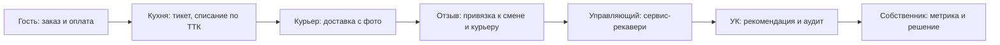

# Сценарии ролей сквозь призму реальных болей

> Аудит кабинетов демо-платформы: для каждой роли зафиксированы **реальные боли**, **сценарии действий**, **подсказки «что делать дальше»** и **прогноз итога** каждого шага. Всё, что описано здесь, **выполнимо в демо**: [открыть демо-кабинет](https://bestdeejay-design.github.io/lovii-crm/demo/). Спецификация демо — [демо-кабинет](02-demo-cabinet.md), карта платформы — [карта](00-platform-map.md).

Принцип: человек в любой момент должен знать три вещи — **кто он**, **что делать дальше** и **к чему это приведёт**. Поэтому в демо встроен движок сценариев, а не статичные подсказки. Платформа в демо разделена на **три кабинета** (Витрина, CRM, ERP — переключатель в шапке): роли ограничены своим кабинетом, а весь периметр виден через переключение кабинетов и ролей.

## 1. Как устроена система «что делать дальше»

| Механизм | Что делает | Где живёт |
|---|---|---|
| **Ролевой баннер** | На каждом экране: «Вы — [роль] · Что дальше: [действие] → Прогноз итога: [результат]». Совет считается от **живого состояния данных** (корзина, смена, отзывы, заявки, прайсы), а не показывается по кругу | `demo/scenarios.js → advice()` |
| **Гид роли** | Кнопка «🧭 Сценарий роли»: кто вы, зона ответственности, кликабельные шаги по экранам, у каждого шага — прогноз итога | `demo/guide.js + scenarios.js` |
| **Журнал событий** | Каждое действие видно как событие платформы: источник (БАНК/ККТ/ОФД/ПЛАТФОРМА/ЭДО/РЕШЕНИЕ) и следствие | «⚡ События» в шапке |
| **Лендинг** | 10 карточек ролей: вход в роль сразу открывает её сценарий | стартовый экран |

Примеры живых правил совета:

| Роль | Условие в данных | Совет | Прогноз итога |
|---|---|---|---|
| Гость | корзина не пуста | Оплатите корзину на N ₽ | Банк → чек ККТ → ОФД, бонусы +5% |
| Гость | заказ доставлен | Оставьте отзыв | Привяжется к заказу, смене и курьеру |
| Кассир | смена не открыта | Откройте смену | Без неё касса не бьёт чеки (54-ФЗ) |
| Кассир | есть чеки в смене | Снимите X-отчёт или закройте смену | Z-отчёт сверит чеки с ОФД |
| Управляющий | негатив без ответа | Ответьте на N отзывов | Возвращает до 70% недовольных гостей |
| Повар | просроченный тикет | Сообщите задержку | Гость уведомлён — негатив предотвращён |
| Закупщик | корзина автозаказа | Сформируйте заказы поставщикам | Поставщик подтвердит, УПД придёт через ЭДО |
| Поставщик | заявка ждёт | Подтвердите и отправьте УПД | Точка увидит поставку в приёмке |
| Франчайзи | роялти не оплачен | Оплатите роялти | Сумма от фискальной выручки — споров нет |
| УК | просроченная заявка | Возьмите в работу | Просрочки видны собственнику |
| Собственник | красные метрики | Одобрите рычаги | Каждое одобрение — задача исполнителям |

## 2. Гость (`app.lovii.ru`)

**Боли:** «где мой заказ?», «почему отказала оплата?», «где мои бонусы?», «оставил отзыв — тишина», «блюдо есть в меню, но его нельзя заказать».

| № | Сценарий | Действия в демо | Что подсказывает система | Прогноз итога |
|---|---|---|---|---|
| G1 | Заказ и оплата | Витрина → корзина → «Оплатить» | «Оплатите корзину…» | Банк (0,7 с) → чек ФФД 1.2 в ФН → подтверждение ОФД → заказ на KDS |
| G2 | Оплата бонусами | Способ «Бонусы+карта» | Баллы закрывают до 30% чека | Списание баллов видно в чеке строкой, карта — на остаток |
| G3 | Отказ оплаты | Сумма кратна 997 при оплате картой | Мок-банк отказывает с кодом 51 | Отказ фиксируется в журнале, деньги не списаны |
| G4 | Трекинг статуса | «Мои заказы» | «Следите за статусом…» | Те же статусы видят кухня и диспетчер (один журнал) |
| G5 | Отзыв после доставки | Кнопка «Оставить отзыв» | «Отзыв привяжется к заказу, смене и курьеру» | Негатив создаёт задачу сервис-рекавери у заведения |
| G6 | Персональные данные | Профиль → выгрузка/отзыв согласия | 152-ФЗ | Запрос регистрируется, ответ в течение 30 дней |

## 3. Кассир (`crm.lovii.ru`)

**Боли:** «смена не открывается», «чек потерялся», «возврат оформлять страшно», «как сверить кассу в середине дня», «гости из агрегаторов приходят без опознания».

| № | Сценарий | Действия в демо | Подсказка | Прогноз итога |
|---|---|---|---|---|
| C1 | Открытие смены | Смена → «Открыть смену» | «Без неё касса не бьёт чеки» | Касса готова; событие в журнале |
| C2 | Приём заказа из любого канала | Очередь → открыть заказ | Одна очередь: зал/сайт/приложение/агрегаторы/телефон | Гость опознан по телефону/карте |
| C3 | Пробитие чека | Карточка заказа → «Пробить чек» | «Чек уйдёт в ФН и ОФД» | Выручка сразу в дашборде, отчёте УК и роялти |
| C4 | Возврат | Карточка заказа → «Возврат» | Основание фиксируется | Деньги возвращаются через банк, след в журнале |
| C5 | Промежуточная сверка | «Внесение наличных» + «X-отчёт» | Итоги без закрытия смены | Для сверки с кассой в середине дня |
| C6 | Закрытие смены | «Закрыть смену (Z-отчёт)» | «Сверка с ОФД» | Итоги уходят в УК и расчёт роялти |

## 4. Управляющий точкой (`crm` + `erp`)

**Боли:** «отчёты собираю вручную ночью», «негатив замечаю через неделю», «некем закрыть пятницу», «фудкост ползёт, а почему — не вижу», «задачи теряются в мессенджерах».

| № | Сценарий | Действия в демо | Подсказка | Прогноз итога |
|---|---|---|---|---|
| M1 | Утро с дашбордом | Дашборд точки | «Все цифры из фискальных данных и журнала» | Выручка, каналы, NPS, фудкост без ручного сведения |
| M2 | Разбор негатива | Отзывы → ответ → сервис-рекавери | «Ответ за 24 ч возвращает до 70% гостей» | Задача рекавери уходит в рекомендации УК |
| M3 | Задачи точки | Борд: аудиты/отзывы/УК/регулярные | Источники задач видны | Закрытые задачи двигают индекс стандарта |
| M4 | Кампания с прогнозом | Конструктор: сегмент × канал | Охват, заказы, выручка, ROMI — **до запуска** | Рассылка уходит автоматически |
| M5 | График на неделю | Планирование смен | Пиковые дни подсвечены | Закрытые разрывы = меньше просрочек и опозданий |
| M6 | Контроль фудкоста | Фудкост → стоп-лист → инвентаризация | «Отклонение > 2 п.п. — сигнал» | Причина отклонения видна до конца дня |

## 5. Повар (`erp.lovii.ru`)

**Боли:** «вал заказов в пик», «не знаю норматив», «гость злится, а я ещё не начал», «продукты списываются непонятно как», «сроки партий».

| № | Сценарий | Действия в демо | Подсказка | Прогноз итога |
|---|---|---|---|---|
| CH1 | Очередь KDS | Тикеты с таймерами и нормативом ТТК | «Красный тикет уже портит рейтинг» | Приоритеты видны без слов |
| CH2 | Закрытие тикета | «Готово» | «Спишутся ингредиенты по ТТК» | Гость получает статус, курьер — сигнал на выдачу |
| CH3 | Задержка | «Задержка +5 мин» | «Гость получит уведомление» | Обещание доставки сдвигается, негатив предотвращён |
| CH4 | Сроки партий | Склад: подсветка ≤ 2 дня | «Что быстрее — в заготовки» | Минус списания, плюс фудкост |
| CH5 | Фабрика-кухня | Производство: задания и перемещения | Прогноз потребности точек | Полуфабрикаты уходят по ЭДО-накладным |

## 6. Курьер (`erp.lovii.ru`)

**Боли:** «адрес не найден», «гостя нет дома», «кто решит проблему за меня?», «как считается мой рейтинг и чаевые».

| № | Сценарий | Действия в демо | Подсказка | Прогноз итога |
|---|---|---|---|---|
| K1 | Забрать заказ | «Забрал заказ» | — | Гость видит «Везу» и время прибытия |
| K2 | Доставить | «Доставлено (фото)» | — | Заказ закрыт, гостю — запрос отзыва, чаевые в смену |
| K3 | Проблема | «Проблема» + причина | «Диспетчер получит алерт» | Диспетчер сам звонит гостю; проблема видна на диспетчеризации |
| K4 | Итог смены | Карточка смены | — | Доставки, чаевые, рейтинг |

## 7. Закупщик (`erp.lovii.ru`)

**Боли:** «то дефицит, то пересорт», «поставщик поднял цену, а я узнал при приёмке», «акты не сходятся», «инвентаризация по ночам».

| № | Сценарий | Действия в демо | Подсказка | Прогноз итога |
|---|---|---|---|---|
| B1 | Автозаказ | Предложения по прогнозу и остаткам | Каждая позиция объяснена | Заявка попадает в корзину закупщика |
| B2 | Заказ поставщику | Корзина → «Сформировать заказы» | Группировка по поставщикам | Заказы появляются в порталах поставщиков |
| B3 | Слепая инвентаризация | Факт без книжных остатков → утверждение | «Итоги уйдут в фудкост» | Недостача становится видимой в тот же день |
| B4 | Взаиморасчёты | Поставки против платежей | «Погашение закрывает риск остановки отгрузок» | Оплата — в один клик, платёжка в банк |
| B5 | Красная зона фудкоста | Фудкост → причина → тендер | «Кировский»: цены + недостача | Экономия ~86 тыс ₽/мес по прогнозу |

## 8. Поставщик (`erp.lovii.ru`, портал)

**Боли:** «заявки теряются», «непонятно, почему проиграли тендер», «УПД ходят почтой», «цены сверяют вручную».

| № | Сценарий | Действия в демо | Подсказка | Прогноз итога |
|---|---|---|---|---|
| S1 | Конкурентность прайса | Колонка «дороже рынка» | «Позиции +8% сеть выносит на тендер» | Ясно, где рискуете объёмом |
| S2 | Алерт о повышении цен | Жёлтый блок: лосось +12% | «Снижение цены удержит заказы» | Решение до потери объёма |
| S3 | Подтверждение заявки | «Подтвердить и отправить УПД» | — | УПД уходит через оператора ЭДО, приёмка сверится |
| S4 | Пересмотр цены | «Дешевле на 5%» | — | Новый прайс мгновенно виден всем точкам |

## 9. Франчайзи (`crm.lovii.ru`)

**Боли:** «за что я плачу роялти?», «маркетинговый фонд — чёрный ящик», «заявки в УК тонут», «аудиты пугают».

| № | Сценарий | Действия в демо | Подсказка | Прогноз итога |
|---|---|---|---|---|
| F1 | Кабинет по договору | Свои точки, выручка, стандарты | «Данные из ОФД — поправить нельзя» | Прозрачность без запросов в УК |
| F2 | Роялти | «Оплатить» | Сумма от фискальной выручки | Оплата видна УК в реальном времени |
| F3 | Заявка в УК | Форма: тема + текст | Таймер SLA | УК видит заявку; просрочка невозможна незаметно |
| F4 | Маркетинговый фонд | Блок «Маркетинговый фонд (2%)» | Накоплено/израсходовано/прогноз | Детальный отчёт — заявкой с SLA 48 ч |
| F5 | Стандарты | Аудиты своих точек | «Индекс ≥ 85% — спокойное продление» | Нарушения → задачи с дедлайном |

## 10. Менеджер УК (кабинет УК)

**Боли:** «франчайзи приукрашивают цифры», «заявки копятся», «стандарты падают незаметно», «долги по роялти».

| № | Сценарий | Действия в демо | Подсказка | Прогноз итога |
|---|---|---|---|---|
| U1 | Пульс сети | Красные/зелёные зоны | «Красная зона = где теряются деньги» | Точка внимания на сегодня |
| U2 | Заявки с SLA | «Взять в работу» → «Выполнено» | Таймеры и просрочки | Просрочки видны собственнику |
| U3 | Аудиты | Открыть проверку → задача на устранение | Фотофиксация нарушений | Задача точке с дедлайном, закрытие под контролем |
| U4 | Рекомендации | «Взять в работу» / «Эскалировать» | Причины и действия собраны системой | Эскалация попадает в «Решения дня» собственника |
| U5 | Роялти | Напоминание должникам | База — фискальная выручка | Сбор без споров |
| U6 | Шаблоны точек | Клонирование | — | Новый франчайзи за часы |

## 11. Собственник бизнеса (кабинет УК)

**Боли:** «где деньги?», «решаю по ощущениям», «не вижу причинно-следственные связи», «всё тушение пожаров».

| № | Сценарий | Действия в демо | Подсказка | Прогноз итога |
|---|---|---|---|---|
| O1 | Живые показатели | Выручка тикает онлайн | «Красные метрики — где теряются деньги» | Картина без запросов менеджерам |
| O2 | Рычаги влияния | «Показатель → причина → действие» | Одобрение — один клик | Действие становится задачей исполнителям |
| O3 | Песочница решений | Слайдеры: цены/поток/фудкост/ФОТ | Учитывается эластичность спроса | Прогноз прибыли месяца до решения |
| O4 | Решения дня | Одобрить / делегировать / отклонить | — | Решения фиксируются в журнале |
| O5 | Эскалации | Лента из УК | — | Критичное поднимается наверх само |

## 12. Сквозные сценарии — через все роли

Именно они показывают, что платформа — единый организм:

| Сквозной сценарий | Цепочка | Итог |
|---|---|---|
| **Путь заказа** | Гость → банк/ККТ/ОФД → KDS → склад (списание) → курьер → отзыв → УК | Деньги, статусы и репутация в одном журнале |
| **Путь цены** | Поставщик +12% → автозаказ замечает → закупщик: тендер → УК: рекомендация → собственник одобряет | Экономия видна до решения |
| **Путь негатива** | Отзыв 1★ → сервис-рекавери → задача управляющему → индекс стандарта → роялти/договор | Ни один негатив не теряется |
| **Путь заявки** | Франчайзи → заявка с SLA → УК → просрочка видна собственнику | Сервис УК измерим |

## 13. Покрытие и честные ограничения

| Роль | Экраны | Интерактивных действий | Прогноз итога |
|---|---|---|---|
| Гость | 3 | 8 | ✅ на каждом шаге |
| Кассир | 2 | 7 | ✅ |
| Управляющий | 8 | 11 | ✅ |
| Повар | 3 | 6 | ✅ |
| Курьер | 2 | 5 | ✅ |
| Закупщик | 5 | 9 | ✅ |
| Поставщик | 1 (+сквозные) | 5 | ✅ |
| Франчайзи | 2 (+сквозные) | 7 | ✅ |
| Менеджер УК | 6 | 10 | ✅ |
| Собственник | 2 (+сквозные) | 9 | ✅ песочница |
| **Итого** | **30 экранов** (+лендинг) | **77 действий** | у всех ролей |

Ограничения (осознанные): банк/ККТ/ОФД/ЭДО — мок-сервисы по контрактам из [платёжной инфраструктуры](../infrastructure/banks-kassa-ofd.md); прогноз кампании и песочница — модели на фактических данных демо, а не боевые алгоритмы; данные вымышленные, но согласованные по всем контурам.

---

**Связанные документы:** [карта платформы](00-platform-map.md) · [правила движения информации](01-information-flow.md) · [спецификация демо](02-demo-cabinet.md).
