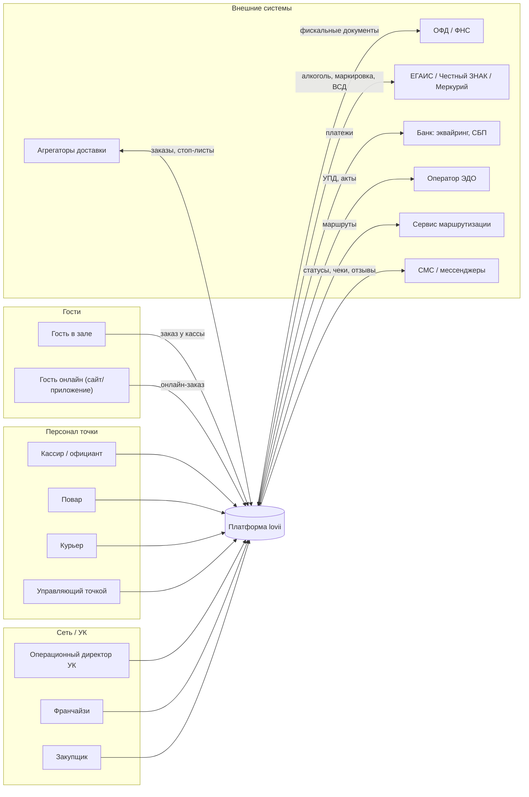
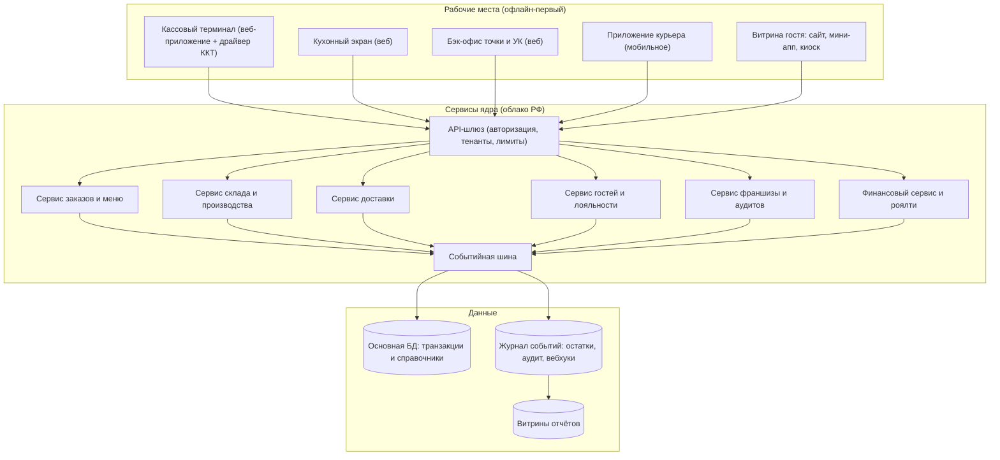

# Спецификация 00. Обзор системы: контекст и контейнеры

> **Статус: ревизия №2 по итогам аудита корпуса · 10.10.2026.** Числовые факты сопровождаются ссылками; канонические перечисления — в «Модели данных», §0.

> Техническая спецификация платформы с визуальными схемами (Mermaid). Серия: 00 обзор → 01 доменная модель → 02 процессы → 03 контракты API → 04 деплой и офлайн. База: [`../components/12-data-model.md`](../components/12-data-model.md).

## 1. Контекст системы (кто и что взаимодействует с платформой)

## 2. Контейнерная схема (из чего состоит платформа)

## 3. Назначение контейнеров

| Контейнер | Назначение | Офлайн |
|---|---|---|
| Кассовый терминал | заказы, оплаты, смены; драйверы ККТ | обязательный (буфер событий) |
| Кухонный экран | тикеты, тайминги, стоп-лист | обязательный (локальная очередь) |
| Бэк-офис | меню/ТТК, склад, персонал, финансы, аудиты | не требуется |
| Приложение курьера | назначения, маршруты, статусы, фото | устойчивость в «мёртвых зонах» |
| Витрина гостя | меню, корзина, оплата, статусы | не требуется |
| Сервисы ядра | бизнес-логика по доменам | — |
| Событийная шина | единый поток фактов; источник остатков и витрин | — |

## 4. Принципы (неизменяемые)

1. Один контракт заказа для всех каналов (см. [Спецификацию 03](03-api-contracts.md)).
2. Остаток склада = проекция журнала движений; остатков «вручную» не существует.
3. Выручка для роялти — только из фискальных документов.
4. Данные тенанта изолированы; агрегаты УК — только по точкам договора.
5. Хранение ПДн в РФ (см. [Разбор 4](../academic/04-personal-data-loyalty.md)).
