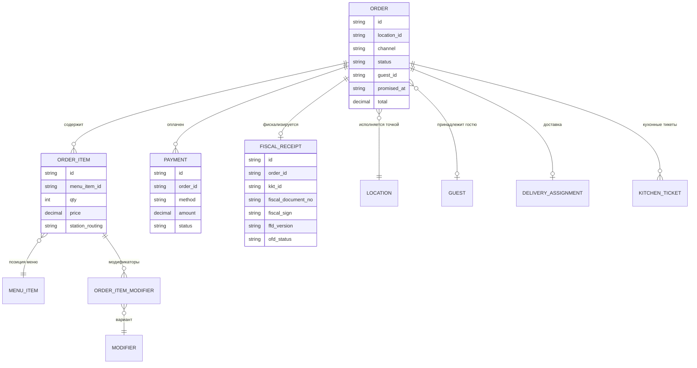
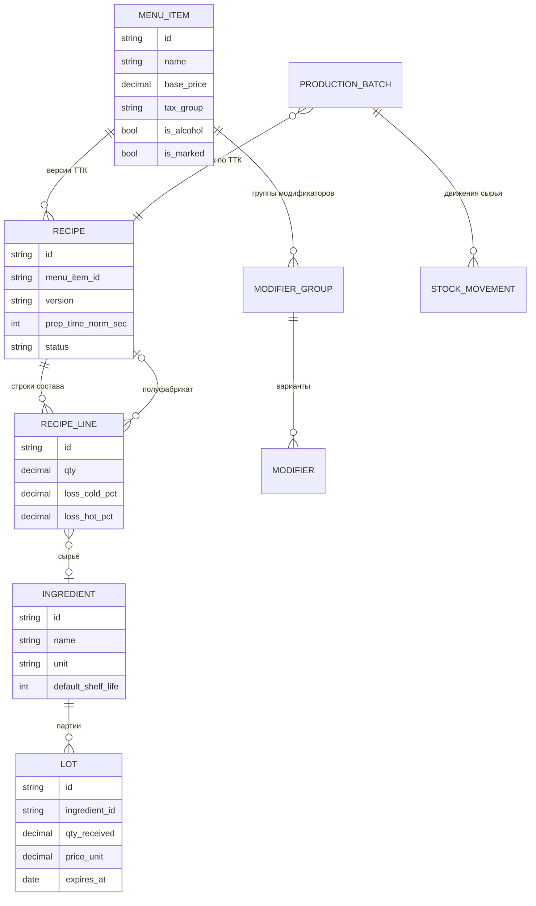
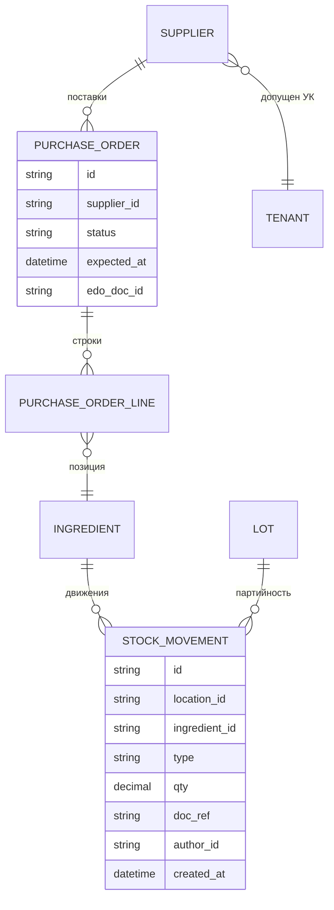
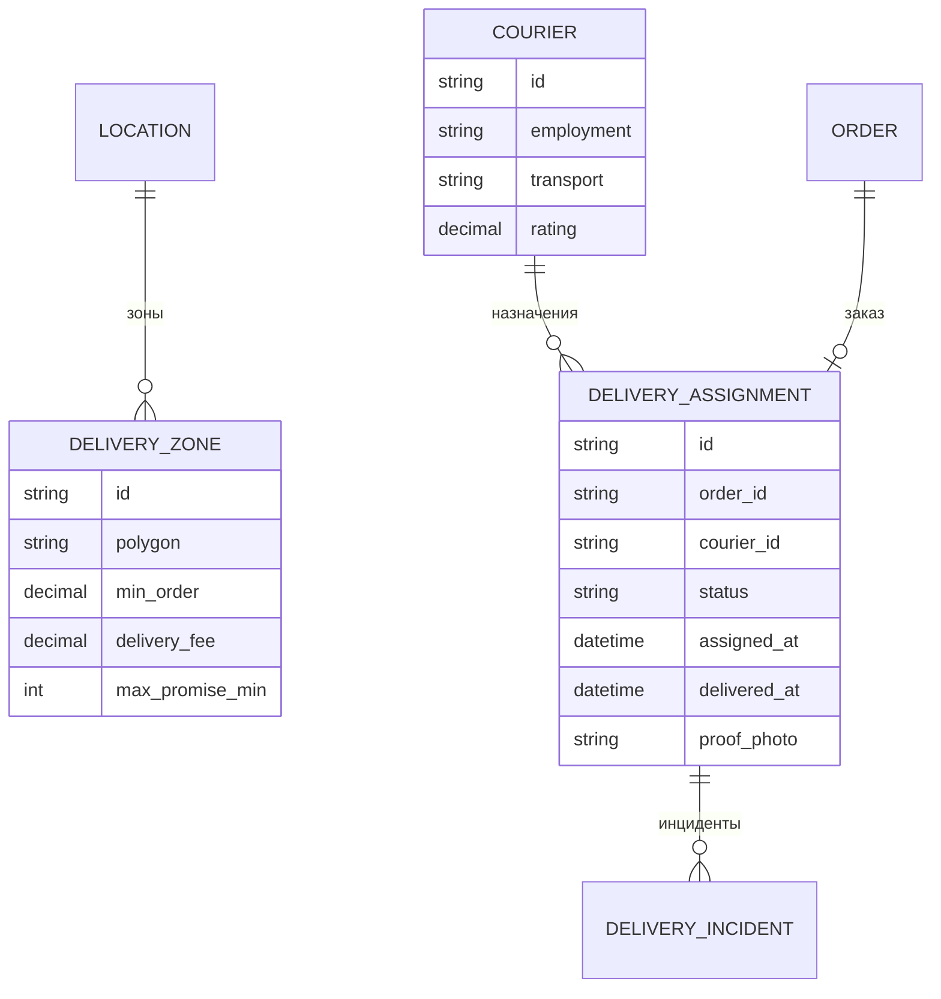
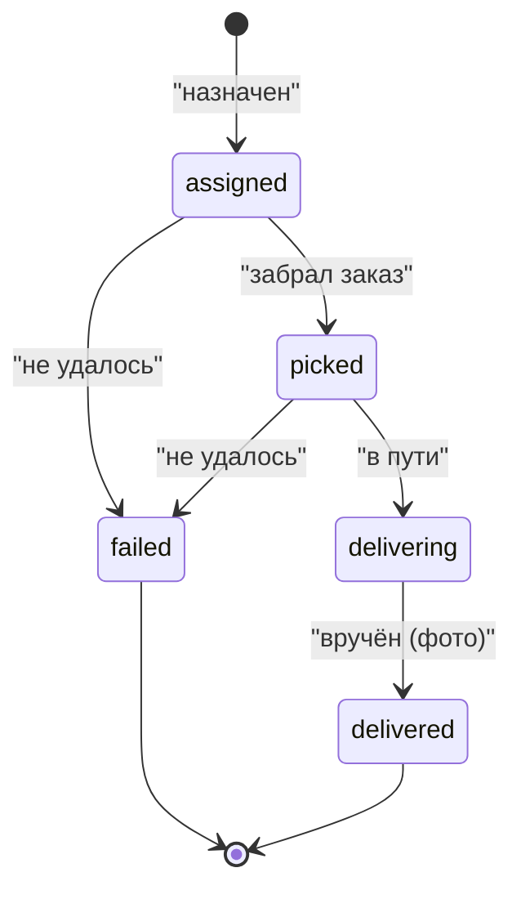
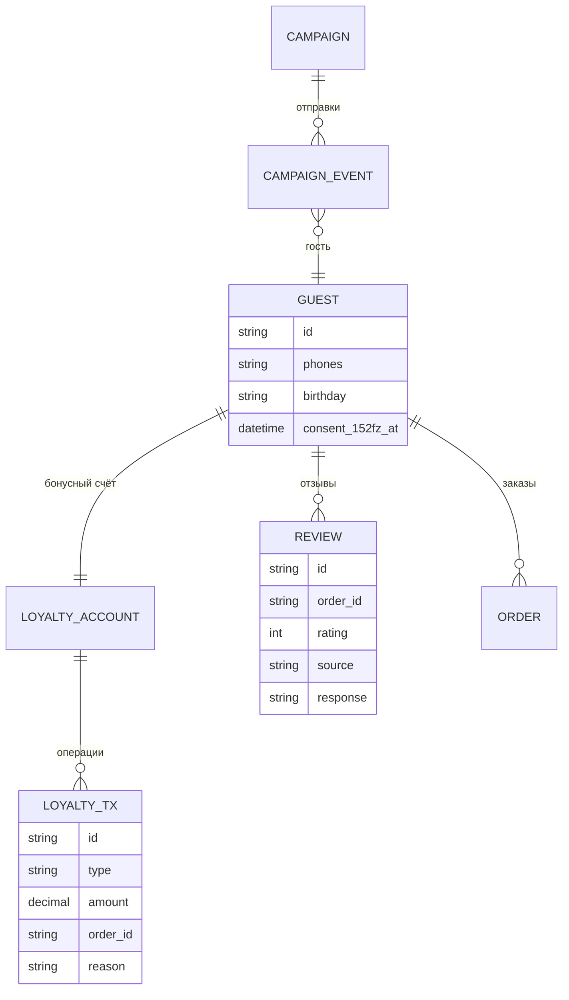
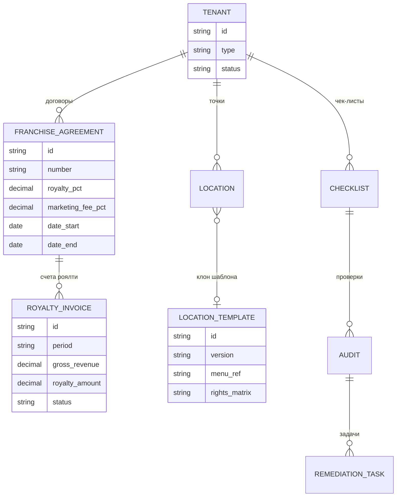
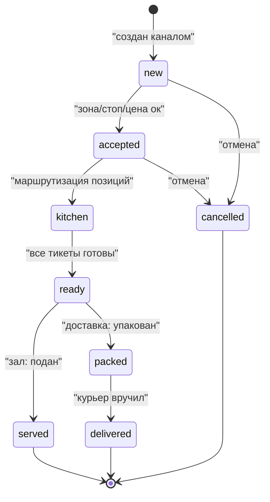

# Спецификация 01. Доменная модель (схемы сущностей)

> Атрибутные схемы по доменам. Полное описание атрибутов — в [`../components/12-data-model.md`](../components/12-data-model.md); здесь — визуальные связи. Имена сущностей на английском (код), подписи связей — по смыслу.

## 1. Ядро: заказы, оплаты, чеки

## 2. Меню и производство

## 3. Склад и закупки

Типы движений: `receive` (приёмка), `sale_writeoff` (продажа по ТТК), `production_in` / `production_out` (заготовки), `transfer` (перемещение), `writeoff_spoilage` (порча), `inventory_adjust` (инвентаризация), `return` (возврат).

## 4. Доставка

Статусы назначения:

## 5. Гости, лояльность, отзывы

## 6. Франшиза и контроль

## 7. Жизненный цикл заказа (единый для всех каналов)

