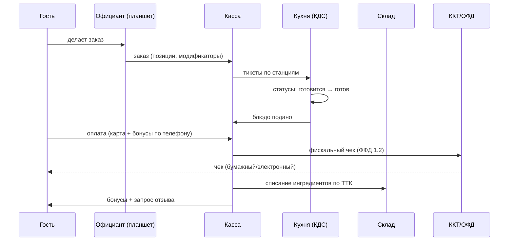
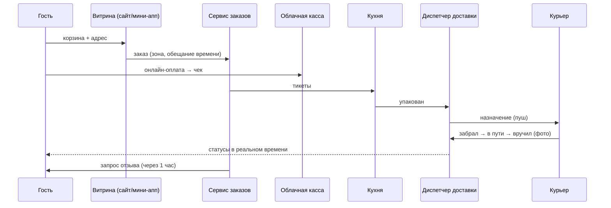
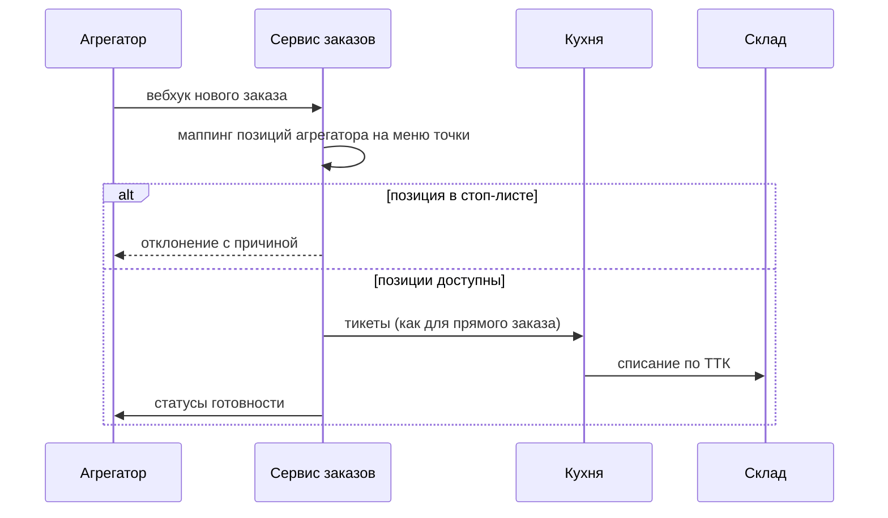
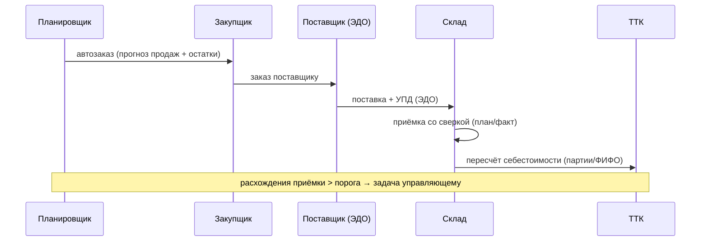
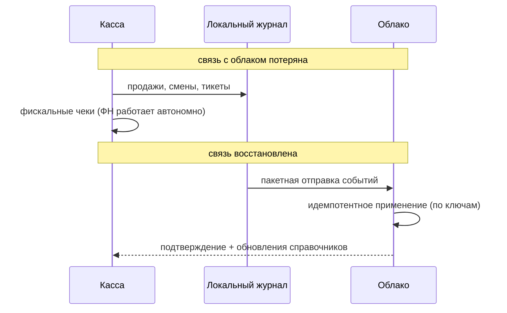
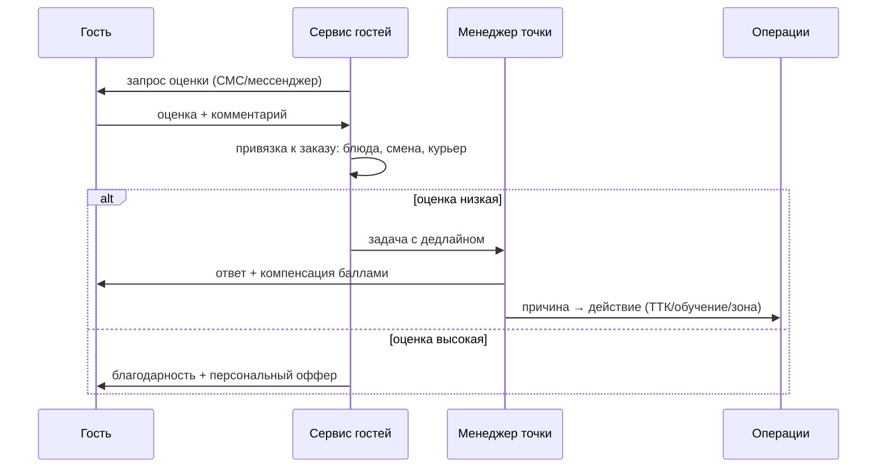
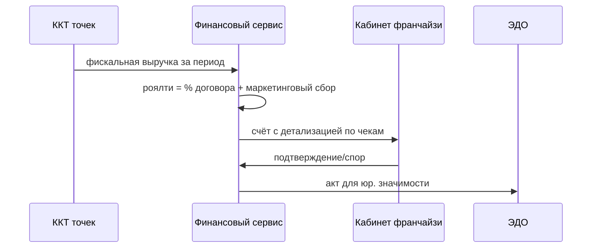
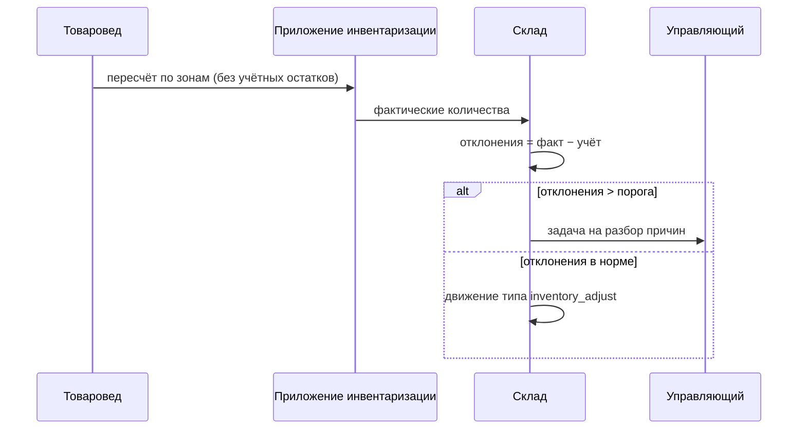

# Спецификация 02. Ключевые процессы (последовательности)

> Схемы сценариев «от заказа до отзыва» и поддерживающих контуров. Каждый сценарий = один вертикальный срез платформы.

## 1. Заказ в зале: официант → кухня → оплата → чек

## 2. Онлайн-заказ с доставкой

## 3. Заказ из агрегатора в общую очередь

## 4. Закупки: прогноз → автозаказ → приёмка → себестоимость

## 5. Офлайн-режим кассы и кухни

## 6. Отзыв и сервис-рекавери

## 7. Роялти: от фискальных данных к счёту

## 8. Инвентаризация (слепая)

