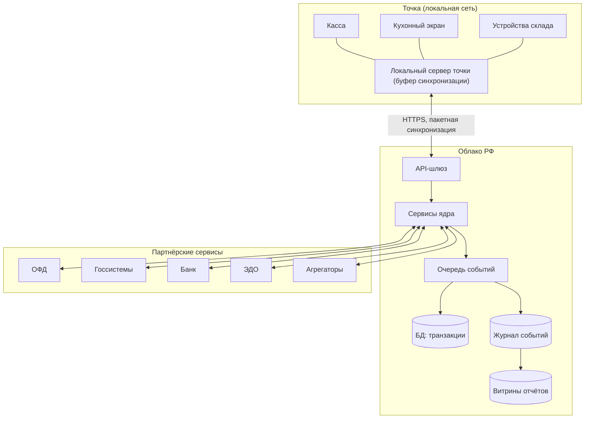
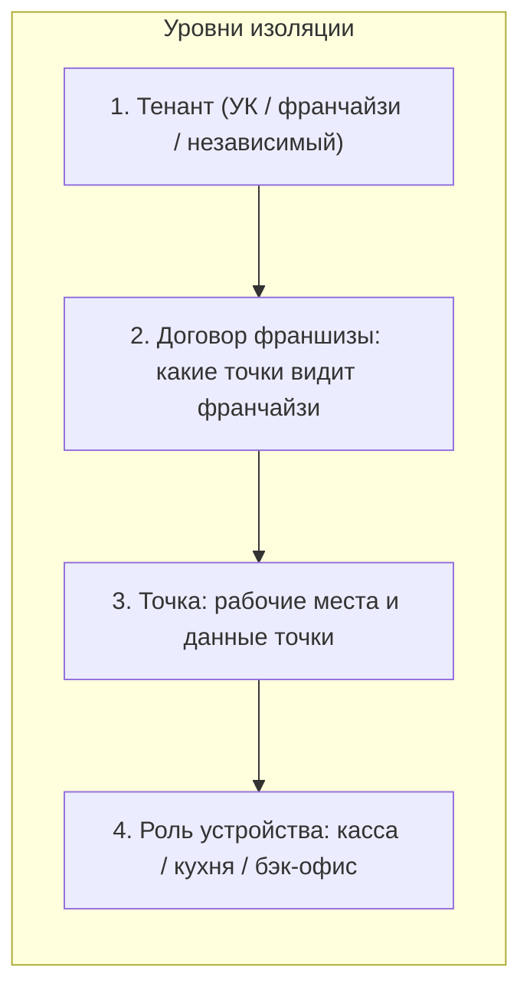
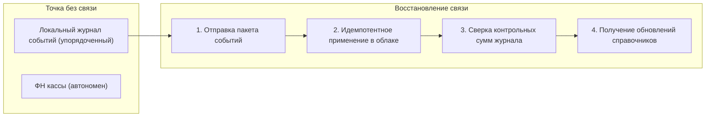
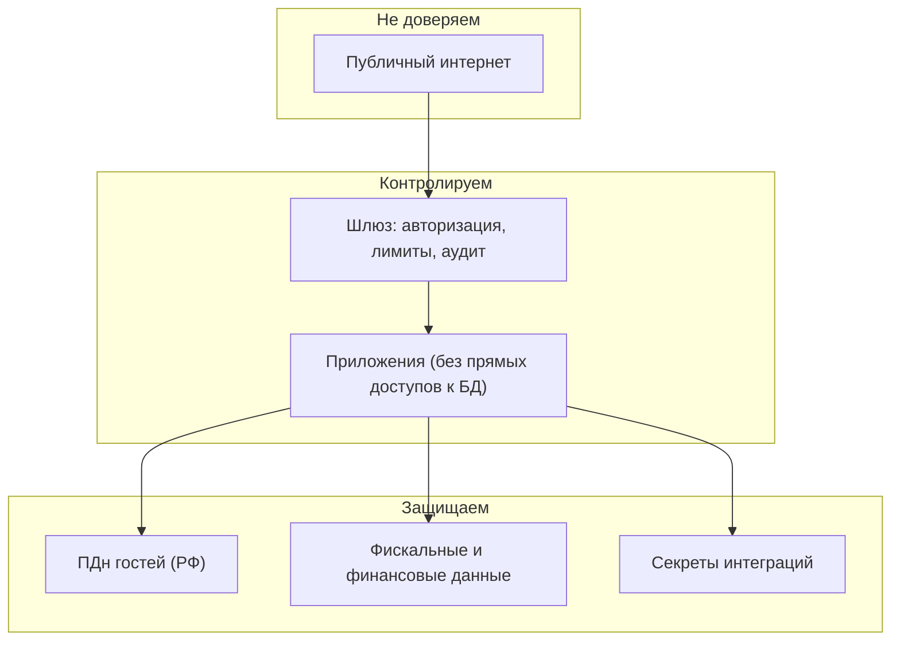

# Спецификация 04. Деплой, офлайн-синхронизация и безопасность

> Финальный документ серии: как платформа размещается, как точка живёт без интернета и где проходят границы безопасности.

## 1. Топология деплоя

## 2. Мультитенантность и изоляция

Правила:

- Данные читаются только в рамках разрешенного уровня; агрегаты УК строятся по точкам договора.
- Справочники наследуются сверху вниз (шаблон УК → точка) с локальными переопределениями.
- Журнал доступа к данным гостей — обязателен (152-ФЗ).

## 3. Офлайн-синхронизация: модель

Контрактные требования:

1. Точка **обязана торговать без интернета** неограниченно долго (продажи, чеки, кухня, складские операции).
2. Порядок событий в журнале — источник истины при слиянии; конфликты решаются по типам операций (см. правила в [Спецификации 03](03-api-contracts.md), раздел 4).
3. Фискальные документы не теряются: ФН хранит чеки автономно; передача в ОФД — после связи (мониторинг «чеки не уходят»).
4. Алерт платформе: точка офлайн дольше порога → уведомление УК.

## 4. Безопасность: границы

Требования:

- **ПДн**: первичная запись в РФ; согласия и журналы; выгрузка/удаление по запросу ([Разбор 4](../academic/04-personal-data-loyalty.md)).
- **Платежи**: полные данные карт не храним — токены процессинга; СБП через сертифицированный шлюз.
- **ЭДО/госсистемы**: доступ через сертифицированные шлюзы; секреты — в хранилище секретов, не в коде.
- **2ФА** для ролей УК и управляющих; линейный персонал — ПИН/карта с короткими сессиями.
- Резервное копирование: RPO ≤ 15 мин, RTO ≤ 1 ч; локальный буфер точки — дополнительная защита.

## 5. Наблюдаемость и телеметрия

- Метрики платформы: аптайм ≥ 99,9%, латентность создания заказа < 3 с от витрины до тикета кухни.
- Телеметрия точек: онлайн/офлайн, загрузка ККТ, заполненность ФН, «чеки не уходят».
- Бизнес-телеметрия для УК: пульс сети (выручка, скорость кухни, индекс стандарта) — дашборд в реальном времени.

## 6. Критерии готовности платформы (DoD)

- [ ] Офлайн-смена 8 часов без потерь при синхронизации.
- [ ] Чек уходит в ОФД; маркированный товар проходит разрешительный режим.
- [ ] Онлайн-заказ появляется на КДС < 3 секунд.
- [ ] Вебхуки: доставка с подписью, идемпотентность получателя продемонстрирована.
- [ ] Тенант-иерархия клонирует шаблон точки < 1 часа.
- [ ] Запрос удаления ПДн гостя исполняется инструментами поддержки.
